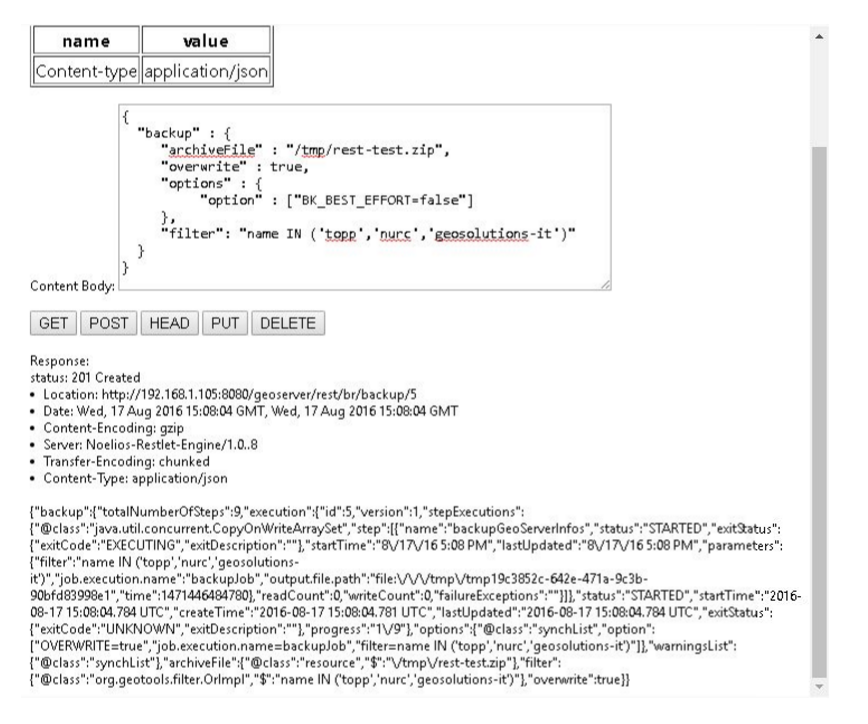
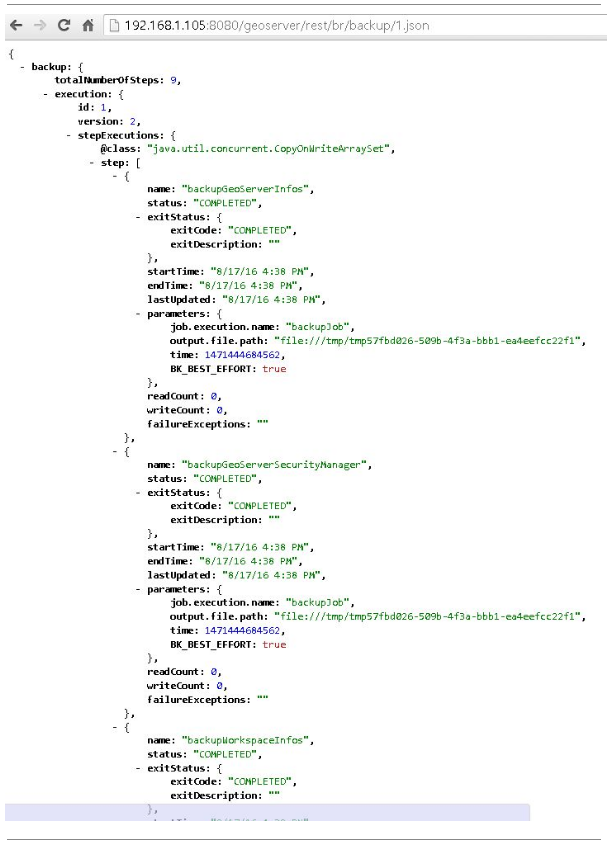
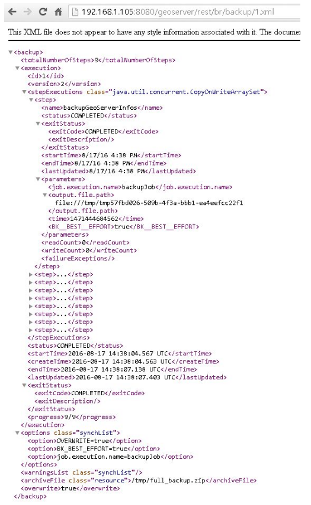
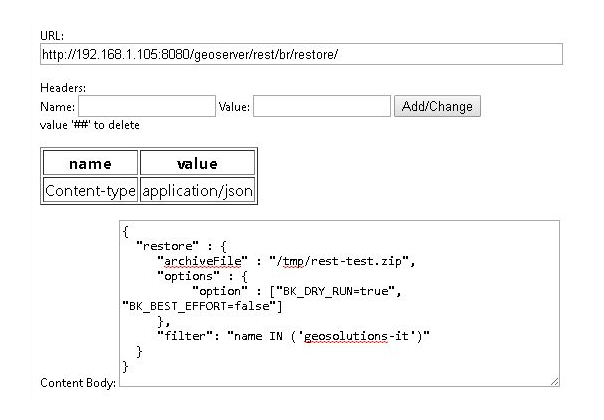
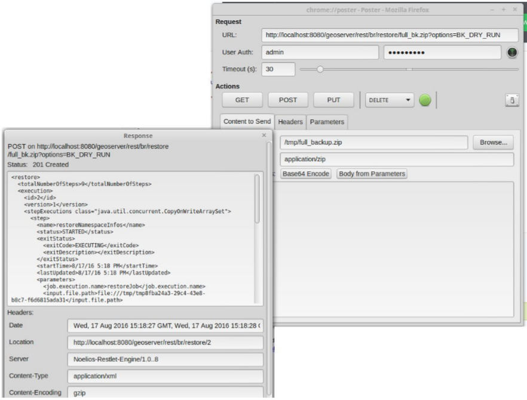

# Usage Via GeoServer's REST API

The Backup and Restore REST API consists of a few resources meant to be used in an asynchronous fashion:

| Resource                   | Method | Parameters and Notes                                                 |
|----------------------------|--------|----------------------------------------------------------------------|
| /rest/br/backup/           | POST   | Post a JSON/XML document with the backup parameters, see below       |
| /rest/br/backup/backupId   | GET    | Returns a json/xml representation of the backup operation. See below |
| /rest/br/backup/backupId   | DELETE | Cancels the backup operation                                         |
| /rest/br/restore           | POST   | Post a JSON/XML document with the restore parameters, see below      |
| /rest/br/restore/restoreId | GET    | Returns a json/xml representation of the backup operation, see below |
| /rest/br/restore/restoreId | DELETE | Cancels the restore operation                                        |

## Usage Example

We are going to use the command line tool cURL to send HTTP REST requests to GeoServer.

The `/rest/br/backup/` and `/rest/br/restore` endpoints accept an optional format suffix that allows the Backup / Restore archive to be streamed to / from the client instead of being written on / read from the file system.

**Initiate a Backup**

Prepare a file containing with a JSON object representing the Backup procedure configuration.

`backup_post.json`:

``` json
{
   "backup":{
      "archiveFile":"/home/sg/BackupAndRestore/test_rest_1.zip",
      "overwrite":true,
      "options":{
      }
   }
}
```

In this case we did not specify any options in the backup configuration so default values will be used.

Available options are:

1.  `BK_BEST_EFFORT`: Skip any failing resources and proceed with the backup procedure. Default: ``false``.
2.  `BK_PARAM_PASSWORDS`: Whether outgoing store passwords should be parameterized in the backup. With this option set all store passwords will be replaced with a token that looks like ``\${workspaceName:storeName.passwd.encryptedValue}``. See also `BK_PASSWORD_TOKENS` for the Restore command.
3.  `BK_SKIP_SECURITY`: This will exclude security settings from the backup. Default: ``true``.
4.  `BK_SKIP_SETTINGS`: This will attempt to exclude global settings from the backup, as well as security settings. Default: ``true``.
5.  `BK_SKIP_GWC`: This option will avoid backup / restore the GWC catalog and folders. Default: ``false``.
6.  `BK_CLEANUP_TEMP`: This will attempt to delete temporary folder at the end of the execution. Default: ``true``.
7.  `exclude.file.path`: A `;` separated list of paths relative to the `GEOSERVER_DATA_DIR` (e.g.: 'exclude.file.path=/data/geonode;/monitoring;/geofence'). If exist, the backup / restore will skip the path listed. Default: [[]]{.title-ref}. WARNING: `security` and `workspaces` are treated differently. This option should be used only for custom external resources located under the `GEOSERVER_DATA_DIR`.

Also an optional `Filter` can be passed to restrict the scope of the restore operation to a list of workspaces.

For example:

``` json
{
   "backup":{
      "archiveFile":"/home/sg/BackupAndRestore/test_rest_1.zip",
"overwrite":true,
      "options":{
        "option": ["BK_BEST_EFFORT=true"] 
      },
"filter": "name IN ('topp','geosolutions-it')"
   }
}
```

Backup procedure will be initiated.

Here is a sample response:

    HTTP/1.1 201 Created
    Date: Mon, 01 Aug 2016 14:35:44 GMT
    Location: http://mygeoserver/geoserver/rest/br/backup/1
    Server: Noelios-Restlet-Engine/1.0..8
    Content-Type: application/json
    Transfer-Encoding: chunked

``` json
{
   "backup":{
      "totalNumberOfSteps":9,
      "execution":{
         "id":1,
         "version":1,
         "stepExecutions":{
            "@class":"java.util.concurrent.CopyOnWriteArraySet"
         },
         "status":[
            "STARTED"
         ],
         "startTime":"2016-08-01 14:35:44.802 UTC",
         "createTime":"2016-08-01 14:35:44.798 UTC",
         "lastUpdated":"2016-08-01 14:35:44.803 UTC",
         "exitStatus":{
            "exitCode":"UNKNOWN",
            "exitDescription":""
         },
         "progress":"1\/9"
      },
      "options":{
         "@class":"synchList",
         "option":[
            "OVERWRITE=true"
         ]
      },
      "warningsList":{
         "@class":"synchList"
      },
      "archiveFile":{
         "@class":"resource",
         "$":"\/home\/sg\/BackupAndRestore\/test_rest_1.zip"
      },
      "overwrite":true
   }
}
```

At the end of the backup procedure you'll be able to download the generated archive to your local file system by making an HTTP GET request to the same endpoint, using the **backup ID** as above and adding the `.zip` at the end.

``` bash
curl -u "admin:geoserver" -i -X GET  "http://mygeoserver/geoserver/rest/br/backup/1.zip" -o 1.zip
```



**Query status of Backup executions**

Status of the operation can be queried making an HTTP GET request to the location listed in the response.

``` text
``http://mygeoserver/geoserver/rest/br/backup/$ID.{json/xml}``
```

Replace `$ID` with the **ID** of the backup operation you'd like to inspect.

``` bash
curl -u "admin:geoserver" http://mygeoserver/geoserver/rest/br/backup/1.json
```

or

``` bash
curl -u "admin:geoserver" http://mygeoserver/geoserver/rest/br/backup/1.xml
```

GeoServer will respond with the status of the backup job corresponding to that ID





Here you are able to see the status of all the steps involved in the backup procedure with creation time, start time, end time, exit status etc.

**Cancel a Backup**

Cancel an in progress Backup by sending an HTTP DELETE request with the ID of the task

``` bash
curl -v -XDELETE -u "admin:geoserver" http://mygeoserver/geoserver/rest/br/backup/$ID
```

Replace `$ID` with the **ID** of the backup operation you'd like to cancel.

**Initiate a Restore**

Prepare a file with a JSON object representing the Restore procedure configuration

`restore_post.json`:

``` json
{
   "restore":{
      "archiveFile":"/home/sg/BackupAndRestore/test_rest_1.zip",
      "options":{
      }
   }
}
```

In this case we did not specify any options in the restore configuration so default values will be used.

Available Options are:

1.  `BK_DRY_RUN`: Only test the archive do not persist the restored configuration. Default: ``false``.

2.  `BK_BEST_EFFORT`: Skip any failing resources and proceed with the restore procedure. Default: ``false``.

3.  `BK_PASSWORD_TOKENS`: A comma separated list of equal sign separated key/values to be replaced in data store passwords in an incoming backup. For example:

    ``` text
    BK_PASSWORD_TOKENS=${workspace:store1.passwd.encryptedValye}=foo,${workspace:store2.passwd.encryptedValue}=bar
    ```

4.  `BK_SKIP_SECURITY`: This will exclude security settings from the restore. Default: ``true``.

5.  `BK_SKIP_SETTINGS`: This will attempt to exclude global settings from the backup, as well as security settings. Default: ``true``.

6.  `BK_PURGE_RESOURCES`: If 'false' this parameter will avoid deleting incoming resources where possible. In particular, existing workspaces will not be deleted during the restore. Default: ``true``.

7.  `BK_SKIP_GWC`: This option will avoid backup / restore the GWC catalog and folders. Default: ``false``.

8.  `BK_CLEANUP_TEMP`: This will attempt to delete temporary folder at the end of the execution. Default: ``true``.

9.  `exclude.file.path`: A `;` separated list of paths relative to the `GEOSERVER_DATA_DIR` (e.g.: 'exclude.file.path=/data/geonode;/monitoring;/geofence'). If exist, the backup / restore will skip the path listed. Default: [[]]{.title-ref}. WARNING: `security` and `workspaces` are treated differently. This option should be used only for custom external resources located under the `GEOSERVER_DATA_DIR`.

Also an optional `Filter` can be passed to restrict the scope of the restore operation to a list of workspaces.

For example:

``` text
{
   "restore":{
      "archiveFile":"/home/sg/BackupAndRestore/test_rest_1.zip",
      "options":{
        "option": ["BK_DRY_RUN=true"] 
      },
"filter": "name IN ('topp','geosolutions-it')"
   }
}
```

If `archiveFile` is specified, the archive specified on that path of the remote file system will be used to initiate the restore procedure. Otherwise the archive needs to be uploaded from your local system.

Then make a POST HTTP request to GeoServer's REST interface endpoint for the restore procedure

``` bash
curl -u "admin:geoserver" -i -H "Content-Type: application/json" -X POST --data @restore_post.json http://mygeoserver/geoserver/rest/br/restore/
```

Restore procedure will be initiated.

Here is a sample response:

    HTTP/1.1 201 Created
    Date: Mon, 01 Aug 2016 15:07:29 GMT
    Location: http://mygeoserver/geoserver/rest/br/restore/2
    Server: Noelios-Restlet-Engine/1.0..8
    Content-Type: application/json
    Transfer-Encoding: chunked

``` json
{
   "restore":{
      "totalNumberOfSteps":9,
      "execution":{
         "id":2,
         "version":1,
         "stepExecutions":{
            "@class":"java.util.concurrent.CopyOnWriteArraySet"
         },
         "status":[
            "STARTED"
         ],
         "startTime":"2016-08-01 15:07:29.398 UTC",
         "createTime":"2016-08-01 15:07:29.393 UTC",
         "lastUpdated":"2016-08-01 15:07:29.398 UTC",
         "exitStatus":{
            "exitCode":"UNKNOWN",
            "exitDescription":""
         },
         "progress":"0\/9"
      },
      "options":{
         "@class":"synchList"
      },
      "warningsList":{
         "@class":"synchList"
      },
      "archiveFile":{
         "@class":"resource",
         "$":"\/home\/sg\/BackupAndRestore\/test_rest_1.zip"
      }
   }
}
```



To upload the archive from our local system instead, omit the archiveFile parameter in the JSON object and pass the `--upload-file` parameter to cURL:

`restore_post.json`:

``` json
{
   "restore":{
      "options":{
      },
   }
}
```

``` bash
curl -u "admin:geoserver" -i -H "Content-Type: application/json" --upload-file "archive_to_restore.zip" -X POST --data @restore_post.json http://localhost:8081/geoserver/rest/br/restore/
```

Local `archive_to_restore.zip` archive will be uploaded and used by the restore procedure.



Query for status of Restore operations

`http://mygeoserver/geoser/restore/$ID.{json/xml}`:

``` text
{
   "restore":{
      "execution":{
         "hash":2,
         "key":{
            "@class":"long",
            "$":"2"
         },
         "val":{
            "@class":"restore",
            "totalNumberOfSteps":9,
            "execution":{
               "id":2,
               "version":2,
               "stepExecutions":{
                  "@class":"java.util.concurrent.CopyOnWriteArraySet",
                  "step":[
                     {
                        "name":"restoreNamespaceInfos",
                        "status":"COMPLETED",
                        "exitStatus":{
                           "exitCode":"COMPLETED",
                           "exitDescription":""
                        },
                        "startTime":"8\/1\/16 3:07 PM",
                        "endTime":"8\/1\/16 3:07 PM",
                        "lastUpdated":"8\/1\/16 3:07 PM",
                        "parameters":{
                           "input.file.path":"file:\/\/\/opt\/tomcat-geoserver-2.9.x\/temp\/tmpbbe2388a-f26d-4f26-a20f-88c653d88aec",
                           "time":1470064049392
                        },
                        "readCount":1,
                        "writeCount":1,
                        "failureExceptions":""
                     },
                    ...
                     {
                        "name":"restoreGeoServerSecurityManager",
                        "status":"COMPLETED",
                        "exitStatus":{
                           "exitCode":"COMPLETED",
                           "exitDescription":""
                        },
                        "startTime":"8\/1\/16 3:07 PM",
                        "endTime":"8\/1\/16 3:07 PM",
                        "lastUpdated":"8\/1\/16 3:07 PM",
                        "parameters":{
                           "input.file.path":"file:\/\/\/opt\/tomcat-geoserver-2.9.x\/temp\/tmpbbe2388a-f26d-4f26-a20f-88c653d88aec",
                           "time":1470064049392
                        },
                        "readCount":0,
                        "writeCount":0,
                        "failureExceptions":""
                     }
                  ]
               },
               "status":"COMPLETED",
               "startTime":"2016-08-01 15:07:29.398 UTC",
               "createTime":"2016-08-01 15:07:29.393 UTC",
               "endTime":"2016-08-01 15:07:30.356 UTC",
               "lastUpdated":"2016-08-01 15:07:30.772 UTC",
               "exitStatus":{
                  "exitCode":"COMPLETED",
                  "exitDescription":""
               },
               "progress":"9\/9"
            },
            "options":{
               "@class":"synchList"
            },
            "warningsList":{
               "@class":"synchList"
            },
            "archiveFile":{
               "@class":"resource",
               "$":"\/home\/sg\/BackupAndRestore\/test_rest_1.zip"
            }
         }
      }
      ...
```

Here you are able to see the status of all the steps involved in the restore procedure with creation time, start time, end time, exit status etc.

**Cancel a Restore**

Cancel an in-progress Restore by sending an HTTP DELETE request:

``` bash
curl -v -XDELETE -u "admin:geoserver" http://mygeoserver/geoserver/rest/br/restore/$ID
```

Replace `$ID` with the **ID** of the restore operation you'd like to cancel.
