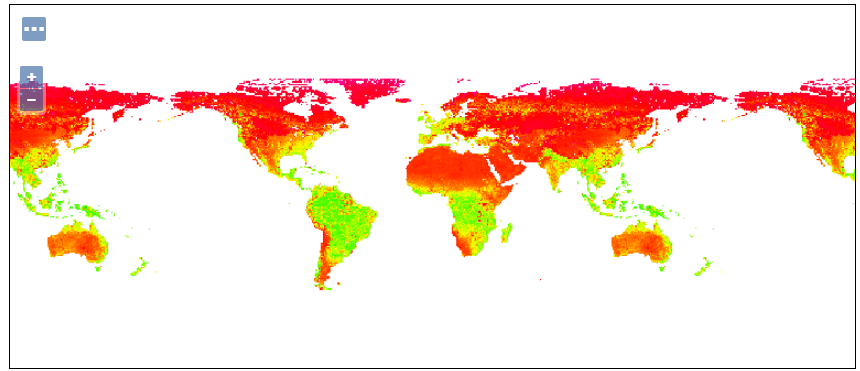

# ImageMosaic example with Modis COG datasets {: #tutorial_imagemosaic_cog_landsat8 }

## Introduction

This tutorial provide some hints on configuring an ImageMosaic on top of some MODIS Vegetation Index datasets available at [NASA EarthData](https://earthdata.nasa.gov/collaborate/cloud-optimized-geotiffs)

## ImageMosaic Configuration files

We need a couple of configuration files to have an ImageMosaic properly set. Configuration is based on these key points:

-   The ImageMosaic will be initially created empty without any data. Data will be harvested as a second step.
-   A Time dimension will be used, based on the date contained in the file's name.

More details on ImageMosaic configuration are available on the dedicated documentation section: [ImageMosaic configuration](../../data/raster/imagemosaic/configuration.md)

Based on the above key points, we can setup the following configuration files:

### indexer.properties:

This contains the main configuration to index the datasets composing the ImageMosaic.



Relevant parts:

-   Cog flag specifying that the ImageMosaic is a Mosaic of COG Datasets
-   PropertyCollectors, TimeAttribute and Schema are used to define the ImageMosaic index columns and how to populate them
-   CanBeEmpty allows to define an empty ImageMosaic. It will be populated afterwards
-   Name is the name for this mosaic

### timeregex.properties:

The previous indexer refers to a time dimension and the related time column in the index's schema that will get populated by extracting the time value from the filename (the 8 digits, representing YEAR, MONTH, DAY) using the regex specified in the timeregex.properties file. An example of sample file for this collection as stored on the S3 bucket is 2018.01.01.tif so the time regex will reflect that. Note the 3 groups of digits and the 'format' of the date.



### datastore.properties:

Due to the amount of available datasets, storing the ImageMosaic index on a DBMS is recommended, i.e. a PostGIS DB. See ``**`datastore.properties``** <../../data/raster/imagemosaic/configuration.rst#mosaic_datastore_properties>`_ section of the ImageMosaic documentation for more info. Make sure that a DB with the name reported in the datastore is available



Once the 3 files have been setup, create a zip archive with them and let's name it modisvi.zip. (Note that the files need to be in the root of the zip files, not into a subdirectory)

You are now ready to use REST calls to start the ImageMosaic creation.

### ImageMosaic REST operations

On the next steps we assume:

-   An existing GeoServer instance is running on port 8080 of localhost.
-   A workspace named "test" exists on that GeoServer.
-   REST credentials are user=admin password=geoserver.
-   A default aws region is defined on JAVA System Property, using the flag ``-Diio.https.aws.region=us-west-2``.

Make sure to update the incoming URLs accordingly, based on your actual installation.

**Create an empty ImageMosaic without configuring it**

!!! abstract "curl request"

        curl -u admin:geoserver -XPUT --write-out %{http_code} -H "Content-type:application/zip" --data-binary @modisvi.zip http://localhost:8080/geoserver/rest/workspaces/test/coveragestores/modisvi/file.imagemosaic?configure=none

*Response*

    201 OK

**Providing sample prototyping granules**

Next step is providing a prototype dataset for the coverage to be supported.

!!! abstract "curl request"

        curl -u admin:geoserver -XPOST -H "Content-type: text/plain" --write-out %{http_code} -d "https://modis-vi-nasa.s3-us-west-2.amazonaws.com/MOD13A1.006/2018.01.01.tif" "http://localhost:8080/geoserver/rest/workspaces/test/coveragestores/modisvi/remote.imagemosaic"

*Response*

    202 Accepted

**Initializing the store (Listing available coverages)**

Once a prototype has been provided we need to initialize the store by querying it for the available coverages.

!!! abstract "curl request"

        curl -v -u admin:geoserver -XGET http://localhost:8080/geoserver/rest/workspaces/test/coveragestores/modisvi/coverages.xml?list=all

*Response*

``` xml
<List>
  <coverageName>modisvi</coverageName>
</list>
```

**Configuring the coverage**

Once we get the list of available coverages, we need to configure a coverage by sending the config through REST.

!!! abstract "curl request"

        curl -v -u admin:geoserver -XPOST -H "Content-type: text/xml" -d @"coverage.xml" "http://localhost:8080/geoserver/rest/workspaces/test/coveragestores/modisvi/coverages"

where coverage.xml has this content:

``` xml
<coverage>
  <name>modisvi</name>
  <nativeName>modisvi</nativeName>
  <enabled>true</enabled>
  <metadata>
    <entry key="time">
      <dimensionInfo>
        <enabled>true</enabled>
        <presentation>LIST</presentation>
        <units>ISO8601</units>
        <defaultValue>
          <strategy>MAXIMUM</strategy>
        </defaultValue>
      </dimensionInfo>
    </entry>
  </metadata>
</coverage>
```

**Adding more granules**

Now that we have a coverageStore ready and a coverage layer configured we can start adding more granules.

!!! abstract "curl request"

        curl -u admin:geoserver -XPOST -H "Content-type: text/plain" --write-out %{http_code} -d "https://modis-vi-nasa.s3-us-west-2.amazonaws.com/MOD13A1.006/2018.01.17.tif" "http://localhost:8080/geoserver/rest/workspaces/test/coveragestores/modisvi/remote.imagemosaic"

**Setting Style**

That MODIS data has 2 bands representing (Normalized Difference Vegetation Index) (NDVI) and Enhanced Vegetation Index (EVI). Let's add this ndvi.sld style to apply a proper colormap to the NDVI band (copy this content to a file named ndvi.sld to be used by the next REST call):

``` xml
<StyledLayerDescriptor xmlns="http://www.opengis.net/sld" xmlns:sld="http://www.opengis.net/sld" xmlns:gml="http://www.opengis.net/gml" xmlns:ogc="http://www.opengis.net/ogc" version="1.0.0">
  <NamedLayer>
    <Name>Default Styler</Name>
    <UserStyle>
      <Name>ndvi</Name>
      <Title>ndvi</Title>
      <FeatureTypeStyle>
        <Name>name</Name>
        <Rule>
          <RasterSymbolizer>
            <ChannelSelection>
              <GrayChannel>
                <SourceChannelName>1</SourceChannelName>
              </GrayChannel>
            </ChannelSelection>
            <ColorMap>
              <ColorMapEntry color="#000000" quantity="-1"/>
              <ColorMapEntry color="#0000ff" quantity="-0.75"/>
              <ColorMapEntry color="#ff00ff" quantity="-0.25"/>
              <ColorMapEntry color="#ff0000" quantity="0"/>
              <ColorMapEntry color="#ffff00" quantity="0.5"/>
              <ColorMapEntry color="#00ff00" quantity="1"/>
            </ColorMap>
            <ContrastEnhancement/>
          </RasterSymbolizer>
        </Rule>
      </FeatureTypeStyle>
    </UserStyle>
  </NamedLayer>
</StyledLayerDescriptor>
```

!!! abstract "curl request to create the style"

        curl -v -u admin:geoserver -XPOST -H "Content-type: application/vnd.ogc.sld+xml" -d @ndvi.sld http://localhost:8080/geoserver/rest/styles

!!! abstract "curl request to set the style as default style of the layer"

    :
    
        curl -v -u admin:geoserver -XPUT -H "Content-type: text/xml" -d "<layer><defaultStyle><name>ndvi</name></defaultStyle></layer>" http://localhost:8080/geoserver/rest/layers/modisvi.xml

### Final preview

This is how a layer preview will looks like:


*NDVI COG dataset*
