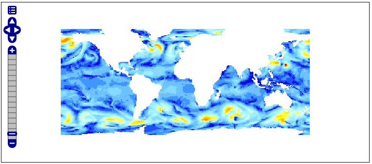
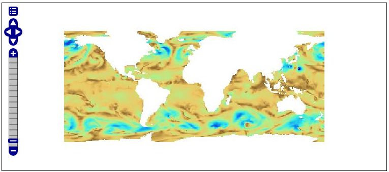
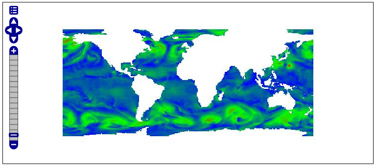

# Dynamic colormap generation

`ras:DynamicColorMap` is a **Raster-to-Raster** rendering transformation which applies a dynamic color map to a Raster on top of its statistics and a set of colors.

## Installing the dynamic colormap community extension

> 1.  Download the extension from the [nightly GeoServer community module builds](https://build.geoserver.org/geoserver/main/community-latest/).
>
>     ::: warning
>     ::: title
>     Warning
>     :::
>
>     Make sure to match the version of the extension to the version of the GeoServer instance!
>     :::
>
> 2.  Extract the contents of the archive into the `WEB-INF/lib` directory of the GeoServer installation.

## Usage

The following SLD invokes a Dynamic Color Map rendering transformation on a Coverage using colorMaps created on top of QuantumGIS SVG files. Dynamic Color Map Rendering Transformation takes data as first parameter (the coverage) and ColorRamp as second parameter which is a colorMap.

``` xml
<?xml version="1.0" encoding="ISO-8859-1"?>
<StyledLayerDescriptor version="1.0.0"
    xsi:schemaLocation="http://www.opengis.net/sld StyledLayerDescriptor.xsd"
    xmlns="http://www.opengis.net/sld"
    xmlns:ogc="http://www.opengis.net/ogc"
    xmlns:xlink="http://www.w3.org/1999/xlink"
    xmlns:xsi="http://www.w3.org/2001/XMLSchema-instance">
  <NamedLayer>
    <Name>DynamicColorMap</Name>
    <UserStyle>
      <Title>DynamicColorMap</Title>
      <Abstract>A DynamicColorMap</Abstract>
      <FeatureTypeStyle>
        <Transformation>
          <ogc:Function name="ras:DynamicColorMap">
            <ogc:Function name="parameter">
              <ogc:Literal>data</ogc:Literal>
            </ogc:Function>
            <ogc:Function name="parameter">
              <ogc:Literal>colorRamp</ogc:Literal>
              <ogc:Function name="colormap">
                <ogc:Literal>gmt\GMT_panoply</ogc:Literal>
                <ogc:Function name="gridCoverageStats"><ogc:Literal>minimum</ogc:Literal></ogc:Function>
                <ogc:Function name="gridCoverageStats"><ogc:Literal>maximum</ogc:Literal></ogc:Function>
              </ogc:Function>
            </ogc:Function>
          </ogc:Function>
        </Transformation>
        <Rule>
         <Name>rule1</Name>
         <RasterSymbolizer>
           <Opacity>1.0</Opacity>
         </RasterSymbolizer>
        </Rule>
      </FeatureTypeStyle>
    </UserStyle>
  </NamedLayer>
 </StyledLayerDescriptor>
```

Key aspects of the SLD are:

-   **Lines 14-15** define the rendering transformation, using the process `ras:DynamicColorMap`.

-   **Lines 16-18** supply the input data parameter, named `data` in this process.

-   **Lines 19-21** supply a value for the process's `colorRamp` parameter which specifies a colorMap.

-   **Lines 22-23** supply the value for the `colorMap` parameter. In this case it's a reference to a SVG containing a LinearGradient definition.

    A sample of QuantumGIS SVG LinearGradient subelement is:

    ``` xml
    ```

    <linearGradient id="GMT_panoply" gradientUnits="objectBoundingBox" spreadMethod="pad" x1="0%" x2="100%" y1="0%" y2="0%">

    :   <stop offset="0.00%" stop-color="rgb(4,14,216)" stop-opacity="1.0000"/> <stop offset="6.25%" stop-color="rgb(4,14,216)" stop-opacity="1.0000"/> <stop offset="6.25%" stop-color="rgb(32,80,255)" stop-opacity="1.0000"/> <stop offset="12.50%" stop-color="rgb(32,80,255)" stop-opacity="1.0000"/> <stop offset="12.50%" stop-color="rgb(65,150,255)" stop-opacity="1.0000"/> <stop offset="18.75%" stop-color="rgb(65,150,255)" stop-opacity="1.0000"/> <stop offset="18.75%" stop-color="rgb(109,193,255)" stop-opacity="1.0000"/> <stop offset="25.00%" stop-color="rgb(109,193,255)" stop-opacity="1.0000"/> <stop offset="25.00%" stop-color="rgb(134,217,255)" stop-opacity="1.0000"/> <stop offset="31.25%" stop-color="rgb(134,217,255)" stop-opacity="1.0000"/> <stop offset="31.25%" stop-color="rgb(156,238,255)" stop-opacity="1.0000"/> <stop offset="37.50%" stop-color="rgb(156,238,255)" stop-opacity="1.0000"/> <stop offset="37.50%" stop-color="rgb(175,245,255)" stop-opacity="1.0000"/> <stop offset="43.75%" stop-color="rgb(175,245,255)" stop-opacity="1.0000"/> <stop offset="43.75%" stop-color="rgb(206,255,255)" stop-opacity="1.0000"/> <stop offset="50.00%" stop-color="rgb(206,255,255)" stop-opacity="1.0000"/> <stop offset="50.00%" stop-color="rgb(255,254,71)" stop-opacity="1.0000"/> <stop offset="56.25%" stop-color="rgb(255,254,71)" stop-opacity="1.0000"/> <stop offset="56.25%" stop-color="rgb(255,235,0)" stop-opacity="1.0000"/> <stop offset="62.50%" stop-color="rgb(255,235,0)" stop-opacity="1.0000"/> <stop offset="62.50%" stop-color="rgb(255,196,0)" stop-opacity="1.0000"/> <stop offset="68.75%" stop-color="rgb(255,196,0)" stop-opacity="1.0000"/> <stop offset="68.75%" stop-color="rgb(255,144,0)" stop-opacity="1.0000"/> <stop offset="75.00%" stop-color="rgb(255,144,0)" stop-opacity="1.0000"/> <stop offset="75.00%" stop-color="rgb(255,72,0)" stop-opacity="1.0000"/> <stop offset="81.25%" stop-color="rgb(255,72,0)" stop-opacity="1.0000"/> <stop offset="81.25%" stop-color="rgb(255,0,0)" stop-opacity="1.0000"/> <stop offset="87.50%" stop-color="rgb(255,0,0)" stop-opacity="1.0000"/> <stop offset="87.50%" stop-color="rgb(213,0,0)" stop-opacity="1.0000"/> <stop offset="93.75%" stop-color="rgb(213,0,0)" stop-opacity="1.0000"/> <stop offset="93.75%" stop-color="rgb(158,0,0)" stop-opacity="1.0000"/> <stop offset="100.00%" stop-color="rgb(158,0,0)" stop-opacity="1.0000"/>

    </linearGradient>

    Which should be rendered like this:

    

-   **Lines 24** supplies the `minimum` parameter which is determined through a FilterFunction which takes the minimum value from the GridCoverage statistics,

-   **Lines 25** supplies the `maximum` parameter which is determined through a FilterFunction which takes the maximum value from the GridCoverage statistics,

    The resulting image may look like this (you may note the STEPs across colors due to color intervals):

    

    Using an GMT_drywet SVG, the resulting image may look like this, which uses a smoother color ramp:

    

Alternatively, a ColorMap may be specified this way:

``` xml
..........
           <ogc:Function name="ras:DynamicColorMap">
             <ogc:Function name="parameter">
               <ogc:Literal>data</ogc:Literal>
             </ogc:Function>
             <ogc:Function name="parameter">
               <ogc:Literal>colorRamp</ogc:Literal>
               <ogc:Function name="colormap">
                 <ogc:Literal>#0000FF;#00FF00;#FF0000</ogc:Literal>
                 <ogc:Function name="gridCoverageStats"><ogc:Literal>minimum</ogc:Literal></ogc:Function>
                 <ogc:Function name="gridCoverageStats"><ogc:Literal>maximum</ogc:Literal></ogc:Function>
               </ogc:Function>
             </ogc:Function>
           </ogc:Function>
...........
```

or

``` xml
..........
           <ogc:Function name="ras:DynamicColorMap">
             <ogc:Function name="parameter">
               <ogc:Literal>data</ogc:Literal>
             </ogc:Function>
             <ogc:Function name="parameter">
               <ogc:Literal>colorRamp</ogc:Literal>
               <ogc:Function name="colormap">
                 <ogc:Literal>rgb(0,0,255);rgb(0,255,0);rgb(255,0,0)</ogc:Literal>
                 <ogc:Function name="gridCoverageStats"><ogc:Literal>minimum</ogc:Literal></ogc:Function>
                 <ogc:Function name="gridCoverageStats"><ogc:Literal>maximum</ogc:Literal></ogc:Function>
               </ogc:Function>
             </ogc:Function>
           </ogc:Function>
...........
```

In these cases a RAMP will be used with the indicated colors.

> The resulting image may look like this:
>
> 
>
> ::: note
> ::: title
> Note
> :::
> :::

## DynamicColorMap Requirements

-   A preliminar *gdalinfo -stats* command needs to be run against the coverages in order to create the PAM Auxiliary file containing statistics and metadata.
-   In order to setup colorMap from QuantumGIS, you should have copied the QuantumGIS SVG resources folder from **apps/qgis/resources/cpt-city-XXXXX** within the **GEOSERVER_DATA_DIR** as a **styles/ramps** subfolder.
-   The underlying reader should support statistics retrieval by adding a PAMDataset object as a property of the returned coverage. For this reason the user should take care of setting the **CheckAuxiliaryMetadata** flag to *true* inside the *indexer.properties* or update the *.properties* file generated by GeoServer with that flag in case of already configured stores (You also need to reload the configuration in that case).
