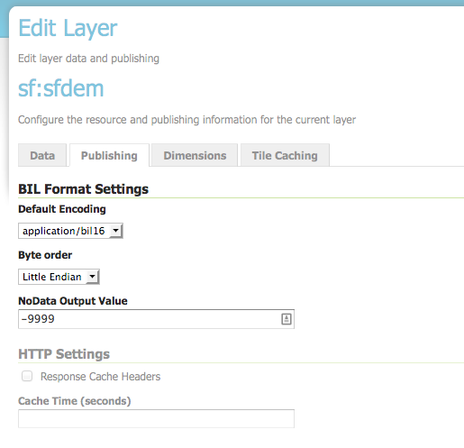

# DDS/BIL(World Wind Data Formats) Extension {: #community_dds }

This output module allows GeoServer to output imagery and terrain in formats understood by [NASA World Wind](http://worldwind.arc.nasa.gov/java/). The mime-types supported are:

> 1.  Direct Draw Surface (DDS) - image/dds. This format allows efficient loading of textures to the GPU and takes the task off the WorldWind client CPU in converting downloaded PNG, JPEG or TIFF tiles. The DDS compression is done using [DXT3](http://en.wikipedia.org/wiki/S3_Texture_Compression) with help from the worldwind library on server side.
> 2.  Binary Interleaved by Line(BIL) - image/bil. This is actually a very simple raw binary format produced using the [RAW Image Writer](http://www.java2s.com/Open-Source/Java-Document/6.0-JDK-Modules/Java-Advanced-Imaging/com/sun/media/imageioimpl/plugins/raw/RawImageWriterSpi.java.java-doc.htm). The supplied GridCoverage2D undergoes appropriate subsampling, reprojection and bit-depth conversion. The output can be requested as 16bit Int or 32bit Float.

## Installing the DDS/BIL extension

> 1.  Download the DDS/BIL extension from the [nightly GeoServer community module builds](https://build.geoserver.org/geoserver/main/community-latest/). A prebuilt version for GeoServer 2.0.x can be found on Jira - [GEOS-3586](https://osgeo-org.atlassian.net/browse/GEOS-3586).
>
>     ::: warning
>     ::: title
>     Warning
>     :::
>
>     Make sure to match the version of the extension to the version of the GeoServer instance!
>     :::
>
> 2.  Extract the contents of the archive into the `WEB-INF/lib` directory of the GeoServer installation.

## Checking if the extension is enabled

Once the extension is installed, the provided mime-types should appear in the layer preview dropbox as shown:

The mime-types will also be listed in the `GetCapabilities` document:

    <Format>image/bil</Format>
    <Format>image/dds</Format>

## Configuring the BIL format

For a client application to use a BIL layer, it must know the data encoding of the BIL file (e.g. 16-bit integer, 32-bit floating point, etc), the byte order of the data, and the value that indicates missing data. BIL files do not contain this metadata, so it may be necessary to configure the server to produce BIL files in the format that a client application expects.

The BIL output format can be configured for each layer in the Publishing tab of the layer configuration. The plugin supports the following options:

  ----------------------------------- ------------------------------------------------------------------------------------------------------------------------------------------------------------------------------------------------------------------------------------------------
  **Option**                          **Description**

  `Default encoding`                  The data encoding to use if the request does not specify an encoding. For example, application/bil does not specify the response encoding, while application/bil16 does specify an encoding. Default: use same encoding as layer source files.

  `Byte order`                        Byte order of the response. Default: network byte order (big endian).

  `No Data value`                     The value that indicates missing data. If this option is set, missing data values will be recoded to this value. Default: no data translation.
  ----------------------------------- ------------------------------------------------------------------------------------------------------------------------------------------------------------------------------------------------------------------------------------------------

For compatibility with the default behavior of NASA World Wind, use these settings:

-   Default encoding: application/bil16
-   Byte order: Little endian
-   No data: -9999

## Configuring World Wind to access Imagery/Terrain from GeoServer

Please refer to the [WorldWind Forums](http://forum.worldwindcentral.com/index.php) for instructions on how to setup World Wind to work with layers published via GeoServer. For image layers(DDS) the user need to create a [WMSTiledImageLayer](http://builds.worldwind.arc.nasa.gov/releases/docs/latest/api/gov/nasa/worldwind/wms/WMSTiledImageLayer.html) either via XML configuration or programmatically. For terrain layers (BIL) the equivalent class is [WMSBasicElevationModel](http://builds.worldwind.arc.nasa.gov/releases/docs/latest/api/gov/nasa/worldwind/terrain/WMSBasicElevationModel.html).
