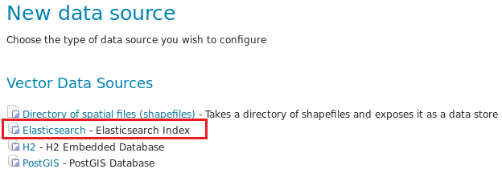
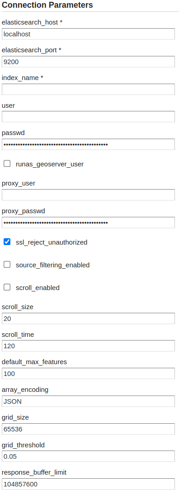
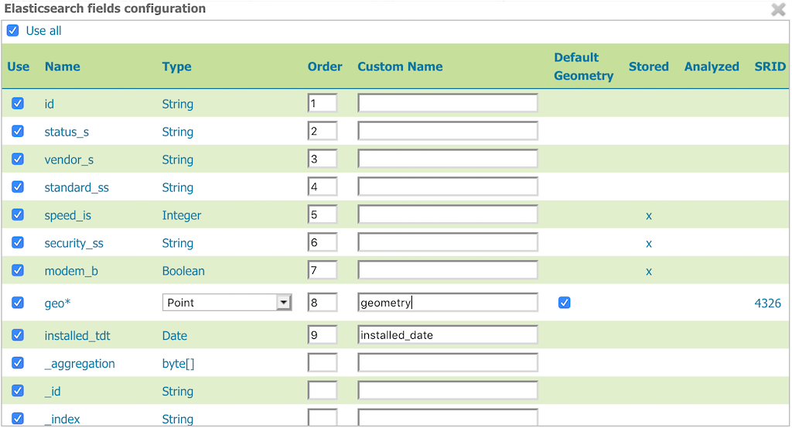
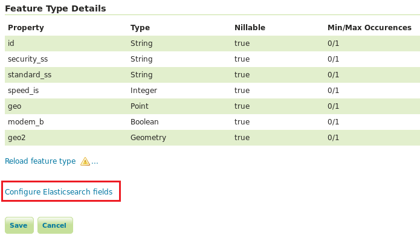
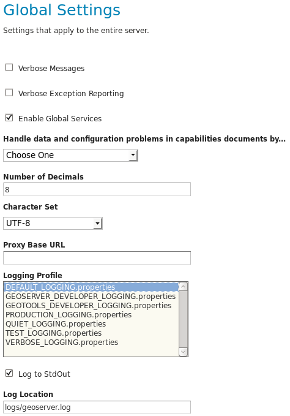

# Elasticsearch data store

Elasticsearch is a popular distributed search and analytics engine that enables complex search features in near real-time. Default field type mappings support string, numeric, boolean and date types and allow complex, hierarchical documents. Custom field type mappings can be defined for geospatial document fields. The `geo_point` type supports point geometries that can be specified through a coordinate string, geohash or coordinate array. The `geo_shape` type supports Point, LineString, Polygon, MultiPoint, MultiLineString, MultiPolygon and GeometryCollection GeoJSON types as well as envelope and circle types. Custom options allow configuration of the type and precision of the spatial index.

This data store allows features from an Elasticsearch index to be published through GeoServer. Both `geo_point` and `geo_shape` type mappings are supported. OGC filters are converted to Elasticsearch queries and can be combined with native Elasticsearch queries in WMS and WFS requests.

## Configuration

### Configuring data store {: #config_elasticsearch }

Once the Elasticsearch GeoServer extension is installed, `Elasticsearch index` will be an available vector data source format when creating a new data store.

  -------------------------------------------------------------
  {.align-middle}

  -------------------------------------------------------------

The Elasticsearch data store configuration panel includes connection parameters and search settings.

  ---------------------------------------------------------
  

  ---------------------------------------------------------

Available data store configuration parameters are summarized in the following table:

Parameter

:   Description

elasticsearch_host

:   Host (IP) for connecting to Elasticsearch. HTTP scheme and port can optionally be included to override the defaults. Multiple hosts can be provided. Examples:

        localhost
        localhost:9200
        http://localhost
        http://localhost:9200
        https://localhost:9200
        https://somehost.somedomain:9200,https://anotherhost.somedomain:9200

elasticsearch_port

:   Default HTTP port for connecting to Elasticsearch. Ignored if the hostname includes the port.

user

:   Elasticsearch user. Must have superuser privilege on index.

passwd

:   Elasticsearch user password

runas_geoserver_user

:   Whether to submit requests on behalf of the authenticated GeoServer user

proxy_user

:   Elasticsearch user for document queries. If not provided then admin user credentials are used for all requests.

proxy_passwd

:   Elasticsearch proxy user password

index_name

:   Index name or alias (wildcards supported)

reject_unauthorized

:   Whether to validate the server certificate during the SSL handshake for https connections

default_max_features

:   Default used when maxFeatures is unlimited

source_filtering_enabled

:   Whether to enable filtering of the _source field

scroll_enabled

:   Enable the Elasticsearch scan and scroll API

scroll_size

:   Number of documents per shard when using the scroll API

scroll_time

:   Search context timeout when using the scroll API

array_encoding

:   Array encoding strategy. Allowed values are `JSON` (keep arrays) and `CSV` (keep first array element).

grid_size

:   Hint for Geohash grid size (numRows*numCols)

grid_threshold

:   Geohash grid aggregation precision will be the minimum necessary so that actual_grid_size/grid_size > grid_threshold

response_buffer_limit

:   Maximum number of bytes to buffer in memory when reading responses from Elasticsearch

#### Configuring authentication

Basic authentication is supported through the `user` and `passwd` credential parameters. The provided user must have superuser privilege on the index to enable the mapping and alias requests performed during store initialization. Note that aliases must already be present on the Elasticsearch index. If you enter an alias which is not present, the plugin will not generate it for you. Optional `proxy_user` and `proxy_passwd` parameters can be used to specify an alternate user for document search (OGC service) requests. The proxy user can have restricted privileges on the index through document level security. If not provided the default user is used for all requests.

The `runas_geoserver_user` flag can be used to enable Elasticsearch requests to be submitted on behalf of the authenticated GeoServer user. When the run-as mechanism is configured the plugin will add the `es-security-runas-user` header with the authenticated GeoServer username. See [X-Pack run-as documentation](https://www.elastic.co/guide/en/x-pack/current/run-as-privilege.html) for more information. Note the run-as mechanism is applied only to document search requests.

For added security it is recommended to define `proxy_user` and `proxy_passwd` when using the run-as mechanism. The proxy user will be used when submitting requests on behalf of the GeoServer user and can have restricted privileges enabling access only to documents that all users can have access to. The plugin can optionally be deployed to require user credentials and proxy credentials and to force the use of `runas_geoserver_user` by setting the environment variable `org.geoserver.elasticsearch.xpack.force-runas`:

    $ export JAVA_OPTS="-Dorg.geoserver.elasticsearch.xpack.force-runas $JAVA_OPTS"

#### Configuring HTTPS/SSL

System properties are supported for SSL/TLS configuration:

    javax.net.ssl.trustStore
    javax.net.ssl.trustStorePassword
    javax.net.ssl.keyStore
    javax.net.ssl.keyStorePassword

See [HttpClientBuilder](https://hc.apache.org/httpcomponents-userClient-ga/httpclient/apidocs/org/apache/http/impl/userClient/HttpClientBuilder.html) documentation for available properties.

For example, use `javax.net.ssl.trustStore[Password]` to validate server certificate:

    $ export JAVA_OPTS="-Djavax.net.ssl.trustStore=/path/to/truststore.jks -Djavax.net.ssl.trustStorePassword=changeme $JAVA_OPTS "

### Configuring layer

The initial layer configuration panel for an Elasticsearch layer will include an additional pop-up showing a table of available fields.

  ------------------------------------------------------------------
  {.align-middle}

  ------------------------------------------------------------------

|                      |                                                                                                                                                                                                              |
|----------------------|--------------------------------------------------------------------------------------------------------------------------------------------------------------------------------------------------------------|
| Item                 | Description                                                                                                                                                                                                  |
| `Use All`            | Use all fields in the layer feature type                                                                                                                                                                     |
| `Use`                | Used to select the fields that will make up the layer feature type                                                                                                                                           |
| `Name`               | Name of the field                                                                                                                                                                                            |
| `Type`               | Type of the field, as derived from the Elasticsearch schema. For geometry types, you have the option to provide a more specific data type.                                                                   |
| `Order`              | Integer order values are used to sort fields, where fields with smaller order are returned first                                                                                                             |
| `Custom Name`        | Provides the option to give the field a custom name                                                                                                                                                          |
| `Default Geometry`   | Indicates if the geometry field is the default one. Useful if the documents contain more than one geometry field, as SLDs and spatial filters will hit the default geometry field unless otherwise specified |
| `Stored`             | Indicates whether the field is stored in the index                                                                                                                                                           |
| `Analyzed`           | Indicates whether the field is analyzed                                                                                                                                                                      |
| `SRID`               | Native spatial reference ID of the geometries. Currently only EPSG:4326 is supported.                                                                                                                        |
| `Valid Date Formats` | Possible valid date formats used for parsing field values and printing filter elements                                                                                                                       |
| `Refresh`            | If the field mappings or Elasticsearch schema has changed since this page was loaded, use this button to update the field configuration list.                                                                |

To return to the field table after it has been closed, click the "Configure Elasticsearch fields" button below the "Feature Type Details" panel on the layer configuration page.

  ----------------------------------------------------------------------------
  {.align-middle}

  ----------------------------------------------------------------------------

### Configuring logging

Logging is configurable through Log4j. The data store includes logging such as the query object being sent to Elasticsearch, which is logged at a lower level than may be enabled by default. To enable these logs, add the following lines to the GeoServer logging configuration file (see GeoServer Global Settings):

    log4j.category.org.geoserver.data.elasticsearch=DEBUG 
    log4j.category.org.geoserver.process.elasticsearch=DEBUG 

The logging configuration file will be in the `logs` subdirectory in the GeoServer data directory. Check GeoServer global settings for which logging profile is being used (e.g. `DEFAULT_LOGGING`, etc.).

  -------------------------------------------------------------
  {.align-middle}

  -------------------------------------------------------------

## Filtering

Filtering capabilities include OpenGIS simple comparisons, temporal comparisons, as well as other common filter comparisons. Elasticsearch natively supports numerous spatial filter operators, depending on the type:

-   `geo_shape` types natively support BBOX/Intersects, Within and Disjoint binary spatial operators
-   `geo_point` types natively support BBOX and Within binary spatial operators, as well as the DWithin and Beyond distance buffer operators

Requests involving spatial filter operators not natively supported by Elasticsearch will include an additional filtering operation on the results returned from the query, which may impact performance.

### Native queries

Native Elasticsearch queries can be applied in WMS feature requests through a custom rendering transformation, `vec:GeoHashGrid`, which translates aggregation response data into a raster for display. If supplied, the query is combined with the query derived from the request bbox, CQL or OGC filter using the AND logical binary operator.

### Examples

BBOX and CQL filter:

    http://localhost:8080/geoserver/test/wms?service=WMS&version=1.1.0&request=GetMap
         &layers=test:active&styles=&bbox=-1,-1,10,10&width=279&height=512
         &srs=EPSG:4326&format=application/openlayers&maxFeatures=1000
         &cql_filter=standard_ss='IEEE 802.11b'

BBOX and native query:

    http://localhost:8080/geoserver/test/wms?service=WMS&version=1.1.0&request=GetMap
         &layers=test:active&styles=NativeQueryStyle&bbox=-1,-1,10,10&width=279&height=512
         &srs=EPSG:4326&format=application/openlayers&maxFeatures=1000

    <StyledLayerDescriptor version="1.0.0"
       xsi:schemaLocation="http://www.opengis.net/sld StyledLayerDescriptor.xsd"
       xmlns="http://www.opengis.net/sld"
       xmlns:ogc="http://www.opengis.net/ogc"
       xmlns:xlink="http://www.w3.org/1999/xlink"
       xmlns:xsi="http://www.w3.org/2001/XMLSchema-instance">
     <NamedLayer>
       <Name>test</Name>
       <UserStyle>
         <Title>Test</Title>
         <Abstract>Test Native Query</Abstract>
         <FeatureTypeStyle>
           <Transformation>
             <ogc:Function name="vec:GeoHashGrid">
               <ogc:Function name="parameter">
                 <ogc:Literal>data</ogc:Literal>
               </ogc:Function>
               <ogc:Function name="parameter">
                 <ogc:Literal>queryDefinition</ogc:Literal>
                 <ogc:Literal>{"term":{"standard_ss":"IEEE 802.11b"}}
               </ogc:Function>
               <ogc:Function name="parameter">
                 <ogc:Literal>outputBBOX</ogc:Literal>
                 <ogc:Function name="env">
                   <ogc:Literal>wms_bbox</ogc:Literal>
                 </ogc:Function>
               </ogc:Function>
               <ogc:Function name="parameter">
                 <ogc:Literal>outputWidth</ogc:Literal>
                 <ogc:Function name="env">
                   <ogc:Literal>wms_width</ogc:Literal>
                 </ogc:Function>
               </ogc:Function>
               <ogc:Function name="parameter">
                 <ogc:Literal>outputHeight</ogc:Literal>
                 <ogc:Function name="env">
                   <ogc:Literal>wms_height</ogc:Literal>
                 </ogc:Function>
               </ogc:Function>
             </ogc:Function>
           </Transformation>
           <Rule>
            <RasterSymbolizer>
              <Geometry>
                <!-- Actual geometry property name in feature source -->
                <ogc:PropertyName>geo</ogc:PropertyName></Geometry>
              <Opacity>0.6</Opacity>
              <ColorMap type="ramp" >
                <ColorMapEntry color="#FFFFFF" quantity="0" label="nodata" opacity="0"/>
                <ColorMapEntry color="#2851CC" quantity="1" label="values"/>
                <ColorMapEntry color="#211F1F" quantity="2" label="label"/>
                <ColorMapEntry color="#EE0F0F" quantity="3" label="label"/>
                <ColorMapEntry color="#AAAAAA" quantity="4" label="label"/>
                <ColorMapEntry color="#6FEE4F" quantity="5" label="label"/>
                <ColorMapEntry color="#DDB02C" quantity="10" label="label"/>
              </ColorMap>
            </RasterSymbolizer>
           </Rule>
         </FeatureTypeStyle>
       </UserStyle>
     </NamedLayer>
    </StyledLayerDescriptor>

## Aggregations

Elasticsearch aggregations are supported through WMS requests by including the query in WMS requests through a custom rendering transformation, `vec:GeoHashGrid`, which translates aggregation response data into a raster for display.

Note that size is set to zero when an aggregation is supplied so only aggregation features are returned (e.g. maxFeatures is ignored and there will be no search hit results). See [FAQ](#faq) for common issues using aggregations.

### Geohash grid aggregations

Geohash grid aggregation support includes dynamic precision updating and a custom rendering transformation for visualization. Geohash grid aggregation precision is updated dynamically to approximate the specified `grid_size` based on current bbox extent and the additional `grid_threshold` parameter as described above.

Geohash grid aggregation visualization is supported in WMS requests through a custom rendering transformation, `vec:GeoHashGrid`, which translates aggregation response data into a raster for display. By default, raster values correspond to the aggregation bucket `doc_count`. The following shows an example GeoServer style that uses the GeoHashGrid rendering transformation:

    <StyledLayerDescriptor version="1.0.0"
        xsi:schemaLocation="http://www.opengis.net/sld StyledLayerDescriptor.xsd"
        xmlns="http://www.opengis.net/sld"
        xmlns:ogc="http://www.opengis.net/ogc"
        xmlns:xlink="http://www.w3.org/1999/xlink"
        xmlns:xsi="http://www.w3.org/2001/XMLSchema-instance">
      <NamedLayer>
        <Name>GeoHashGrid</Name>
        <UserStyle>
          <Title>GeoHashGrid</Title>
          <Abstract>GeoHashGrid aggregation</Abstract>
          <FeatureTypeStyle>
            <Transformation>
              <ogc:Function name="vec:GeoHashGrid">
                <ogc:Function name="parameter">
                  <ogc:Literal>data</ogc:Literal>
                </ogc:Function>
                <ogc:Function name="parameter">
                  <ogc:Literal>gridStrategy</ogc:Literal>
                  <ogc:Literal>Basic</ogc:Literal>
                </ogc:Function>
                <ogc:Function name="parameter">
                  <ogc:Literal>outputBBOX</ogc:Literal>
                  <ogc:Function name="env">
                    <ogc:Literal>wms_bbox</ogc:Literal>
                  </ogc:Function>
                </ogc:Function>
                <ogc:Function name="parameter">
                  <ogc:Literal>outputWidth</ogc:Literal>
                  <ogc:Function name="env">
                    <ogc:Literal>wms_width</ogc:Literal>
                  </ogc:Function>
                </ogc:Function>
                <ogc:Function name="parameter">
                  <ogc:Literal>outputHeight</ogc:Literal>
                  <ogc:Function name="env">
                    <ogc:Literal>wms_height</ogc:Literal>
                  </ogc:Function>
                </ogc:Function>
              </ogc:Function>
            </Transformation>
            <Rule>
             <RasterSymbolizer>
               <Geometry>
                 <!-- Actual geometry property name in feature source -->
                 <ogc:PropertyName>geo</ogc:PropertyName></Geometry>
               <Opacity>0.6</Opacity>
               <ColorMap type="ramp" >
                 <ColorMapEntry color="#FFFFFF" quantity="0" label="nodata" opacity="0"/>
                 <ColorMapEntry color="#2851CC" quantity="1" label="values"/>
                 <ColorMapEntry color="#211F1F" quantity="2" label="label"/>
                 <ColorMapEntry color="#EE0F0F" quantity="3" label="label"/>
                 <ColorMapEntry color="#AAAAAA" quantity="4" label="label"/>
                 <ColorMapEntry color="#6FEE4F" quantity="5" label="label"/>
                 <ColorMapEntry color="#DDB02C" quantity="10" label="label"/>
               </ColorMap>
             </RasterSymbolizer>
            </Rule>
          </FeatureTypeStyle>
        </UserStyle>
      </NamedLayer>
     </StyledLayerDescriptor>

Example WMS request including Geohash grid aggregation with the above custom style:

    http://localhost:8080/geoserver/test/wms?service=WMS&version=1.1.0&request=GetMap
         &layers=test:active&styles=geohashgrid&bbox=0.0,0.0,24.0,44.0&srs=EPSG:4326
         &width=418&height=768&format=application/openlayers

The Elasticsearch aggregation definition can be computed automatically, or provided as an explicit parameter, for example:

    <ogc:Function name="parameter">
      <ogc:Literal>aggregationDefinition</ogc:Literal>
      <ogc:Literal>{"agg": {"geohash_grid": {"field": "_ogr_geometry_.coordinates", "precision": 3}}}</ogc:Literal>
    </ogc:Function>

The store may update the precision to a smaller value, if it finds it goes beyond the aggregation limits setup in its configuration, see `grid_size` and `grid_threshold` above.

### Grid Strategy

`gridStrategy`: Parameter to identify the `org.geoserver.process.elasticsearch.GeoHashGrid` implementation that will be used to convert each geohashgrid bucket into a raster value (number).

|        |              |                  |                                                       |
|--------|--------------|------------------|-------------------------------------------------------|
| Name   | gridStrategy | gridStrategyArgs | Description                                           |
| Basic  | `basic`      | no               | Raster value is geohashgrid bucket `doc_count`.       |
| Metric | `metric`     | yes              | Raster value is geohashgrid bucket metric value.      |
| Nested | `nested_agg` | yes              | Extract raster value from nested aggregation results. |

`gridStrategyArgs`: (Optional) Parameter used to specify an optional argument list for the grid strategy.

`emptyCellValue`: (Optional) Parameter used to specify the value for empty grid cells. By default, empty grid cells are set to `0`.

`scaleMin`, `scaleMax`: (Optional) Parameters used to specify a scale applied to all raster values. Each tile request is scaled according to the min and max values for that tile. It is best to use a non-tiled layer with this parameter to avoid confusing results.

`useLog`: (Optional) Flag indicating whether to apply logarithm to raster values (applied prior to scaling, if applicable)

#### Basic

Raster value is geohashgrid bucket `doc_count`.

Example Aggregation:

    {
      "agg": {
        "geohash_grid": {
          "field": "geo"
        }
      }
    }

Example bucket:

    {
      "key" : "xv",
      "doc_count" : 1
    }

Extracted raster value: `1`

#### Metric

Raster value is geohashgrid bucket metric value.

|                |               |                                                                                                    |
|----------------|---------------|----------------------------------------------------------------------------------------------------|
| Argument Index | Default Value | Description                                                                                        |
| 0              | `metric`      | Key used to pluck metric object from top level bucket. Empty string results in plucking doc_count. |
| 1              | `value`       | Key used to pluck the value from the metric object.                                                |

Example Aggregation:

    {
      "agg": {
        "geohash_grid": {
          "field": "geo"
        },
        "aggs": {
          "metric": {
            "max": {
              "field": "magnitude"
            }
          }
        }
      }
    }

Example bucket:

    {
      "key" : "xv",
      "doc_count" : 1,
      "metric" : {
        "value" : 4.9
      }
    }

Extracted raster value: `4.9`

#### Nested

Extract raster value from nested aggregation results.

Argument Index

:   Default Value

    Description

0

:   `nested`

    Key used to pluck nested aggregation results from the geogrid bucket.

1

:   empty string

    Key used to pluck metric object from each nested aggregation bucket. Empty string results in plucking doc_count.

2

:   `value`

    Key used to pluck the value from the metric object.

3

:   `largest`

    `largest` | `smallest`. Strategy used to select a bucket from the nested aggregation buckets. The grid cell raster value is extracted from the selected bucket.

4

:   `value`

    `key` | `value`. Strategy used to extract the raster value from the selected bucket. `value`: Raster value is the selected bucket's metric value. `key`: Raster value is the selected bucket's key.

5

:   null

    (Optional) Map used to convert String keys into numeric values. Use the format `key1:1;key2:2`. Only utilized when raster strategy is `key`.

Example Aggregation:

    {
      "agg": {
        "geohash_grid": {
          "field": "geo"
        },
        "aggs": {
          "nested": {
            "histogram": {
              "field": "magnitude",
              "interval": 1,
              "min_doc_count": 1
            }
          }
        }
      }
    }

Example Parameters:

    <ogc:Function name="parameter">
      <ogc:Literal>gridStrategyArgs</ogc:Literal>
      <ogc:Literal>nested</ogc:Literal>
      <ogc:Literal></ogc:Literal>
      <ogc:Literal></ogc:Literal>
      <ogc:Literal>largest</ogc:Literal>
      <ogc:Literal>key</ogc:Literal>
    </ogc:Function>

Example bucket:

    {
      "key" : "xv",
      "doc_count" : 1729,
      "nested" : {
        "buckets" : [
          {
            "key" : 2.0,
            "doc_count" : 5
          },
          {
            "key" : 3.0,
            "doc_count" : 107
          },
          {
            "key" : 4.0,
            "doc_count" : 1506
          },
          {
            "key" : 5.0,
            "doc_count" : 100
          },
          {
            "key" : 6.0,
            "doc_count" : 11
          }
        ]
      }
    }

Extracted raster value: `4.0`

### Implementing a custom Grid Strategy

By default the raster values computed in the geohash grid aggregation rendering transformation correspond to the top level `doc_count`. Adding an additional strategy for computing the raster values from bucket data currently requires source code updates to the `gt-elasticsearch-process` module as described below.

First create a custom implementation of `org.geoserver.process.elasticsearch.GeoHashGrid` and provide an implementation of the `computeCellValue` method, which takes the raw bucket data and returns the raster value. For example, the default basic implementation simply returns the doc_count:

    public class BasicGeoHashGrid extends GeoHashGrid {
        @Override
        public Number computeCellValue(Map<String,Object> bucket) {
            return (Number) bucket.get("doc_count");
        }
    }

Then update `org.geoserver.process.elasticsearch.GeoHashGridProcess` and add a new entry to the Strategy enum to point to the custom implementation.

After deploying the customized plugin, the new geohash grid computer can be used by updating the `gridStrategy` parameter in the GeoServer style:

    <StyledLayerDescriptor version="1.0.0"
        ...
            <Transformation>
              <ogc:Function name="vec:GeoHashGrid">
                ...
                <ogc:Function name="parameter">
                  <ogc:Literal>gridStrategy</ogc:Literal>
                  <ogc:Literal>NewName</ogc:Literal>
                </ogc:Function>

## FAQ {: #FAQ }

-   By default, arrays are returned directly, which is suitable for many output formats including GeoJSON. When using CSV output format with layers containing arrays it's necessary to set the `array_encoding` store parameter to `CSV`. Note however when using the `CSV` array encoding that only the first value will be returned.
-   When updating from pre-2.11.0 versions of the plugin it may be necessary to reload older layers to enable full aggregation and time support. Missing aggregation data or errors of the form `IllegalArgumentException: Illegal pattern component` indicate a layer reload is necessary. In this case the layer must be removed and re-added to GeoServer (e.g. a feature type reload will not be sufficient).
-   Commas in the native query and aggregation body must be escaped with a backslash. Additionally, body may need to be URL encoded.
-   Geometry property name in the aggregation SLD RasterSymbolizer must be a valid geometry property in the layer
-   `PropertyIsEqualTo` maps to an Elasticsearch term query, which will return documents that contain the supplied term. When searching on an analyzed string field, ensure that the search values are consistent with the analyzer used in the index. For example, values may need to be lowercase when querying fields analyzed with the default analyzer. See the Elasticsearch term query documentation for more information.
-   `PropertyIsLike` maps to either a query string query or a regexp query, depending on whether the field is analyzed or not. Reserved characters should be escaped as applicable. Note case sensitive and insensitive searches may not be supported for analyzed and not analyzed fields, respectively. See Elasticsearch query string and regexp query documentation for more information.
-   Date conversions are handled using the valid date formats from the associated type mapping, or `date_optional_time` if not found. Note that UTC timezone is used for both parsing and printing of dates.
-   Filtering on Elasticsearch `object` types is supported. By default, field names will include the full path to the field (e.g. "parent.child.field_name"), but this can be changed in the GeoServer layer configuration.
    -   When referencing fields with path elements using `cql_filter`, it may be necessary to quote the name (e.g. `cql_filter="parent.child.field_name"='value'`)
-   Filtering on Elasticsearch `nested` types is supported only for non-geospatial fields.
-   Circle geometries are approximate and may not be fully consistent with the implementation in Elasticsearch, especially at extreme latitudes (see [#86](https://github.com/ngageoint/elasticgeo/issues/86)).
-   The `joda-shaded` module may need to be excluded when importing the project into Eclipse. Otherwise modules may have build errors of the form `DateTimeFormatter cannot be resolved to a type`.
-   When updating from Elasticgeo 2.16.0, note that the `Short Names` feature has been removed as it is not compatible with Elasticsearch 2.0 and beyond. Previous fields which used the short names will be reverted to the full name, but you can still use aliasing to accomplish the same effect.
