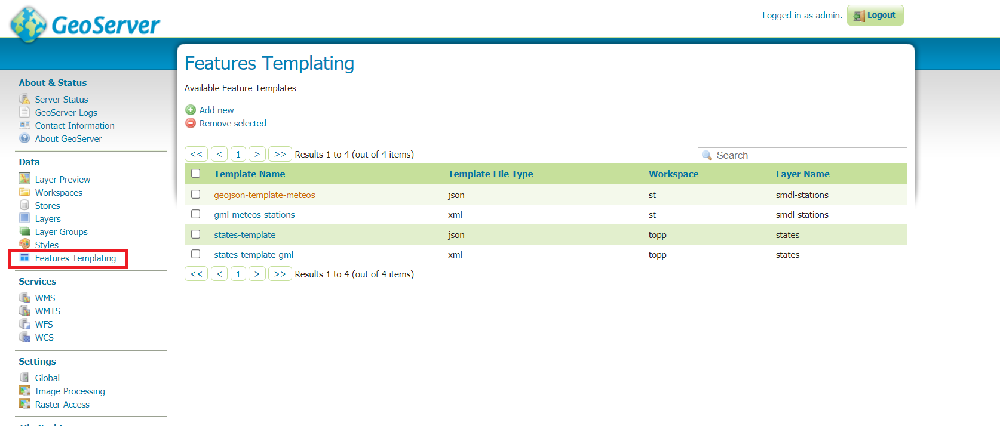
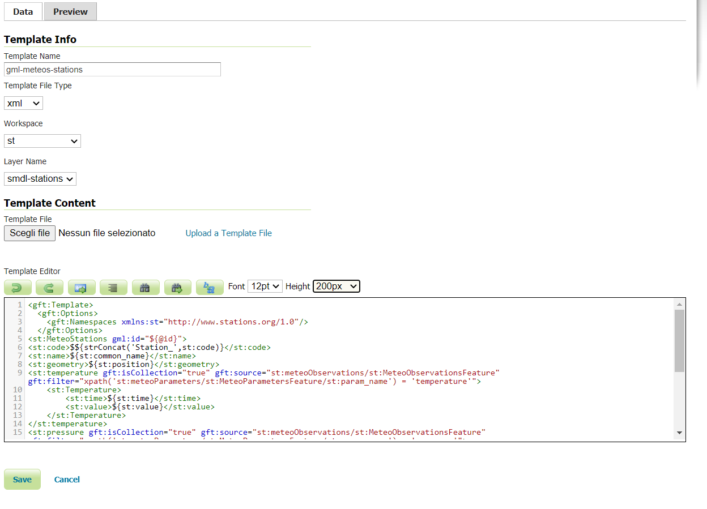
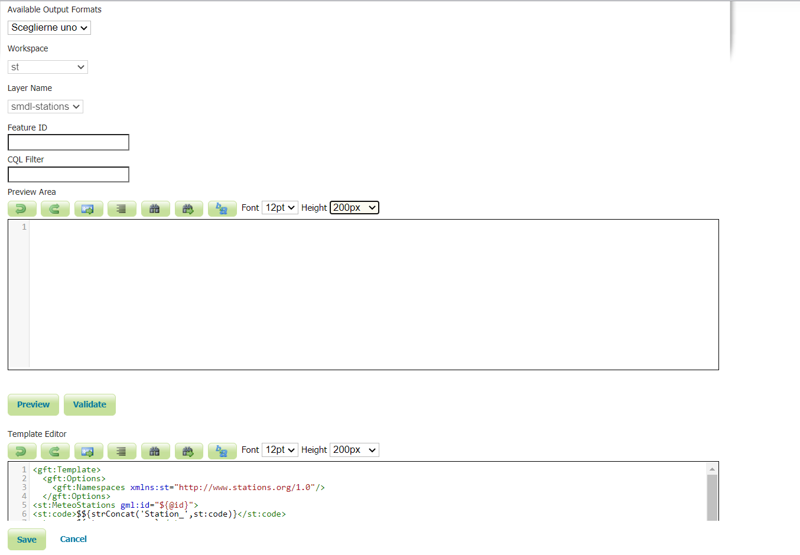
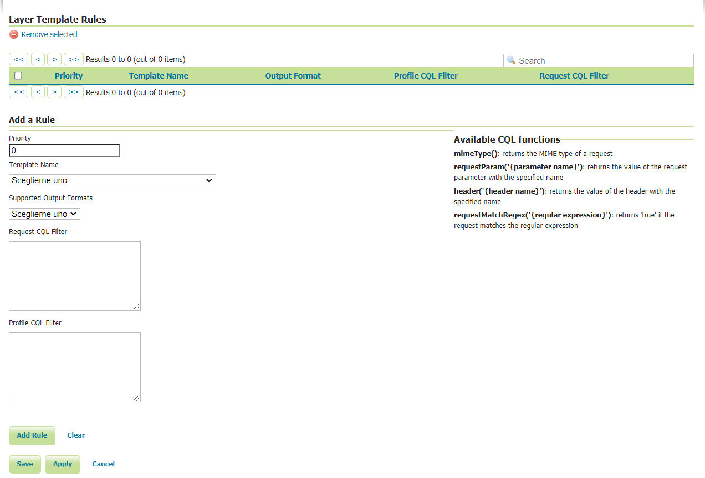

# Template Configuration

This part of the documentation explains how to add new templates to GeoServer and how to define rules from the layer configuration page for when a template should be applied.

## Add Features Templates to GeoServer

Once the plug-in is installed, the left panel of the GeoServer UI will show a new option `Feature Templating` under the `Data` section. Clicking on that option will open a table with the available templates.

Clicking on the **add New** button will open the configuration page.

In the first tab the user can specify the following values:

-   the **Template Name**. This name will be used for the template file name when saved in the data directory.

-   the **Template File Type** (file extension) of the template, by selecting one among those available.

-   the **Workspace** if the user wants to limit the usage of the template to the vector layers available in a specific workspace.

-   -   the **Layer Name** if the user wants to limit the usage of the template to only a specific vector layer. Selecting a **Layer Name** will not cause the template to be applied to that Layer. This option is intended to make the template usable only by the selected Layer. In order to apply a template content negotiation rules need to be configured on a per layer basis (see section below).

The **Workspace** and **Layer Name** values, if specified, will also affect where the template will be saved:

-   if neither is specified the template will be saved inside the `features-templating` directory.
-   if a **Workspace** is specified the template will be saved in that workspace folder.
-   if a **Layer Name** is specified the template will be saved in that layer folder.

The **Template Content** section is where the template is actually defined.

-   The template can be uploaded from a file, and in that case the **Template Name** and **Template File Type** fields are automatically populated from the file.
-   Otherwise the template can be written from scratch into the template editor.

By clicking on the **Preview** tab the user can specify parameters to test the template and preview the result. The preview will only return a single feature.

!!! warning

    When previewing a template the template will be saved/updated in the data directory. This is due the fact that the preview works by issuing a WFS request. This implies that the previous state is lost, but also that any modification is immediately visible to a user that might be accessing the layer.

-   The user must specify one value among the **Available Output Formats**
-   The user must specify values among those available for the **Workspace** and **Layer Name** fields.
-   If the user specified a **Workspace** for the template in the **Data** tab the preview **Workspace** will be automatically set from that workspace.
-   If the user specified a **Layer Name** for the template in the **Data** tab the preview **Layer Name** will be automatically set from that layer.
-   The user can specify a **Feature ID** to obtain a preview for the specified feature.
-   The user can specify a **CQL Filter** to obtain a preview for a feature matching the filter.

The **Validate** button acts differently according to the output format:

-   In the GML case, it will trigger a schema validation based on the Schema Location specified in the template.
-   In the JSON-LD case, it will perform a JSON-LD `@context` validation.
-   In the GeoJSON case no validation will occur.

## Add Templates Rules to a Layer

To inform GeoServer when to apply a template, the user needs to specify the rules on a per layer basis. The most basic rule is one that binds a template to a specific output format. **Request CQL Functions** allow specifying more advanced rules.

When the plug-in is installed a new tab will be available in the Layer configuration page, allowing for the definition of Template rules.

Once the form is filled the user needs to press the **Add** button to add the rule to the rules table. The rules will be then persisted to the layer configuration only when the **Save** button is pressed.

The following values can be specified:

-   the **Priority** needed to inform GeoServer which rule should be applied if more than one rule matches the GetFeature request.
-   the **Template Name** that indicates which template should be applied. If the template has a global scope the dropdown will present it with the template name value only. If a Workspace has been defined at template configuration time, the format will be {workspace name}:{template name}. If a Layer Name has been specified at template configuration time, the format will be {workspace name}:{layer name}:{template name}.
-   the **Supported Output Formats** dropdown shows the output formats for which a template can be invoked. The user can choose one to indicate which output format the selected template should be applied to. If the GML value is selected, the template will be applied to all GML version output formats. If different GML templates should be applied for different GML versions, it is possible to define a condition on the MIME Type using the mimeType() function.
-   the **Request CQL filter** area allows defining a generic CQL filter to evaluate against the request to determine if the template should be t. The available request functions to be used are listed on the right side of the form.
-   the **Profile CQL Filter** allows defining a CQL filter allowing a content negotiation to be done per profile. The available request functions to be used are listed on the right side of the form. There is several approaches for content negotiations per profile, for example one of them is the [W3C recommended approach](https://www.w3.org/TR/dx-prof-conneg/) where the profile is provided as an HTTP header. This will translate in a CQL filter similar to this one `header('Accept-Profile')='http://my-profile/geo+json'`.

An example CQL filter might be the following:

-   `requestParam('myParameter')`` = 'use this template'
-   `mimeType()` = 'application/geo+json'
-   `requestMatchRegex('^.*matchedPart.*$')` = true
-   `header('testHeader')` = 'myHeaderValue'

Every rule must define either a value from the **Supported Output Formats** dropdown or a **Request CQL filter** with a filter on the mimeType() value, or both.

Once rules are defined, if an incoming GetFeature request is matched the template corresponding to the matched rule will be applied to the output.

## Data Directory configuration

A features template can be configured directly from the GeoServer data dir without any UI usage. In this case the template needs to be placed in the Feature Type directory. When configuring templates in this way only one feature template per Feature Type is supported and the name is fixed for each output format as shown in the list below:

-   GML 2 = gml2-template.xml
-   GML 3.1 = gml31-template.xml
-   GML 3.2 = gml32-template.xml
-   JSON-LD = json-ld-template.json
-   GEOJSON = geojson-template.json
-   HTML = html-template.xhtml
