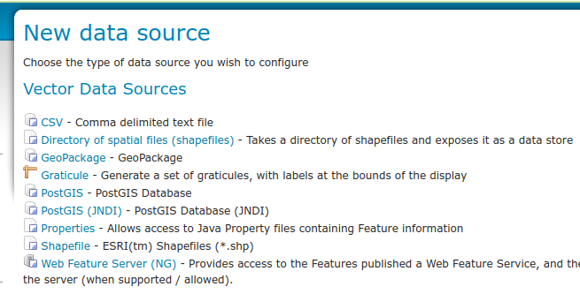

# Graticule Extension

This module allows GeoServer to add graticules or grids to a WMS (or to allow them to be downloaded as WFS). The extension includes a vector process that can transform the grid lines to label points based on a bounding box, to allow adding labels in WMS images (this reqiures the WPS module to be present).

## Installing the graticule extension

> 1.  Download the graticule extension from the [nightly GeoServer community module builds](https://build.geoserver.org/geoserver/main/community-latest/).
>
>     ::: warning
>     ::: title
>     Warning
>     :::
>
>     Make sure to match the version of the extension to the version of the GeoServer instance!
>     :::
>
> 2.  Extract the contents of the archive into the `WEB-INF/lib` directory of the GeoServer installation.

## Checking if the extension is enabled

Once the extension is installed, the new graticule store should show up in the `New data source` page:



## Creating a Graticule Data Source

A new graticule store is created by providing a name, optional description and the a bounding box (which can be calculated automatically from the CRS), a Coordinate Reference System and a series of steps separated by commas.

The bounding box will set the limits of the grid when the user has zoomed out to small scales, while the CRS will be used to determine the values of the grid lines. The list of steps will be used to provide a more detailed grid as the user zooms in to larger scale maps. Each step is used to define a level of grid with a gap of *step* units between the gaps.


## Creating a new style for graticule

Displaying a graticule in a sensible way will require creating a custom style to control the line appearance, the labels, and the visualization hierarchy if multiple levels of graticule are used. This can lead to complex styles, which can be tamed by leveraging the available attributes along with filter functions.

Let's assume one has a graticule with 5 levels of lines at different resolutions (e.g., 1, 5, 10, 20 and 30 degrees spacing), and wants to display them as follows:

> -   level 0: scale denominator lower than 1M
> -   level 1: scale denominator between 1M and 20M
> -   level 2: scale denominator between 20M and 100M
> -   level 3: scale denominator between 10M and 400M
> -   level 4: scale denominator higher than 400M

The following style would be used, using a single Rule, by leveraging the `Categorize` function along with the `wms_scale_denominator` environment variable ([Variable substitution in SLD](../../styling/sld/extensions/substitution.md)):

``` xml
<?xml version="1.0" encoding="ISO-8859-1"?>
<StyledLayerDescriptor version="1.0.0"
                       xsi:schemaLocation="http://www.opengis.net/sld http://schemas.opengis.net/sld/1.0.0/StyledLayerDescriptor.xsd"
                       xmlns="http://www.opengis.net/sld" xmlns:ogc="http://www.opengis.net/ogc"
                       xmlns:xlink="http://www.w3.org/1999/xlink" xmlns:xsi="http://www.w3.org/2001/XMLSchema-instance">

  <NamedLayer>
    <Name>graticule</Name>
    <UserStyle>
      <FeatureTypeStyle>
        <Name>name</Name>
        <Rule>
          <ogc:Filter>
            <ogc:PropertyIsEqualTo>
              <ogc:PropertyName>level</ogc:PropertyName>
              <ogc:Function name="Categorize">
                <ogc:Function name="env"><ogc:Literal>wms_scale_denominator</ogc:Literal></ogc:Function>
                <ogc:Literal>0</ogc:Literal>
                <ogc:Literal>1000000</ogc:Literal>
                <ogc:Literal>1</ogc:Literal>
                <ogc:Literal>20000000</ogc:Literal>
                <ogc:Literal>2</ogc:Literal>
                <ogc:Literal>100000000</ogc:Literal>
                <ogc:Literal>3</ogc:Literal>
                <ogc:Literal>400000000</ogc:Literal>
                <ogc:Literal>4</ogc:Literal>
              </ogc:Function>
            </ogc:PropertyIsEqualTo>
          </ogc:Filter>
          <LineSymbolizer>
            <Stroke>
              <CssParameter name="stroke">#666666</CssParameter>
              <CssParameter name="stroke-dasharray">2.0 2.0</CssParameter>
            </Stroke>
          </LineSymbolizer>
        </Rule>        
      </FeatureTypeStyle>

    </UserStyle>
  </NamedLayer>
</StyledLayerDescriptor>
```

If some important lines are meant to be displayed with solid line rather than dashed, it's possible to use a function to keep the style compact, rather than duplicating the whole rule. The following example makes the equator and the prime meridian solid lines, while keeping the rest dashed:

``` xml
<LineSymbolizer>
  <Stroke>
    <CssParameter name="stroke">#666666</CssParameter>
    <CssParameter name="stroke-dasharray">
      <ogc:Function name="if_then_else">
        <ogc:Function name="equalTo">
          <ogc:PropertyName>value</ogc:PropertyName>
          <ogc:Literal>0</ogc:Literal>
        </ogc:Function>  
        <ogc:Literal>0</ogc:Literal>
        <ogc:Literal>3 3</ogc:Literal>
      </ogc:Function>
    </CssParameter>
  </Stroke>
</LineSymbolizer>
```

Finally, labelling can be a tricky job. A rendering transform is provided to help with this, `vec:GraticuleLabelPoint`, which will take the grid lines and return a point at ends of each gridline, preserving the attributes of the original line, but adding extra ones that can be used to simplify the labelling process:

-   "top" indicates if a label is at the top of the line (true) or at the bottom (false) of a vertical line
-   "left" indicates if a label is at the left of the line (true) or at the right (false) of a horizontal line
-   "anchorX", "anchorY" provides a suitable value to anchor the label inside the grid
-   "offsetX" and "offsetY" provides a suitable value to offset the label from the anchor point, again to keep labels inside the grid

The process itself takes the following parameters:

-   "grid" is the grid lines being processed (the graticule layer).
-   "boundingBox" is the bounding box of the map being rendered, which is used to clip lines and to calculate the label points. This parameter is optional, if missing the labels will be generated at the end of the graticule lines no matter what the display area is. For un-tiled maps, the usage of "boundingBox" helps having the labels as a reference in every map, while for tiled maps it's better to omit it, or the labels will be repeated at the border of every (meta)tile.
-   "offset" is the offset of the label from the grid line (used to compute the values of "offsetX" and "offsetY"), which can be provided using the current request bounding box using the `wms_bbox` environment variable ([Variable substitution in SLD](../../styling/sld/extensions/substitution.md)).
-   "positions" indicates which groups of labels should be generated, and can be one of "top", "bottom", "left", "right" or "topleft", "topright", "bottomleft", "bottomright", or the default value "both" which generates labels on all four sides of the map.

Leveraging this process, the labels can be generated using the following style:

``` xml
<FeatureTypeStyle>
  <Name>label</Name>
  <Transformation>
    <ogc:Function name="vec:GraticuleLabelPoint">
      <ogc:Function name="parameter">
        <ogc:Literal>grid</ogc:Literal>
      </ogc:Function>
      <ogc:Function name="parameter">
        <ogc:Literal>boundingBox</ogc:Literal>
        <ogc:Function name="env">
          <ogc:Literal>wms_bbox</ogc:Literal>
        </ogc:Function>
      </ogc:Function>
      <ogc:Function name="parameter">
        <ogc:Literal>offset</ogc:Literal>
        <ogc:Literal>4</ogc:Literal>
      </ogc:Function>
    </ogc:Function>
  </Transformation>
  <Rule>
    <TextSymbolizer>
      <Label>
        <ogc:PropertyName>label</ogc:PropertyName>
      </Label>
      <Font>
        <CssParameter name="font-family">Noto Sans</CssParameter>
        <CssParameter name="font-size">12</CssParameter>
        <CssParameter name="font-style">normal</CssParameter>
      </Font>
      <LabelPlacement>
        <PointPlacement>
          <AnchorPoint>
            <AnchorPointX><ogc:PropertyName>anchorX</ogc:PropertyName></AnchorPointX>
            <AnchorPointY><ogc:PropertyName>anchorY</ogc:PropertyName></AnchorPointY>
          </AnchorPoint>
          <Displacement>
            <DisplacementX><ogc:PropertyName>offsetX</ogc:PropertyName></DisplacementX>
            <DisplacementY><ogc:PropertyName>offsetY</ogc:PropertyName></DisplacementY>
          </Displacement>
        </PointPlacement>
      </LabelPlacement>
      <Halo>
        <Radius>1</Radius>
        <Fill>
          <CssParameter name="fill">#FFFFFF</CssParameter>
        </Fill>
      </Halo>
      <Fill>
        <CssParameter name="fill">#000000</CssParameter>
      </Fill>
      <VendorOption name="partials">true</VendorOption>
    </TextSymbolizer>
  </Rule>      
</FeatureTypeStyle>
```
