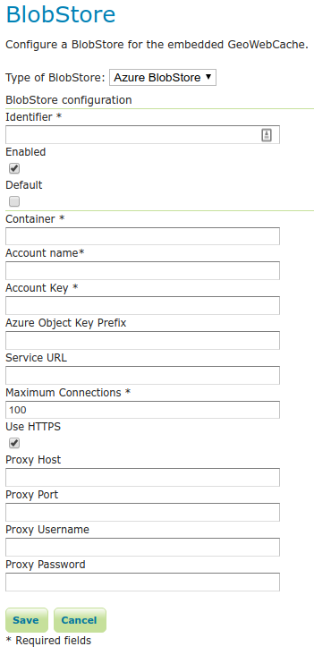

# GWC Azure BlobStore plugin {: #community_azure_tilecache }

This plugin supports the use of the [Azure BLOB storage](https://azure.microsoft.com/services/storage/blobs/). as storage medium for [GeoWebCache settings](../../geowebcache/webadmin/index.md).

## Installing the Azure BlobStore plugin

> 1.  Download the extension from the [nightly GeoServer community module builds](https://build.geoserver.org/geoserver/main/community-latest/).
>
>     ::: warning
>     ::: title
>     Warning
>     :::
>
>     Make sure to match the version of the extension to the version of the GeoServer instance!
>     :::
>
> 2.  Extract the contents of the archive into the `WEB-INF/lib` directory of the GeoServer installation.

## Configuring the Azure BlobStore plugin

Once the plugin has been installed, one or more Azure BlobStores may be configured through [BlobStores](../../geowebcache/webadmin/blobstores.md). Afterwards, cached layers can be explicitly assigned to it or one blobstore could be marked as 'default' to use it for all unassigned layers.

### Container

The name of the Azure storage container where the tiles are stored.

### Account name

Azure storage account name

### Account key

Azure storage Account Key.

### Azure Object Key Prefix

A prefix path to use as the root to store tiles under the container (optional).

### Maximum Connections

The maximum number of allowed open HTTP connections.

### Use HTTPS

When enabled, a HTTPS connection will be used. When disabled, a regular HTTP connection will be used.

### Proxy Host

Proxy host the client will connect through (optional).

### Proxy Port

Proxy port the client will connect through (optional).

### Proxy Username

User name the client will use if connecting through a proxy (optional).

### Proxy Password

Password the client will use if connecting through a proxy (optional).

!!! note

    Unlike AWS, Azure storage controls whether tiles can be accessed by the public at the container level. If you desire to build a public tile cache that can be directly accessed by clients as static files, set the container access level to "public" or "BLOB" and fully seed the cache.
