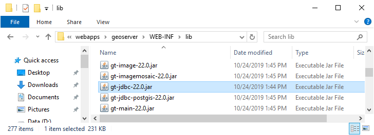
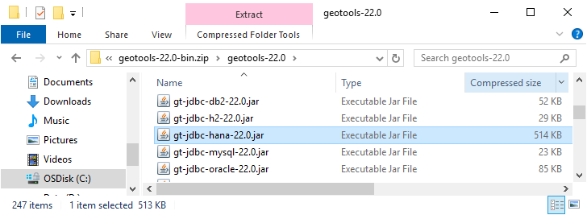
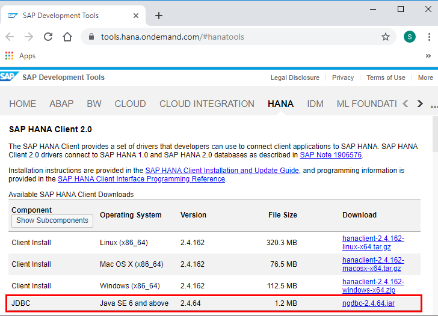
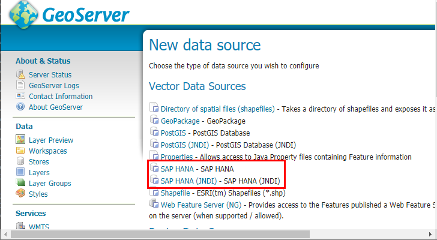

# SAP HANA {: #community_hana }

## Supported versions

The module supports

-   SAP HANA 1 SPS 12
-   SAP HANA 2 (all SPS including the [free express edition](https://www.sap.com/sap-hana-express))
-   [SAP HANA Cloud](https://www.sap.com/products/hana/cloud.html)

## Installing SAP HANA support {: #hana_install }

GeoServer has no built-in support for SAP HANA. You can enable SAP HANA support by adding the HANA GeoTools module and the HANA JDBC driver to your GeoServer installation.

### Installing the HANA GeoTools module

Identify the GeoTools version your GeoServer installation is using by navigating to the **`webapps/geoserver/WEB-INF/lib/`** folder in your GeoServer installation and locating the file **`gt-jdbc-{<version>}.jar`** as shown in the image below. In the example below the GeoServer version is `22.0`.

*Finding the GeoTools version*

Download the GeoTools archive with the version used by GeoServer from the [GeoTools website](https://geotools.org/). You need the **`geotools-{<version>}-bin.zip`** file. Copy the **`gt-jdbc-hana-{<version>}.jar`** file to the **`webapps/geoserver/WEB-INF/lib/`** folder of your GeoServer installation.

*Locating the GeoTools HANA module*

### Installing the HANA JDBC driver

Browse to the [SAP Development Tools website](https://tools.hana.ondemand.com/#hanatools) and download the JDBC component to the **`webapps/geoserver/WEB-INF/lib/`** folder of your GeoServer installation.

*Downloading ngdbc.jar from the SAP Development Tools website*

Afterwards restart your GeoServer instance.

## Adding a SAP HANA database

After both modules have been installed, `SAP HANA` will show up as an option when creating a new data store.

*HANA in the list of vector data sources*

## Configuring a SAP HANA data store

*Configuring a SAP HANA data store*

The following options are relevant for SAP HANA:

  -------------- ---------------------------------------------------------------------------------------------------------------------------------------------------------------------------------------------------------------
  `host`         The machine name or IP address to connect to.

  `port`         The port to connect to. If set and different from 0, the parameters `instance` and `database` are ignored. If not set or 0, the `instance` parameter must be set.

  `instance`     The instance to connect to. This parameter is ignored if a port is set. The `instance` field is at the bottom of the configuration form in case you have difficulties locating it.

  `database`     The database to connect to. Leave empty in case of single-container databases. Set to `SYSTEMDB` to connect to the system database of a multi-container database. This parameter is ignored if a port is set.

  `schema`       The database schema to access. If left blank, the user-specific database schema is accessed.

  `user`         The database user used to connect to the database.

  `passwd`       The password used to connect to the database.

  `use ssl`      If checked the TLS/SSL cryptographic protocol is used to establish a secure connection with the database.
  -------------- ---------------------------------------------------------------------------------------------------------------------------------------------------------------------------------------------------------------
