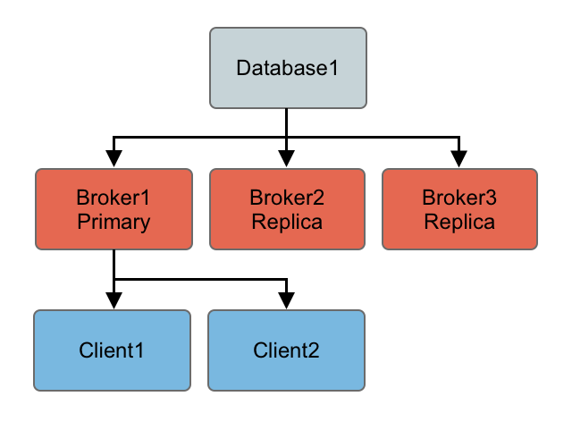

# JDBC Primary/Replica

If you are using pure JDBC and not using the high performance journal then you are generally relying on your database as your single point of failure and persistence engine. If you do not have really high performance requirements this approach can make a lot of sense as you have a single persistence engine to backup and manage etc.

## Startup

When using just JDBC as the data source you can use a Primary/Replica approach, running as many brokers as you wish as this diagram shows. On startup one primary grabs an exclusive lock in the broker database - all other brokers are replicas and pause waiting for the exclusive lock.



Clients should be using the Failover Transport to connect to the available brokers. e.g. using a URL something like the following failover:(tcp://broker1:61616,tcp://broker2:61616,tcp://broker3:61616) Only the primary broker starts up its transport connectors and so the clients can only connect to the primary.

## Primary failure

If the primary looses connection to the database or looses the exclusive lock then it immediately shuts down. If a primary shuts down or fails, one of the other replicas will grab the lock and so the topology switches to the following diagram


One of the other replicas immediately grabs the exclusive lock on the database to then commences becoming the primary, starting all of its transport connectors. Clients lose connection to the stopped primary and then the failover transport tries to connect to the available brokers - of which the only one available is the new primary. Primary restart At any time you can restart other brokers which join the cluster and start as replicas waiting to become a primary if the primary is shutdown or a failure occurs. So the following topology is created after a restart of an old primary\...

## Configuring JDBC Primary/Replica


By default if you use the <jdbcPersistenceAdapter/> to avoid the high performance journal you will be using JDBC Primary/Replica by default. You just need to run more than one broker and point the client side URIs to them to get primary/replica. This works because they both try an acquire an exclusive lock on a shared table in the database and only one will succeed.

The following example shows how to configure the ActiveMQ broker in JDBC Primary/Replica mode

``` xml
<beans>

  <!-- Allows us to use system properties as variables in this configuration file -->
  <bean class="org.springframework.beans.factory.config.PropertyPlaceholderConfigurer"/>

  <broker xmlns="http://activemq.apache.org/schema/core">

    <destinationPolicy>
  <policyMap><policyEntries>

      <policyEntry topic="FOO.>">
        <dispatchPolicy>
      <strictOrderDispatchPolicy />
        </dispatchPolicy>
        <subscriptionRecoveryPolicy>
      <lastImageSubscriptionRecoveryPolicy />
        </subscriptionRecoveryPolicy>
      </policyEntry>

  </policyEntries></policyMap>
    </destinationPolicy>


    <persistenceAdapter>
    <jdbcPersistenceAdapter dataDirectory="${activemq.base}/activemq-data"/>

    <!-- 
    <jdbcPersistenceAdapter dataDirectory="activemq-data" dataSource="#oracle-ds"/>
    --> 
    </persistenceAdapter>

    <transportConnectors>
  <transportConnector name="default" uri="tcp://localhost:61616"/>
    </transportConnectors>

  </broker>

  <!--  This xbean configuration file supports all the standard spring xml configuration options -->

  <!-- Postgres DataSource Sample Setup -->
  <!-- 
  <bean id="postgres-ds" class="org.postgresql.ds.PGPoolingDataSource">
    <property name="serverName" value="localhost"/>
    <property name="databaseName" value="activemq"/>
    <property name="portNumber" value="0"/>
    <property name="user" value="activemq"/>
    <property name="password" value="activemq"/>
    <property name="dataSourceName" value="postgres"/>
    <property name="initialConnections" value="1"/>
    <property name="maxConnections" value="10"/>
  </bean>
  -->

  <!-- MySql DataSource Sample Setup -->
  <!-- 
  <bean id="mysql-ds" class="org.apache.commons.dbcp.BasicDataSource" destroy-method="close">
    <property name="driverClassName" value="com.mysql.jdbc.Driver"/>
    <property name="url" value="jdbc:mysql://localhost/activemq?relaxAutoCommit=true"/>
    <property name="username" value="activemq"/>
    <property name="password" value="activemq"/>
    <property name="poolPreparedStatements" value="true"/>
  </bean>
  -->  

  <!-- Oracle DataSource Sample Setup -->
  <!--
  <bean id="oracle-ds" class="org.apache.commons.dbcp.BasicDataSource" destroy-method="close">
    <property name="driverClassName" value="oracle.jdbc.driver.OracleDriver"/>
    <property name="url" value="jdbc:oracle:thin:@localhost:1521:AMQDB"/>
    <property name="username" value="scott"/>
    <property name="password" value="tiger"/>
    <property name="poolPreparedStatements" value="true"/>
  </bean>
  -->

  <!-- Embedded Derby DataSource Sample Setup -->
  <!-- 
  <bean id="derby-ds" class="org.apache.derby.jdbc.EmbeddedDataSource">
    <property name="databaseName" value="derbydb"/>
    <property name="createDatabase" value="create"/>
  </bean>
  -->  

</beans>
```
