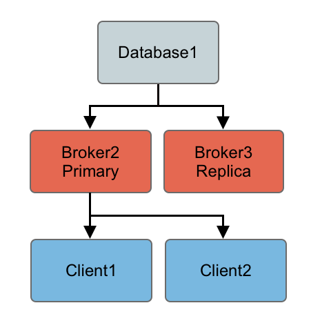
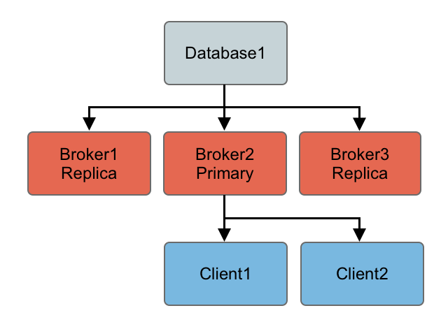

# Shared File System Primary/Replica

Basically you can run as many brokers as you wish from the same shared file system directory. The first broker to grab the exclusive lock on the file is the primary broker. If that broker dies and releases the lock then another broker takes over. The replica brokers sit in a loop trying to grab the lock from the primary broker. The following example shows how to configure a broker for Shared File System Primary/Replica where /sharedFileSystem is some directory on a shared file system. It is just a case of configuring a file based store to use a shared directory.

``` xml
<persistenceAdapter>
  <kahaDB directory="/sharedFileSystem/sharedBrokerData"/>
</persistenceAdapter>
```

or:

``` xml
<persistenceAdapter>
  <levelDB directory="/sharedFileSystem/sharedBrokerData"/>
</persistenceAdapter>
```

or:

``` xml
<persistenceAdapter>
  <amqPersistenceAdapter directory="/sharedFileSystem/sharedBrokerData"/>
</persistenceAdapter>
```

## Startup

On startup one primary grabs an exclusive lock on the broker file directory - all other brokers are replicas and pause waiting for the exclusive lock.


Clients should be using the Failover Transport to connect to the available brokers. e.g. using a URL something like the following

``` xml
failover:(tcp://broker1:61616,tcp://broker2:61616,tcp://broker3:61616)
```

Only the primary broker starts up its transport connectors and so the clients can only connect to the primary.

## Primary failure

If the primary looses the exclusive lock then it immediately shuts down. If a primary shuts down or fails, one of the other replicas will grab the lock and so the topology switches to the following diagram



One of the other replicas immediately grabs the exclusive lock on the file system to them commences becoming the primary, starting all of its transport connectors. Clients lose connection to the stopped primary and then the failover transport tries to connect to the available brokers - of which the only one available is the new primary.

## Primary restart

At any time you can restart other brokers which join the cluster and start as replicas waiting to become a primary if the primary is shutdown or a failure occurs. So the following topology is created after a restart of an old primary\...



!!! note

    If you have a SAN or shared file system it can be used to provide high availability such that if a broker is killed, another broker can take over immediately.
    
    > Ensure your shared file locks work
    
    Note that the requirements of this failover system are a distributed file system like a SAN for which exclusive file locks work reliably. If you do not have such a thing available then consider using Primary/Replica instead which implements something similar but working on commodity hardware using local file systems which ActiveMQ does the replication.
    
    > OCFS2 Warning
    
    Was testing using OCFS2 and both brokers thought they had the primary lock - this is because "OCFS2 only supports locking with 'fcntl' and not 'lockf and flock', therefore mutex file locking from Java isn't supported."
    
    From <http://sources.redhat.com/cluster/faq.html#gfs_vs_ocfs2> :
    
    OCFS2: No cluster-aware flock or POSIX locks
    
    GFS: fully supports Cluster-wide flocks and POSIX locks and is supported.
    
    > NFSv3 Warning
    
    In the event of an abnormal NFSv3 client termination (i.e., the ActiveMQ primary broker), the NFSv3 server will not timeout the lock that is held by that client. This effectively renders the ActiveMQ data directory inaccessible because the ActiveMQ replica broker can't acquire the lock and therefore cannot start up. The only solution to this predicament with NFSv3 is to reboot all ActiveMQ instances to reset everything.
    
    Use of NFSv4 is another solution because it's design includes timeouts for locks. When using NFSv4 and the client holding the lock experiences an abnormal termination, by design, the lock is released after 30 seconds, allowing another client to grab the lock. For more information about this, see this blog entry.
