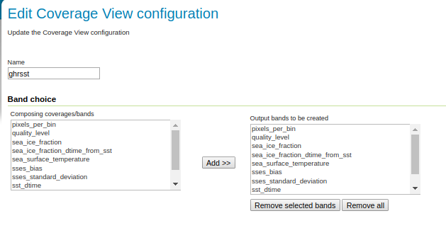
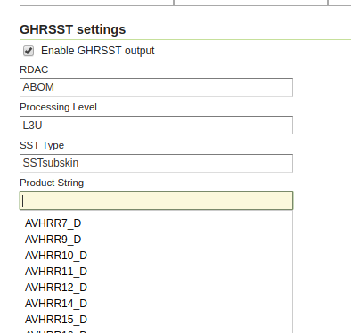

# GHRSST NetCDF output

[GHRSST](https://www.ghrsst.org/) is Group for High Resolution Sea Surface Temperature. Among its various activities it issued a [specification on how sea surface temperature data should be organized in NetCDF files](ftp://podaac.jpl.nasa.gov/OceanTemperature/ghrsst/docs/GDS20r5.pdf).

The NetCDF GHRSST module allows to generate complaint GHRSST files as WCS outputs, given a compliant GHRSST input.

## Installation

As a community module, the package needs to be downloaded from the [nightly builds](https://build.geoserver.org/geoserver/), picking the community folder of the corresponding GeoServer series (e.g. if working on the GeoServer main development branch nightly builds, pick the zip file form `main/community-latest`).

To install the module, unpack the zip file contents into GeoServer own `WEB-INF/lib` directory and restart GeoServer.

For the module to work, the [NetCDF](../../extensions/netcdf/netcdf.md) and [NetCDF Output Format](../../extensions/netcdf-out/index.md) extensions must also be installed.

## Input preparation

A GHRSST file contains multiple variables that are related with each other, and should be explored together in order to better understand the data. Thus, it is assumed that the source GHRSST file is published as a single coverage view holding all the variables as bands, retaining their native name (this is important for the plugin to work):

*Setting up a coverage view with all variables as bands*

A GHRSST output must also have a time, so the time dimension of this layer should be enabled (the output generation will fail with an error otherwise).

At the time of writing a coverage view requires the source bands to be of uniform data type, and the data sources might not be. In case setting up the view is not possible with the data available, a NCML file can be used to reprocess the source NetCDF into one that has bands with uniform data type. A downloadable example has been provided to facilitate setting up the view.

[Download the reference NCML transformation](artifacts/ghrsst.ncml)

The GHRSST may also have to be setup in a image mosaic in order to provide a deep temporal layer that users can select data from. The image mosaic setup can be complex, so a downloadable example has been provided for it as well (will require some changes, at a minimum, fix the paths at the bottom of indexer.xml, and the database connection parameters in the two datastore properties files).

[Download the sample mosaic configuration files](artifacts/ghrsst_mosaic.zip)

## Configuring GHRSST output

The normal WCS NetCDF output will pick the first band of a coverage and generate a single variable NetCDF output. When the GHRSST plugin is installed, a new UI element will show up that enables GHRSST output:

*Enabling GHRSST output mode*

Notes about the configuration UI:

-   Various normal configurations such as variable name, unit of measure, and data packing will be ignored (each variable in GHRSST has its own assigned data type and packing, as from specification)
-   For the output to be compliant, enable copy of both global and per variable attributes
-   The RDAC, Processing Level, SST Type and Product String have to be filled in order to generate a valid GHRSST file name in output. The user interface provides auto-complete with names picked from the specification, but others can be inputed as well.

For the output to generate correctly the coverage band names have to follow exactly the expected specification variable names (which comes naturally if the input is valid GHRSST), variable will be re-packed in output according to specification, so even if the inputs are all floats, the output will follow the expected data types.

Any extra coverage band not present in the specification will be copied from input to output un-modified.
