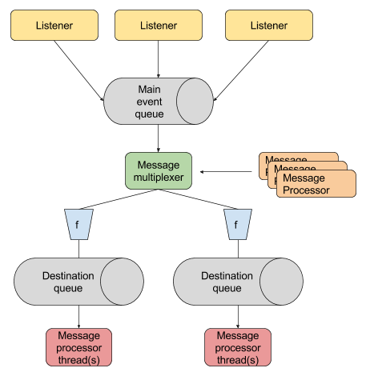

# Notification community module Plugin Documentation {: #notification_plugin }

The notification community module is meant to be a pluggable system to listen, summarize and notify events triggered by GeoServer data and configuration manipulation to some external source, in some agreed upon format.

The events of interest are:

1.  **Catalog configuration changes** (insert/update/removal of layers, styles, workspaces, stores, groups and so on)
2.  **Data changes via WFS-T** (anything that can affect the data precise bounding box)

The system is completely pluggable in terms of notification destinations, potential targets can be direct HTTP calls to external system, message queues, log files, email. The message format can also vary depending on the target and intended usage, both in terms of contents, e.g., it could be full of details or simply an indication of what changed, and encoding, e.g., xml, json, text, html.

## Overall architecture

The overall architecture is depicted in the following diagram:

The system basically generates a set of events, has a configuration to match them with a desired tool to send the message out (the processor). The sender can be conceived as a the combination of an "encoder" that generates the message payload and a "sender".

Each message is combined with its processor and send into a destination queue, where a thread pool picks the events and runs their processor. For some type of events, like catalog ones, the thread pool will have to be configured with just one thread to make sure the events are sent in the right order to the destinations.

## Installing the extension

1.  Download the Notification extension from the nightly GeoServer community module builds.
2.  Download the Notification Common extension from the nightly GeoServer community module builds.
3.  (optional) If you want use sender/encoder provided for GeoNode, download the Notification Geonode extension from the nightly GeoServer community module builds.
4.  Place the JARs into the `WEB-INF/lib` directory of the GeoServer installation.

## Usage

The usage of the extensions is based on two components that defines its behavior and logic:

-   A configuration file named notifier.xml that must be present on a "notifier" subfolder of Geoserver root data directory (if extensions found no one `notifier.xml` file under notifier folder, will create a new one with default values)
-   A JAR that implements the specific logic of sender/encoder

## Configuration file

The configuration file will be parsed by XStream framework to instantiate the right classes. An example of notifier.xml have the follow content:

>     <notificationConfiguration>
>     <queueSize>1000</queueSize>
>       <notificator>
>         <messageFilter>type='Catalog'</messageFilter>
>         <queueSize>1000</queueSize>
>         <processorThreads>1</processorThreads>    
>         <genericProcessor>
>           <geonodeEncoder />
>           <fanoutSender>
>             <username>guest</username>
>             <password>guest</password>
>             <host>localhost</host>
>             <port>4432</port>
>             <virtualHost></virtualHost>
>             <exchangeName>testExchange</exchangeName>
>             <routingKey>testRouting</routingKey>
>           </fanoutSender>
>         </genericProcessor>
>       </notificator>
>       <notificator>
>       ...
>       </notificator>
>     </notificationConfiguration>

**notificationConfiguration** -> **queueSize** = the size of queue that store all the notification messages.

**notificationConfiguration** -> **notificator** = is possible to have one or more notificator.

**notificationConfiguration** -> **notificator** -> **messageFilter** = the is a CQL filter, only notification message that satisfy this filter, will be processed by this notificator. Possible values are:

-   `type='Catalog'`
-   `type='Data'`

**notificationConfiguration** -> **notificator** -> **queueSize** = the size of queue to store the notification messages for specific notificator, only the notification that satisfy the CQL filter specified on `<messageFilter>` element will be pushed in this queue.

**notificationConfiguration** -> **notificator** -> **processorThreads** = number of threads that will be work to encode and send the notification messages. Note that for `'Catalog'` type event, this will have to be valued as 1 to make sure the events are sent in the right order to the destinations.

**notificationConfiguration** -> **notificator** -> **genericProcessor** = configurations for the encoder and sender components

**notificationConfiguration** -> **notificator** -> **geonodeEncoder** = this is a placeholder tag that must match with the alias used to map the implementation class for encoder. Based on custom implementation, additional attributes or child tags can be provided.

!!! note

    is mandatory that one and only one implementation of encoder match with each alias.

**notificationConfiguration** -> **notificator** -> **fanoutSender** = this is a placeholder tag that must match with the alias used to map the implementation class for sender. Based on custom implementation, additional attributes or child tags can be provided.

!!! note

    is mandatory that one and only one implementation of sender match with each alias.

For the case of *AMQP Fanout (RabbitMQ)* based sender implementation, the additional parameters are:

-   `host` : the IP/DNS to which the underlying TCP connection is made
-   `port` : port number to which the underlying TCP connection is made
-   `virtualhost` (optional) : a path which acts as a namespace
-   `username` (optional) : if present is used for SASL exchange
-   `password` (optional) : if present is used for SASL exchange
-   `exchangeName` : the name of exchange to publish the message to
-   `routingKey` : identify the queue to publish the message to (ignored by fanout type)

## Sender and encoder implementations

This plugin allow the pluggability of sender/encoder implementation, multiple implementation plugins are allowed.

The core notification extension will be resolve the implementations of the interfaces:

-   `org.geoserver.notification.common.NotificationEncoder`
-   `org.geoserver.notification.common.NotificationProcessor`
-   `org.geoserver.notification.common.NotificationXStreamInitializer`

Based on the match between the tag names on configuration file (`notifier.xml`) and the aliases define in **NotificationXStreamInitializer**, the notification core will be use the right implementation of **NotificationEncoder** / **NotificationProcessor**.

An example of this implementation is provided by the Notification Geonode extension.

The minimal dependencies of this kind of plugin are (see `pom.xml` of *Notification Geonode* extension):

-   `gs-notification-common`
-   `gs-main`

The plugin must be extends/implements almost the three classes/interfaces:

**NotificationXStreamDefaultInitializer**: is a utility implementation of **NotificationXStreamInitializer** to define the match between **NotificationEncoder** / **NotificationProcessor** and configuration aliases:

-   `getEncoderName` : this method must be return the alias for encoder
-   `getSenderName` : this method must be return the alias for sender
-   `getEncoderClass` : this method must be return the class for encoder
-   `getSenderClass` : this method must be return the class for sender
