# Configure the GeoServer OAuth2 filter

1.  Start GeoServer and login to the web admin interface as the `admin` user.

2.  Click the `Authentication` link located under the `Security` section of the navigation sidebar.

    

3.  Scroll down to the `Authentication Filters` panel and click the `Add new` link.

    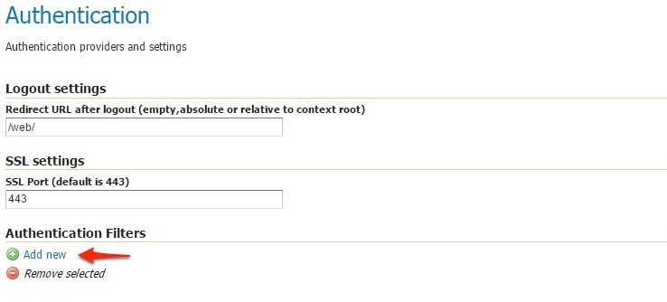

4.  Click the `OAuth2` link.

    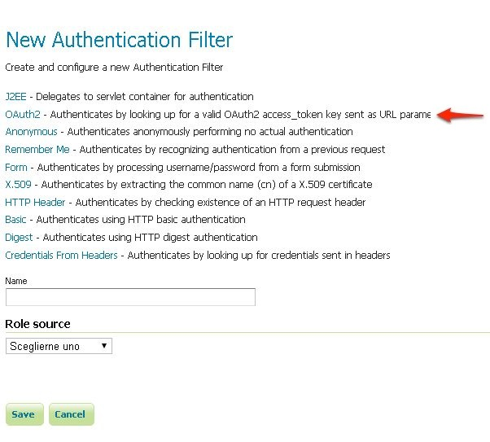

5.  Fill in the fields of the settings form as follows:

    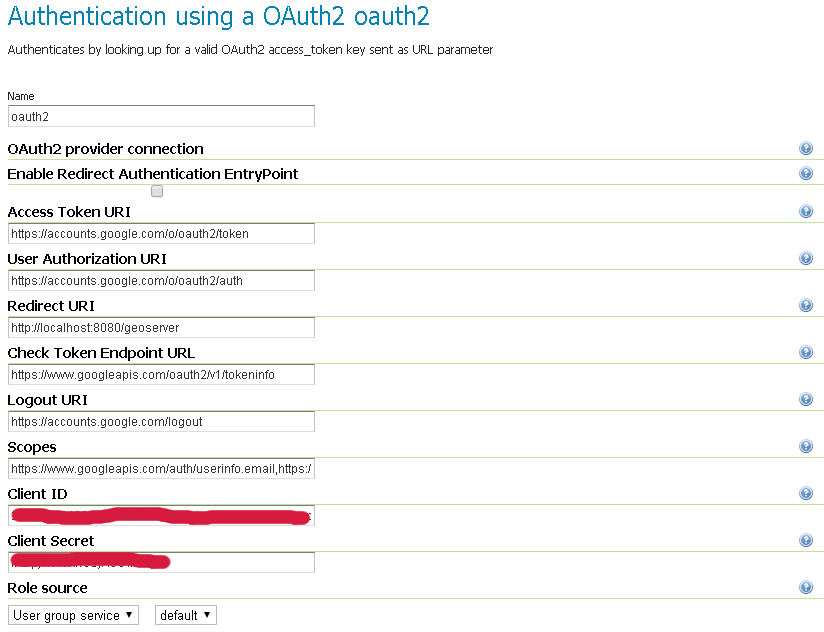

    The default values provided with the plugin are valid for the Google OAuth2 Provider and are the following:

    ``` shell
    "Enable Redirect Authentication EntryPoint" = False
    "Access Token URI" = https://accounts.google.com/o/oauth2/token
    "User Authorization URI" = https://accounts.google.com/o/oauth2/auth
    "Redirect URI" = http://localhost:8080/geoserver
    "Check Token Endpoint URL" = https://www.googleapis.com/oauth2/v1/tokeninfo
    "Logout URI" = https://accounts.google.com/logout
    "Scopes" = https://www.googleapis.com/auth/userinfo.email,https://www.googleapis.com/auth/userinfo.profile
    ```

    !!! note

        1.  `Client ID` and `Client Secret` are the ones Google provided
        2.  Choose a `Role Service` able to recognize user emails as IDs. By default a connected user will have `ROLE_USER` role

    !!! warning

        A few words on the **Enable Redirect Authentication EntryPoint** option
    
        This option allows you to decide whether or not to *force* automatic redirection to OAuth2 Access Token URI or not for authentication.
    
        What does that mean?
    
        -   *Enable Redirect Authentication EntryPoint* = True
    
            > If not already authenticated (or no valid **Access Token** is provided in the query string), this option will **force** a redirection to the OAuth2 Provider Login page.
            >
            > This may cause unwanted behavior since it will override every other explicit login method like `form`. In other words if the filter is applied for instance to the `web` endpoint, it won't be possible to access to the GeoServer Admin GUI using the standard login method via browser.
    
        -   *Enable Redirect Authentication EntryPoint* = False
    
            > In order to avoid the above issue, by disabling this option you will be **forced** to use an explicit Authentication Endpoint to login via the OAuth2 Provider login page.
            >
            > If not already authenticated (or no valid **Access Token** is provided in the query string), you **must** authenticate through the following URLs:
            >
            > 1.  *GeoServer OAuth2 Authorization Endpoint*; `http://<host:port>/geoserver/j_spring_oauth2_login`
            >
            > 2.  *OAuth2 Provider Explicit User Authorization Endpoint*; this must be adapted for your specific OAuth2 Provider, the protocol stated that it should be
            >
            >     >     https://<USER_AUTHORIZATION_URI>?scope=<SCOPES>&response_type=code&redirect_uri=<REDIRECT_URI>&client_id=<CLIENT_ID>
            >     >
            >     > For Google OAuth2 Provider is:
            >     >
            >     >     https://accounts.google.com/o/oauth2/auth?scope%3Dhttps://www.googleapis.com/auth/userinfo.email%2Bhttps://www.googleapis.com/auth/userinfo.profile%26response_type%3Dcode%26redirect_uri%3D<REDIRECT_URI>%26client_id%3D<CLIENT_ID>

6.  Update the filter chains by adding the new OAuth2 filter.

    Once everything has been configured you should be able to see the new `oauth2` filter available among the `Authentication Filters` list

    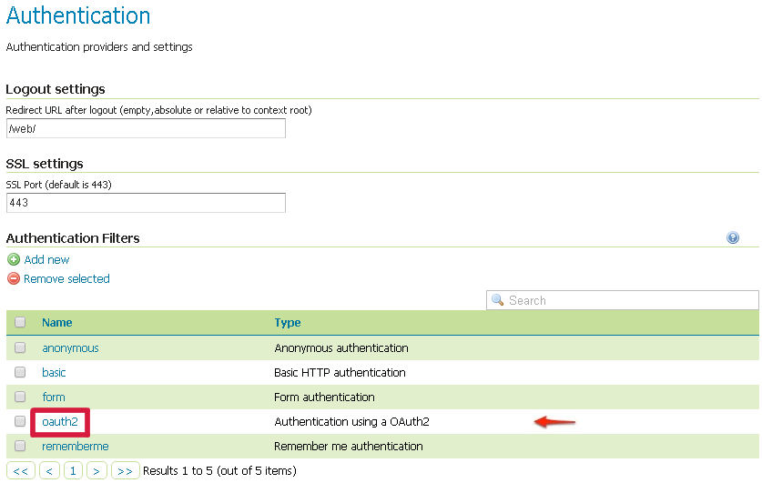

    Through this it will be always possible to modify / update the filter options, or create more of them.

    The next step is to add the filter to the `Filter Chains` you want to protect with OAuth2 also

    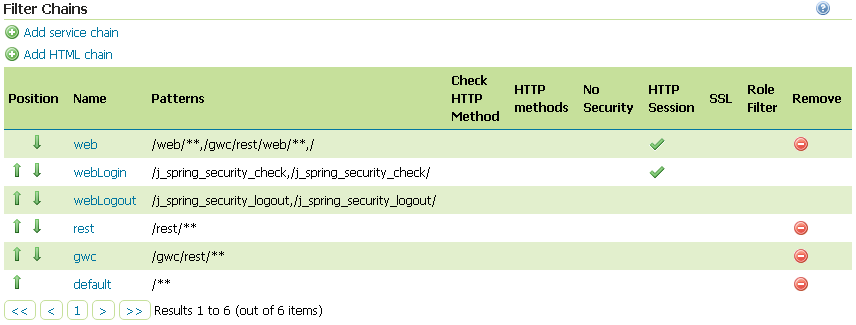

7.  Select the OAuth2 Filter for each filter chain you want to protect with OAuth2.

    If you need to protect **all** the GeoServer services and the GeoServer Admin GUI too with OAuth2, you need to add the `oauth2` filter to all the following chains

    -   `web`
    -   `rest`
    -   `gwc`
    -   `default`

    The order of the authentication filters depends basically on which method you would like GeoServer to *try first*.

    !!! note

        During the authentication process, the authentication filters of a `Filter Chain` are executed serially until one succeed (for more details please see the section [Authentication chain](../../security/auth/chain.md))

    !!! warning

        If *Enable Redirect Authentication EntryPoint* = **True** for OAuth2 Filter, the `web` chain won't be able to login through the `form` method.

    

    !!! note

        Remember that the `anonymous` filter must be always the last one.

8.  Save.

    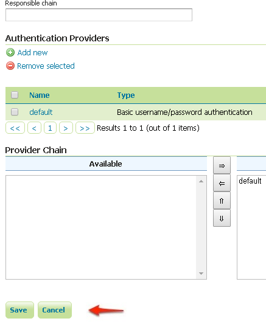

It's now possible to test the authentication:

1.  Navigate to the GeoServer home page and log out of the admin account.

2.  Try to login again, you should be able now to see the external Google login form.

    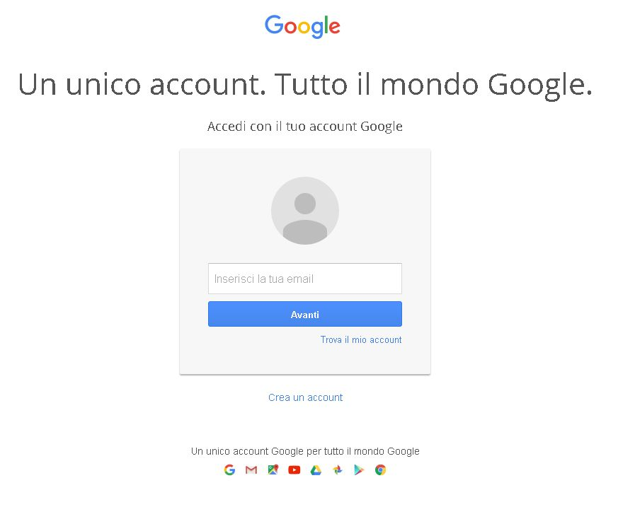

    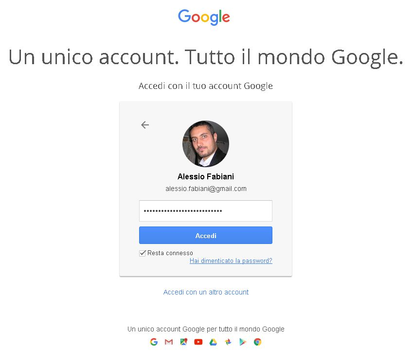

    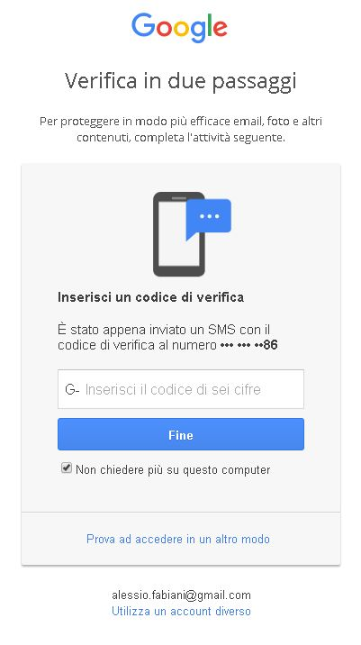

    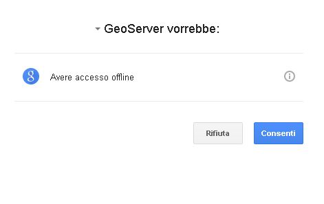

    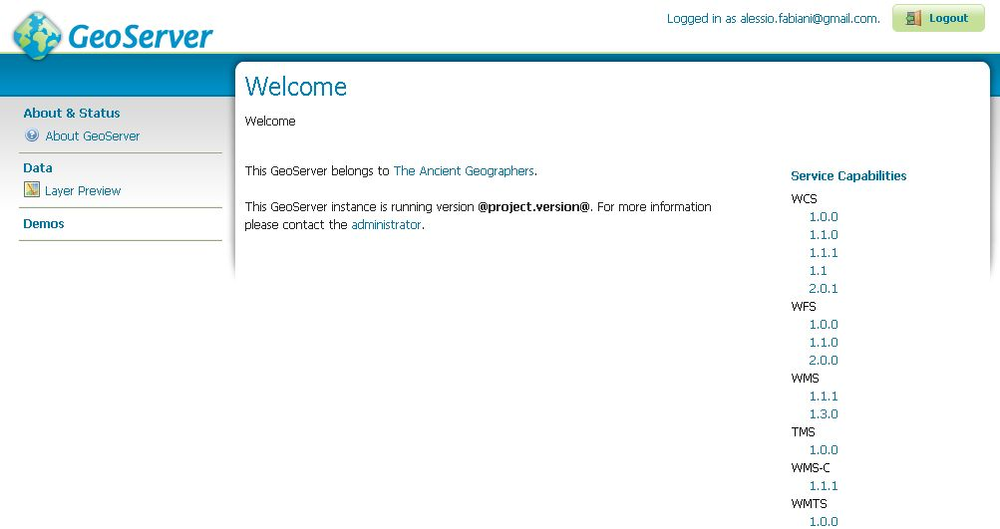
