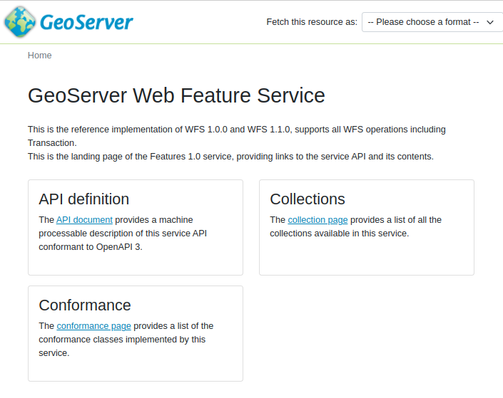
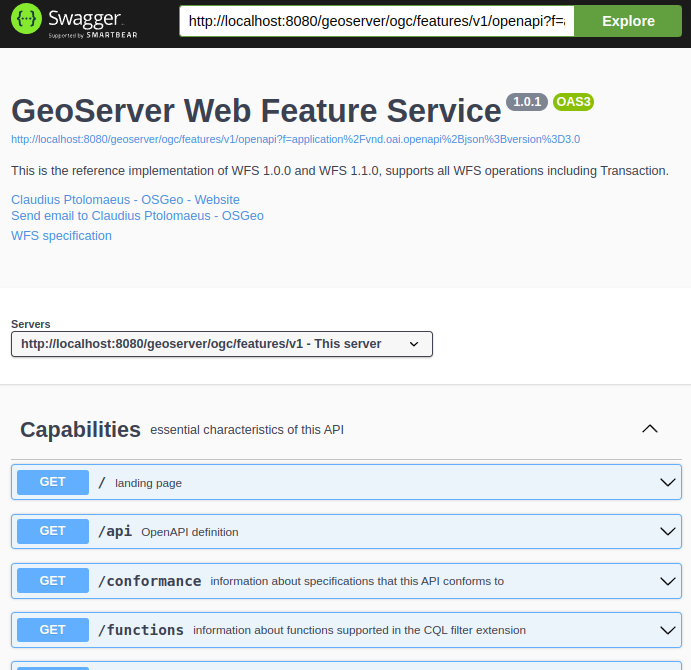
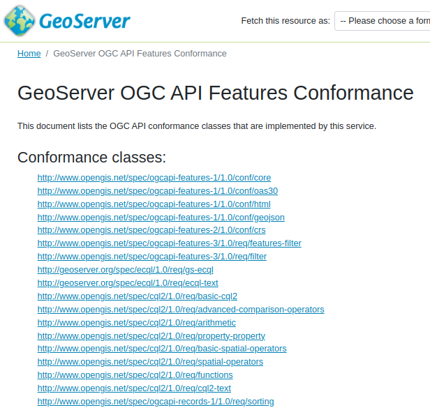

# OGC API - Features

An [OGC Features API](https://github.com/opengeospatial/ogcapi-features) publishing feature data using an OpenAPI web service.

## Features Implementation status

| [OGC API - Features](https://github.com/opengeospatial/ogcapi-features) | Version                                                                                          | Implementation status                                                                                                                    |
|-------------------------------------------------------------------------|--------------------------------------------------------------------------------------------------|------------------------------------------------------------------------------------------------------------------------------------------|
| Part 1: Core                                                            | [1.0.0](https://docs.opengeospatial.org/is/17-069r4/17-069r4.html)                               | Passes compliance tests                                                                                                                  |
| Part 2: Coordinate Systems by Reference                                 | [1.0.0](https://docs.opengeospatial.org/is/18-058r1/18-058r1.htmll)                              | Passes compliance tests                                                                                                                  |
| Part 3: Filtering                                                       | [Draft](http://docs.ogc.org/DRAFTS/19-079r1.html)                                                | Draft implemented (mind, the draft does not include a filtering language)                                                                |
| Part 4: Create, Replace, Update and Delete                              | [Draft](http://docs.ogc.org/DRAFTS/20-002.html)                                                  | Not implemented (volunteers/sponsoring wanted)                                                                                           |
| Common Query Language (CQL2)                                            | [Draft](https://docs.ogc.org/DRAFTS/21-065.html)                                                 | Implements an earlier draft for for both text and JSON encodings. To be updated.                                                         |
| Part n: Query by IDs                                                    | [Proposal](https://github.com/opengeospatial/ogcapi-features/tree/master/proposals/query-by-ids) | Proposal implemented, but syntax and semantic is subject to change in a future release. Thus said, usage should be carefully considered. |

## Installing the GeoServer OGC API Features module

1.  Download the OGC API nightly GeoServer community module from {{ download_community('ogcapi-features','snapshot') }}.

    !!! warning

        Verify that the version number in the filename corresponds to the version of GeoServer you are running (for example geoserver-{{ release }}-ogcapi-features-plugin.zip above).

2.  Extract the contents of the archive into the `WEB-INF/lib` directory of the GeoServer installation.

3.  On restart the services are listed at <http://localhost:8080/geoserver>

## Use of OGC API - Features service

The OGC API Features Service is accessed via the **FEATURES** version **1.0** link on the home page.

### Capabilities

The service is self described using:

-   `html`: A collection of web pages, with links for navigation between content (and that can be indexed by search engines for discoverability).

    
    *OGC API Features service*

-   `application/json`: A collection of **`json`** documents, with reference between each document for programmatic access by web developers.

    ``` json
    {
      "title": "GeoServer Web Feature Service",
      "description": "This is the reference implementation of WFS 1.0.0 and WFS 1.1.0, supports all WFS operations including Transaction.",
      "links": [
        {
          "href": "http://localhost:8080/geoserver/ogc/features/?f=application%2Fx-yaml",
          "rel": "alternate",
          "type": "application/x-yaml",
          "title": "This document as application/x-yaml"
        },
        {
          "href": "http://localhost:8080/geoserver/ogc/features/?f=application%2Fjson",
          "rel": "self",
          "type": "application/json",
          "title": "This document"
        },
        {
          "href": "http://localhost:8080/geoserver/ogc/features/?f=text%2Fhtml",
          "rel": "alternate",
          "type": "text/html",
          "title": "This document as text/html"
        }
    ```

-   `application/x-yaml`: A collection of **`yaml`** documents, with references between each document for programmatic access.

    ``` yaml
    title: GeoServer Web Feature Service
    description: This is the reference implementation of WFS 1.0.0 and WFS 1.1.0, supports
      all WFS operations including Transaction.
    links:
    - href: http://localhost:8080/geoserver/ogc/features/?f=application%2Fx-yaml
      rel: self
      type: application/x-yaml
      title: This document
    - href: http://localhost:8080/geoserver/ogc/features/?f=application%2Fjson
      rel: alternate
      type: application/json
      title: This document as application/json
    - href: http://localhost:8080/geoserver/ogc/features/?f=text%2Fhtml
      rel: alternate
      type: text/html
      title: This document as text/html
    ```

The service title and description are provided by the existing [Web Feature Service (WFS)](../../../services/wfs/index.md) settings.

### Open API

For programmatic access an [OpenAPI](https://www.openapis.org/) description of the service is provided, that may be browsed as documentation, or used to generate a client to access the web services.


*OGC API Features OpenAPI Document*

### Collections

The collection of feature types being published by the service.

Each collection entry is described using the layer details of title, description, geographic extent.

Data can be browsed as web pages, or downloaded in a range of formats such as **`GeoJSON`** and **`GML`** documents.


*Collection sf:roads download formats*

### Conformance

Lists the operations this service can perform, each "conformance class" documents supported functionality.


*OGC API Features Conformance*

### Contact information

Advertises contact information for the service.

Defined by defined in by [Contact Information](../../../configuration/contact.md).

## Configuration of OGC API - Features module

The service does not require any additional configuration to use. The service is configured using:

-   The existing [Web Feature Service (WFS)](../../../services/wfs/index.md) settings to define title, abstract, and output formats.

    This is why the service page is titled `GeoServer Web Feature Service` by default.

-   Built-in templates used for html generation

-   Extra links can be added on a per-service or per-collection basis as indicated in [Configuring the GeoServer OGC API module](../configure.md).

### HTML Templates

To override an OGC API Features template:

1.  Create a directory **`ogc/features`** in the location you wish to override:

    -   **`GEOSERVER_DATA_DIR/templates/ogc/features/v1`**
    -   **`GEOSERVER_DATA_DIR/workspace/{workspace}/ogc/features/v1`**
    -   **`GEOSERVER_DATA_DIR/workspace/{workspace}/{datastore}/ogc/features/v1`**
    -   **`GEOSERVER_DATA_DIR/workspace/{workspace}/{datastore}/{featuretype}/ogc/features/v1`**

2.  Create a file in this location, using the GeoServer {{ release }} examples below:

    -   [ogc/features/v1/collection.ftl](download/collection.ftl)
    -   [ogc/features/v1/collection_include.ftl](download/collection_include.ftl)
    -   [ogc/features/v1/collections.ftl](download/collections.ftl)
    -   [ogc/features/v1/queryables.ftl](download/queryables.ftl)
    -   [ogc/features/v1/functions.ftl](download/functions.ftl)

    The above built-in examples are for GeoServer {{ release }}, please check for any changes when upgrading GeoServer.

The templates for listing feature content are shared between OGC API services. To override a template used to list features:

1.  Use the directory in the location you wish to override:

    -   **`GEOSERVER_DATA_DIR/templates`**
    -   **`GEOSERVER_DATA_DIR/workspace/{workspace}`**
    -   **`GEOSERVER_DATA_DIR/workspace/{workspace}/{datastore}`**
    -   **`GEOSERVER_DATA_DIR/workspace/{workspace}/{datastore}/{featuretype}`**
    -   [ogc/features/landingPage.ftl](download/landingPage.ftl)

2.  Create a file in this location, using the GeoServer {{ release }} examples below:

    -   [ogc/features/getfeature-complex-content.ftl](download/getfeature-complex-content.ftl)
    -   [ogc/features/getfeature-content.ftl](download/getfeature-content.ftl)
    -   [ogc/features/getfeature-empty.ftl](download/getfeature-empty.ftl)
    -   [ogc/features/getfeature-footer.ftl](download/getfeature-footer.ftl)
    -   [ogc/features/getfeature-header.ftl](download/getfeature-header.ftl)

    The above built-in examples are for GeoServer {{ release }}, please check for any changes when upgrading GeoServer.

As an example customize how collections are listed:

1.  The file **`ogc/features/collections.ftl`** lists published collection:

    ~~~
    
    ~~~

2.  Save file to **`GEOSERVER_DATA_DIR/workspace/templates/ogc/collections.ftl`**, and rewrite as:

    ``` 
    <#include "common-header.ftl">
           <h2>OGC API Feature Collections</h2>
           <p>List of collections published.</p>
           <p>See also: <#list model.getLinksExcept(null, "text/html") as link>
              <a href="${link.href}">${link.type}</a><#if link_has_next>, </#if></#list>.</p>

         <#list model.collections as collection>
           <h2><a href="${serviceLink("collections/${collection.id}")}">${collection.id}</a></h2>
           <#include "collection_include.ftl">
         </#list>
    <#include "common-footer.ftl">
    ```

3.  Many templates are constructed using `#include`, for example **`collection.ftl`** above uses `<#include "common-header.ftl">` located next to **`collections.ftl`**.

    Presently each family of templates manages its own **`common-header.ftl`** (as shown in the difference between **`ogc/features`** service templates, and getfeature templates above).

4.  A restart is required, as templates are cached.

    
    *Template collections.ftl override applied*

5.  Language codes are appended for internationalization. For French create the file **`GEOSERVER_DATA_DIR/workspace/{workspace}/ogc/collections_fr.ftl`** and translate contents:

    ``` 
    <#include "common-header.ftl">
           <h2>OGC API Feature Service</h2>
           <p>Liste des collections publiées.</p>
           <p>Voir également: <#list model.getLinksExcept(null, "text/html") as link>
              <a href="${link.href}">${link.type}</a><#if link_has_next>, </#if></#list>.</p>

         <#list model.collections as collection>
           <h2><a href="${serviceLink("collections/${collection.id}")}">${collection.id}</a></h2>
           <#include "collection_include.ftl">
         </#list>
    <#include "common-footer.ftl">
    ```

6.  For details on how to write templates see [Freemarker Templates](../../../tutorials/freemarker.md) tutorial.
