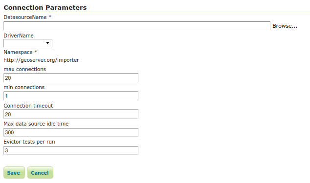

# OGR datastore {: #ogr_store }

The OGR datastore module allows to use the ``GDAL/OGR <https://gdal.org/>`` native library to access a wide variety of vector spatial formats and publish them in GeoServer.

This library is recommended to use when a particular data source does not have a GeoServer pure Java datastore fulfilling the same needs, in particular, compared to built in sources, it has the following limitations:

-   Generally slower than the existing pure Java counterparts, especially for map rendering (the GeoServer stores can help rendering by providing reduced resolution version of the geometries, OGR provides no such facility)
-   Less scalable than the pure Java counterparts, as the DataSource objects used to access data are not thread safe (see the pooling options below)
-   More risky than the pure java counterparts, a SEGFAULT occurring inside OGR will take down the entire GeoServer process (while a pure Java exception is managed and reported, but won't have consequences on the server itself)

The OGR store has been tested with GDAL 2.2.x, but might be working with other versions as well. In case of malfunctions, you can try to remove the `gdal-<version>.jar` file from the GeoServer installation package, and replace it with the specific version jar instead, which you should find in your GDAL installation.

## Installing

This is a community module, which means that it will not be available in the GeoServer official releases and needs to be installed manually.

This module can be installed following these steps:

1.  Download this module package from the [nightly builds](https://build.geoserver.org/geoserver/), the module version should match the desired GeoServer version.
2.  Extract the contents of the package into the `WEB-INF/lib` directory of the GeoServer installation.
3.  Make sure that the GDAL library as well as the GDAL JNI native library are available in the GeoServer path (see below).

### Linux installation details

On Linux the native librariers are commonly available via packages such as `gdal` and `gdal-java`, which, on installation, make available the required libraries on the file system (the specific name may vary):

    /usr/lib/libgdal.so
    /usr/lib/jni/libgdaljni.so

Normally these directories are already in the `PATH`, so no further configuration is required.

If using a custom build instead, the `LD_LIBRARY_PATH` and `GDAL_DATA` directories:

    export LD_LIBRARY_PATH /path/to/gdal/libraries
    export GDAL_DATA /path/to/gdal/data

See also the GDAL FAQ [about the GDAL_DATA setup](https://trac.osgeo.org/gdal/wiki/FAQInstallationAndBuilding#HowtosetGDAL_DATAvariable).

### Windows installation details

On windows the files in question might look like:

    gdal204.dll
    gdalalljni.dll

Locating a pre-build GDAL that includes Java support might be difficult. One option is to download the [gisinternals.com](http://www.gisinternals.com/release.php) packages, in particular the release zip packages including both mapserver and GDAL (these are rather complete and include the necessary libraries, whilst the MSI installers are typically missing the Java support).

Once the package is available on disk, one has to set the following environment variables before starting GeoServer (the path might change depending on the package that is being downloaded):

    set PATH=%PATH%;C:\path\to\release-1900-x64-gdal-2-4-0-mapserver-7-2-1\bin;C:\tmp\release-1900-x64-gdal-2-4-0-mapserver-7-2-1\bin\gdal\java
    set GDAL_DRIVER_PATH=C:\path\to\release-1900-x64-gdal-2-4-0-mapserver-7-2-1\bin\gdal\plugins
    set GDAL_DATA=C:\path\to\release-1900-x64-gdal-2-4-0-mapserver-7-2-1\bin\gdal-data

## Configuring a store

If the library is properly installed you will get the "OGR" data store among the supported stores in the "new store" page. In case it's not there, check the logs, they might be reporting that the GDAL/OGR native libs are missing, if the error is not there, check that the jars have been unpacked in the right position instead.

Creating a new store requires configuration of only the **DatasourceName** field, any other parameter is optional:

*The OGR datasore configuration page*

The **DatasourceName** can be a reference to a file, a directory, or a set of connection parameters to a server. For example, to connect to a PostGIS database the connection parameters could be:

> `PG:user=theUser password=thePassword dbname=theDatabase`

Notice how, unlike documented in the OGR page, single quotes are not needed (and actually harmful) around the user/password/dbname section. The **Browse** button can be used to quickly peek files or directories from the file system.

The **Driver** parameter is optional, OGR should be able to recognize the appropriate driver automatically, but it's useful to force a specific choice when multiple competing drivers are available for the same data source (e.g., OpenFileGDB vs FileGDB).

The pooling parameters, similar to those found in a database, merit an explanation. OGR exposes access to data through DataSource objects, which are not thread safe, so only one request at a time can use them. At the same time, they can be expensive to create and hold onto useful state, like in memory data caches, spatial indexes and the like. As such, they have been stored in a pool much like relational database connections.

The **Prime DataSources** option can be enabled to force a full read of the source data before the GDAL `DataSource` object is used. In some formats this allows the creation of useful support data structures, like an in memory spatial index in the `OpenFileGDB` format. Since the full read can be expensive, care should be taken to configure the pooling options so that it gets reused as much as possible (e.g., setting a higher `min connections`, eventually setting it to the same value as `max connections`).
