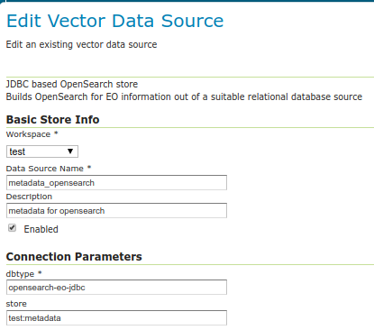
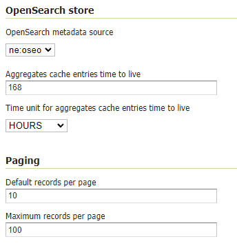
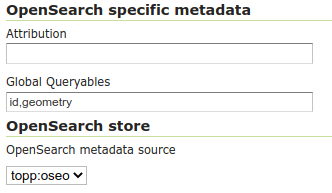

# Configuring the OpenSearch module

The OpenSearch module needs to know upon which database perform the searches.

Follow these steps:

-   Setup a standard PostGIS database pointing to the database and schema created above from the SQL file. Note down the full name of the store (e.g. `test:metadata` where `test` is the workspace and `metadata` is the store name). Besides filling the connection parameters, remember to set "expose primary keys" to true.

-   Create a new store of type "JDBC based OpenSearch store" and configure the fully qualified name of the basic PostGIS store in its "store" parameter.

    

-   Go into the "OS-EO" service configuration page and configure the "OpenSearch" store

    -   (Optional) You can also configure how long values will be cached for performance purposes for templates that require collection level aggregate statistics by adjusting the cache time to live duration and time units.

    

* Global Queryables (applicable to the STAC API to define queryable fields for all Collections) can be configured

:   using a comma delimited list in the text box under OpenSearch specific metadata

    

## Advanced: adding product classes

The design of the OpenSearch module is "data driven", meaning that one can materialize new search properties by just adding new columns to the product and collection tables.

In particular, both tables have a "prefix based" convention linking the properties to their respective product types, and the engine will advertise for a particular product only the properties relevant to it. For example, in an optical product, the properties starting with "opt" will be listed, but not those starting with "sar".

Here is a table of the product classes known out of the box:

| Name        | Prefix | Namespace                        | Description                                                            |
|-------------|--------|----------------------------------|------------------------------------------------------------------------|
| eop_generic | eop    | <http://www.opengis.net/eop/2.1> | Base properties shared among all EO products. Never remove this class. |
| optical     | opt    | <http://www.opengis.net/opt/2.1> | Optical products properties                                            |
| radar       | sar    | <http://www.opengis.net/sar/2.1> | Radar products properties                                              |
| Altimetric  | alt    | <http://www.opengis.net/alt/2.1> | Altimetric products properties                                         |
| Atmospheric | atm    | <http://www.opengis.net/atm/2.1> | Atmospheric products properties                                        |
| Limb        | lmb    | <http://www.opengis.net/lmb/2.1> | Limb products properties                                               |
| ssp         | ssp    | <http://www.opengis.net/ssp/2.1> | SSP products properties                                                |

The various properties have different usages:

-   The *name* is used in the collection to define the type of sensor (eoSensorType column)
-   The *prefix* is used in the product table as a prefix to column name in order to associate them to a particular product type, shows up as-is in the JSON representations of the REST API, as well as the prefix in XML outputs
-   The *namespace* is used in XML output, along with the prefix (e.g., `xmlns:opt="http://www.opengis.net/opt/2.1"`)

It is possible to add new product classes as well as changing the built-in ones, but care should be taken to keep product classes and database aligned. After any change to the database structure remember to "reset" the GeoServer configuration to make it re-scan the table structures.

## HTML templates {: #oseo_html_templates }

The Freemarker templates for collections and products can be found in `$GEOSERVER_DATA_DIRECTORY/templates/os-eo`:

-   [generic-header.ftl](https://github.com/geoserver/geoserver/blob/main/src/community/oseo/oseo-service/src/main/resources/org/geoserver/opensearch/eo/response/) receives SearchResults, Query, organization, title, updated(date), builder and encodes a generic header Atom HTML description for it.
-   [generic-footer.ftl](https://github.com/geoserver/geoserver/blob/main/src/community/oseo/oseo-service/src/main/resources/org/geoserver/opensearch/eo/response/) exists simple for having a </feed> closing tag.
-   [product.ftl](https://github.com/geoserver/geoserver/blob/main/src/community/oseo/oseo-service/src/main/resources/org/geoserver/opensearch/eo/response/product.ftl) receives an OpenSearch product, updated(date), dcDate(date), offerings and encodes the Atom HTML description for it.
-   [collection.ftl](https://github.com/geoserver/geoserver/blob/main/src/community/oseo/oseo-service/src/main/resources/org/geoserver/opensearch/eo/response/collection.ftl) receives an OpenSearch collection, updated(date), dcDate(date), offerings and encodes the Atom HTML description for it.

The default templates, linked above, report the time range for the product/collection, and link to other pertinent OpenSearch resources (metadata, self link, quicklooks).

Collection specific templates can be set up in the data directory, appending the collection identifier to the file name, e.g. `collection-SENTINEL2.ftl` or `product-SENTINEL2.ftl`.

The templates can use a `oseoLink` function to build links pointing back to the OpenSearch service. The function receives the following parameters:

-   The first argument is a `path` segment under the `oseo` service path.
-   The other arguments, optional, are couple of keys and values, used to encode the link's query string.

## Metadata templates {: #oseo_metadata_templates }

The Freemarker metadata templates for collections and products can be found in `$GEOSERVER_DATA_DIRECTORY/templates/os-eo`:

-   [product-metadata.ftl](https://github.com/geoserver/geoserver/blob/main/src/community/oseo/oseo-service/src/main/resources/org/geoserver/opensearch/eo/response/product-metadata.ftl) receives an OpenSearch product and encodes the Atom HTML description for it.
-   [collection-metadata.ftl](https://github.com/geoserver/geoserver/blob/main/src/community/oseo/oseo-service/src/main/resources/org/geoserver/opensearch/eo/response/collection-metadata.ftl) receives an OpenSearch collection and encodes the Atom HTML description for it.

The default templates, linked above, generate respectively a ISO metadata sheet for collections, and a EO O&M product metadata sheet for products.

The templates can use a `oseoLink` function to build links pointing back to the OpenSearch service. The function receives the following parameters:

-   The first argument is a `path` segment under the `oseo` service path.
-   The other arguments, optional, are couple of keys and values, used to encode the link's query string.

The templates can also use a `gml` function that generates a GML 3.2 representation of a geometry (mind, the output must be forced not to be escaped, using `?no_esc`, as well as `minx`, `miny`, `maxx`, `maxy` that can be used to extract the bounding box corner values. All these function expect a geometry as input.

Finally templates can use a `loadJSON` function to read a JSON from a file inside the GeoServer data directory. The path to the JSON file can be absolute eg. `"${loadJSON('/path/to/read.json')}"`, or a plain file name, in case the JSON file is present in the GeoServer root directory eg. `"${loadJSON('read.json')}"`.

The function returns a string JSON that can be parsed using the `?eval_json` free marker built-in function: `<#assign loadedJSON = "${loadJSON('readAndEval.json')}">` `<#assign evalJSON = loadedJSON?eval_json>`

More information about writing templates can be found in the [templates guide](templates.md).

## GeoJSON output templates

The module supports GeoJSON encoding of collections and products according to the <OGC OpenSearch-EO GeoJSON(-LD) Response Encoding Standard`<https://docs.opengeospatial.org/is/17-047r1/17-047r1.html>`>_.

Give the structure required in output, it's not possible to use the simple features GeoJSON encoders. The module is instead using two dedicated [features templates](../features-templating/index.md), that the user can customize to match the database structure.

The default templates are part of the GeoServer distribution, and are automatically copied to the data directory on startup, to allow for customization:

-   ``\$GEOSERVER_DATA_DIR/templates/os-eo/products.json`` is the [products template](https://raw.githubusercontent.com/geoserver/geoserver/main/src/community/oseo/oseo-service/src/main/resources/org/geoserver/opensearch/eo/products.json)
-   ``\$GEOSERVER_DATA_DIR/templates/os-eo/collections.json`` is the [collections template](https://raw.githubusercontent.com/geoserver/geoserver/main/src/community/oseo/oseo-service/src/main/resources/org/geoserver/opensearch/eo/collections.json)

The default templates work against the [default PostGIS database structure](https://raw.githubusercontent.com/geoserver/geoserver/main/src/community/oseo/oseo-core/src/test/resources/postgis.sql) and can be customized to include new properties to follow eventual database modifications.

Collection specific templates can also be provided, which would contain directives and mappings unique to that collection. A collection specific template can be placed in the same templates directory as above, called either `collections-<COLLECTION_ID>.json` or `products-<COLLECTION_ID>.json` where `<COLLECTION_ID>` is the collection identifier. For example, if the collection is named `SENTINEL2` a products template specific for it will be named `products-SENTINEL2.json`, while the collection template will be named `collections-SENTINEL2.json`.

More information about writing templates can be found in the [templates guide](templates.md).
