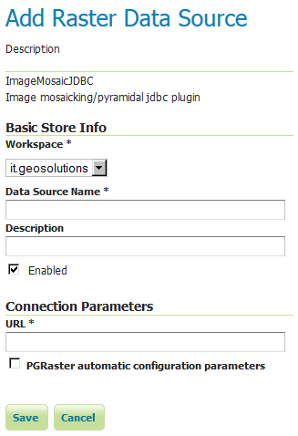
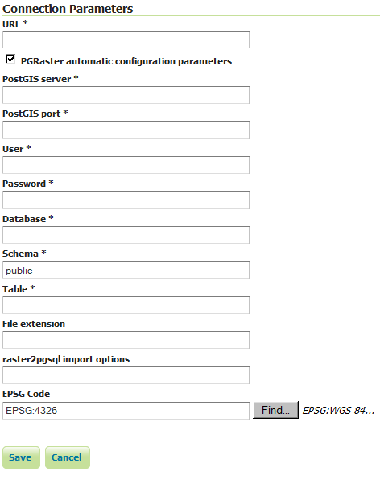

# PGRaster {: #community_pgraster }

The PGRaster geoserver module adds the ability to simplify the configuration of a PostGis Raster based ImageMosaic-JDBC store. Before proceeding, make sure to take a look to the [PostGis Raster plugin documentation](https://docs.geotools.org/latest/userguide/library/coverage/pgraster.html) for background information. Note that configuration files, table creations and raster imports explained in that documentation, will be automatically handled by this module.

**This module allows to do the following steps automatically:**

1.  use raster2pgsql (optionally) to import raster tiles previously configured with gdal_retile
2.  create a metadata table (optionally) referring to tiles tables created through raster2pgsql
3.  create the imageMosaic JDBC XML configuration containing PostGis database connection parameters, attributes mapping and coverage configuration.
4.  configure the imageMosaic JDBC on top of the newly configured XML.

## Requirements

-   You must have a PostGIS 2.0 database where your raster tiles will be stored.
-   Raster tiles should have been previously created using `gdal_retile` since this module will simply import them and configure the store. The ImageMosaic JDBC setup example documentation provides [examples](https://docs.geotools.org/latest/userguide/library/coverage/jdbc/prepare.html) of how to do that.
-   In case you want to perform automatic import of the raster tiles into the database, you need to have raster2pgsql and psql executables installed on your machine and configured on your `PATH`. (In case your PostGIS 2.0 installation is on the same machine where you will run GeoServer, the executables should be already available).

## Installation

#\. Download the pgraster community module for your version of GeoServer from the [pre 2.20 download page](https://build.geoserver.org/geoserver/master/community-latest/) or from the [2.20+ download page](https://build.geoserver.org/geoserver/main/community-latest/).

1.  Unzip the archive into the WEB-INF/lib directory of the GeoServer installation.

    !!! note

        On Windows, make sure to add a `RASTER2PGSQL_PATH=Drive:\Path\to\bin\folder\containing_raster2pgsqlExecutable` property to the `JAVA_OPTS` as an instance: `JAVA_OPTS=-DRASTER2PGSQL_PATH=C:\work\programs\PostgreSQL\9.2\bin`

2.  Restart GeoServer.

## Usage

1.  As for any other store configuration, go to Stores->Add new Store

2.  Select ImageMosaicJDBC. You will see the usual "Add Raster Data Source" form.

    > 
    >
    > For backward compatibility, you may still configure an ImageMosaicJDBC in the old-way, by specifying the URL of a valid XML configuration file, as done in the past (Where all the components of the ImageMosaicJDBC need to be configured by hand by the user).

3.  Notice the presence of a checkBox which allows to proceed with the PGRaster automatic configuration parameters specification. Once Clicking on it, you will see a set of new parameters for the automatic configuration step. When enabling that checkBox, the URL parameter needs to point to the main folder containing the rasters which have been previously produced using gdal_retile.

    > 
    >
    > Other parameters are explained below:

  --------------------------------------------------------------------------------------------------------------------------------------------------------------------------------------------------------------------------------------------------
  Name                          Description
  ----------------------------- --------------------------------------------------------------------------------------------------------------------------------------------------------------------------------------------------------------------
  PostGIS server                The PostGIS server IP

  PostGIS port                  The PostGIS server port

  User                          The PostGIS DB user

  Password                      The PostGIS DB password

  Database                      The PostGIS Database (should have already been created)

  Schema                        The schema where the table will be created (default is public. The schema need to be already defined into the Database before the import)

  Table                         The name of the metadata table which contains all the references to

  File extension                The extension of the raster files to be imported (such as `png`). It may not be specified when raster tiles have been already manually imported into the database by the user

  raster2pgsql import options   The raster2pgsql script importing options (as an instance "-t 128x128" for raster tiles of 128x128). It may not be specified when raster tiles have been already manually imported into the database by the user

  EPSG Code                     The EPSG code which will be configured in the coverage configuration xml. (Default is 4326)
  --------------------------------------------------------------------------------------------------------------------------------------------------------------------------------------------------------------------------------------------------

## Limitations

Right now it doesn't allow to import data folders which have been created with the gdal_retile's `useDirForEachRow` option.
