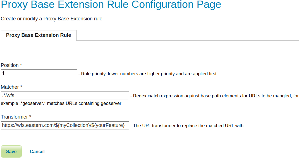

# Using the Proxy Base Extension module

This extension allows the replacement of URLs in the response of a web service request with a different URL. This is useful in order to proxy a web service request to a different server, while still retaining the original URL in the response. An example of this is proxying a WMS request to a different server, but wanting to keep the original URL in the elements of the GetCapabilities response. E.g., rather than exposing WMS at: <http://myserver/geoserver/wms> The module allows exposing the service at: <http://wms.mycompany.com/> and making sure all backlinks in the Capabilities document point to such host.

## Proxy Base Extension Rules

Proxy Base Extension rules allow the matching of the URLs for alteration based on their path elements and followed by the specification a replacement for the entire URL.

A Proxy Base Extension rule is defined by three mandatory attributes:

|               |                                                                                                                                                        |
|---------------|--------------------------------------------------------------------------------------------------------------------------------------------------------|
| **Attribute** | **Description**                                                                                                                                        |
| `Position`    | The priority of the rule, the lower the number the higher the priority. Rules are applied on a first match basis.                                      |
| `Matcher`     | The pattern used to match against paths. Regular expressions can be used to achieve matches.                                                           |
| `Transformer` | The transformation that will be applied to the entire URL. Literal expressions can be used to achieve transformations based on matching header values. |

The following example shows a rule that will match any URL contains the substring `wfs` in the path (the example matcher value is `.*/wfs`) and replace the full URL (the example transformer value is `https://wfs.eastern.com/${myCollection}/${yourFeature}`) with `https://wfs.eastern.com/ABigCollection/AnImportantFeature` if the `myCollection` header is set to `ABigCollection` and the `yourFeature` header is set to `AnImportantFeature`. Note that if one or more of the headers referenced in the transformer by literal expressions are not present the rule will not be applied.

Example of a Proxy Base Extension rule:

*Example of a Proxy Base Extension rule defined in the UI*

This rule will transform the URL (when the `myCollection` and `yourFeature` headers are set):

    http://localhost:8080/geoserver/wfs

to:

    https://wfs.eastern.com/ABigCollection/AnImportantFeature

## Rules Management

Rules can be managed and tested with simulated headers in the rules management UI. Besides the basic operations like add, remove and update is also possible to activate or deactivate rules. A deactivated rule will be ignored by this module.

*Rules management UI*

|               |                                                                                                                                                                                        |
|---------------|----------------------------------------------------------------------------------------------------------------------------------------------------------------------------------------|
| **Attribute** | **Description**                                                                                                                                                                        |
| `Position`    | The priority of the rule, the lower the number the higher the priority. Rules are applied on a first match basis.                                                                      |
| `Matcher`     | The pattern used to match against paths. Regular expressions can be used to achieve matches.                                                                                           |
| `Transformer` | The transformation that will be applied to the entire URL. Literal expressions can be used to achieve transformations based on matching header values.                                 |
| `Active`      | When this box is checked, the rule will be applied.                                                                                                                                    |
| `Edit`        | Click to launch an editor for this specific rule.                                                                                                                                      |
| `Input`       | The input URL to be tested against the rules listed above.                                                                                                                             |
| `Headers`     | If the rule to be tested has literal expressions, simulated headers for the test can be entered here in Properties File Format (equal sign separated, with each header on a new line). |
| `Output`      | The result of applying the rules to the input URL will be displayed here after the `Test` button is clicked.                                                                           |

## REST API

The rules can also be managed by means of a REST API found at `geoserver/rest/proxy-base-ext`. Documentation for it is available in [Swagger format](https://docs.geoserver.org/latest/en/api/#1.0.0/proxy-base-ext.yaml)
