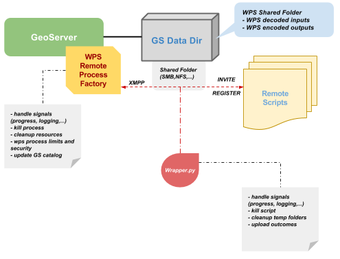
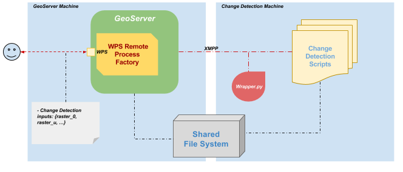

# WPS Remote community module

The GeoServer WPS remote module allows to discover, run and monitor processes running on one or more remote machines, exposing them via the WPS protocol and allowing both synchronous and asynchronous runs of the same, with eventual progress monitoring.

The remote process can be anything, from a Python script or a command line executable. The only constraint is to have a remote component able to handle few RPCs, like run, progress, complete (which means collect and send the outcome to the GeoServer machine), execution error (which means if any error occurs report the exception) and kill. On GeoServer side the module manages the same RPCs in order to perform the integration with the WPS. All the communications and command take place over the XMPP protocol, as a suitable cross-language communication system

A reference implementation of the remote end is available at <https://github.com/geoserver/wps-remote>, a configurable Python/XMPP wrapper for remote commands. The Python XMPP wrapper resides into the remote machine and is able to send a presentation of the remote process through an XMPP message by JSON-encoding into the body the process inputs/outputs parameter descriptors along with their type. On the GeoServer side the WPS Remote module automatically recognizes and loads an XMPP implementation of the RemoteClient. The GeoServer plugin is able to inquire for new available services, un-marshall their inputs and outputs and build appropriate process wrapper for GeoServer WPS to use. At execution time, the new Process is able to interact with the RemoteClient plug-in implementation in order to send a request to the Service.py, follow the status of the remote process and get the outputs at the end.

## Orchestrating remote executable through GeoServer WPS and XMPP

The Remote WPS infrastructure is designed to run external programs **asynchronously** through the standard *OGC WPS* protocol interface on remote machines and to track their progress through the *XMPP Protocols*.

The infrastructure relies on an *XMPP Server* (which can be external or embedded) in order to implement a *message passing distributed infrastructure* that uses the XMPP protocols for exchanging control and status messages between the GeoServer instances and the executables running on remote machines.

A Python based framework, along with addoc GeoServer plugins, manages and translates the XMPP messages by decoupling the custom mechanism of launching external executables running on remote machines from the standard way of invoking OGC WPS compliant processes in GeoServer.

The OGC WPS process I/O map is automatically generated by the Remote WPS GeoServer plug-ins at runtime. Every time the framework recognizes a new external executable declared on the XMPP channel, the Remote WPS GeoServer plug-in creates the equivalent OGC WPS compliant interface and establishes the communication between GeoServer and the external executable. Every time a GeoServer user starts a new OGC WPS compliant process run, the infrastructure performs a call to the external executable and takes care of managing the communication between the two entities asynchronously.

The Remote WPS GeoServer plug-ins provide a new *ProcessFactory* which is responsible to register/unregister the OGC WPS compliant processes automatically and at runtime. Orchestration will be performed by the newly created GeoServer ProcessFactory upon a WPS execution request with the help of the XMPP Server which provides out-of-the-box nodes presence discovery and load balancing capabilities for the remote node through the interaction with the Python framework.

The orchestrator will also be responsible for redirecting the messages generated by running executables on the remote machines to the correct GeoServer process and vice versa for control messages. Executables running on the remote hosts through the Python framework wrappers, will generate progress information which will be sent back to the orchestrator via XMPP.

It is important to note that there are two levels of load balancing. One on the GeoServer side and one on the remote processing nodes side. The GeoServer load balancer will know which user has requested the processing and will be able to enforce system and resources limitations associated to it; as an instance, a user won't be able to run more than M processes in parallel and a quota for both the inputs and outputs will be assigned to its executions. The Orchestrator will be responsible, in cooperation with the XMPP service, for balancing the load for a certain executables on the remote hosts and for deciding where to send a new execution request in case a certain executable has been deployed on multiple remote machines.

Also note that the GeoServer instances comprising the cluster will share a specific directory where the WPS specific resources will be stored.

### Invoking remote processes and consuming the results

The executables on the remote hosts will be invoked through the command line by the Python framework wrappers in response to execution commands, received via the Orchestrator XMPP messages, as the result of a GeoServer WPS Execute call.

On the remote machines the Python framework wrappers and scripts will act as XMPP clients providing the ability to:

-   launch command-line executables using the inputs provided by the end user from the GeoServer process orchestrator
-   send back to the orchestrator status messages with the progress and status of the execution
-   receive eventual control messages from the orchestrator to tentatively kill running executions
-   perform clean-up operations like looking for zombie executions and killing them or removing stale files on the file system from old executions
-   perform runtime discovery of new remote executable

The illustration below shows the interaction between the GeoServer Remote WPS plug-in and the Python framework wrappers. The whole communication is achieved through the XMPP protocols. The Python framework makes available a set of scripts and wrappers allowing to invoke the external executables and manage the entire execution by translating commands and outputs into XMPP messages to be sent and received by GeoServer.

> 

As mentioned above the remote executables should adhere to a certain contract in order to fully support all these functionalities. As an example the ability to kill an existing execution heavily relies on the fact that the current process accounted for this functionality, otherwise we would have to try and kill it using operating system calls. This might require the end user to create wrappers around the legacy executables in certain cases.

Runtime discovery of new remote executable will be supported through adding new Properties files to a location known to the Python modules. A new OGC WPS compliant process will be directly exposed to GeoServer without restarting the GeoServer itself for the new remote executable since the Python wrappers will communicate the existence of a new executable by interacting with the GeoServer Orchestrator via XMPP messages. The end user will see as many OGC WPS compliant processes as properties configuration files on the remote machines thanks to the functionalities implemented by the Python framework scripts.

An example of such a properties file can be like below:

> ``` xml
> [Description]
> service = Service
> namespace = default
> description = A dummy service, replace with your own description
> executable = process.py
> process_buffer = 0
> result_size = 0
> active = True
>
> [Options]
> customargs = --path=D:\user\
> argformat = --key=value
> debug = True
>
> [Input]
> name = {"type": "string", "description": "A person name", "enum": ["Hans", "Peter", "Alex", "Michi"],
> "default": "Hans", "max": 1}
> surname = {"type": "string", "description": "A persons surname", "max": 1, "default": "Meier"}
> child = {"type": "string", "description": "A child name", "min": 0, "max": 10}
>
> [Output]
> welcome = {"type": "string", "description": "A welcome message"}
> goodbye = {"type": "string", "description": "A goodbye message"}
> ```

!!! warning

    the configuration above is a simplified and non-working example of a Remote Process wrapper configuration. The scope of the example above is just for better understand of the high-level scenario and is not meant to be used in a real use case.

### Deploy Diagram

> 

The illustration shows a deploy diagram of a *Change Detection* executable running on a remote machine and exposed as a GeoServer WPS Process thought the *WPS Remote Plug-in*.

-   The external users issue a processing request through GeoServer using the OGC WPS compliant protocol.
-   The GeoServer Remote WPS plug-in, thanks to the WPS RemoteProcessFactory, will be able to expose the processes I/O map along with the process descriptors, and take care of the entire execution by providing feedbacks to the users in an OGC compliant way.
-   On the remote machines, where the executables rely and where the real computation takes place, the Python framework, through the use of wrappers and ad h.o.c. scripts, handles transparently the communication with the Remote plug-in through the XMPP protocols.
-   The XMPP Server, in the middle, handles the secured communication channels ensuring that the endpoints are correctly registered to the system and are able to exchange messages.
-   The outcomes are exchanged through a shared folder.

## Installation and Configuration Steps

The following sections will guide the user to the deployment and configuration of an example *GDAL CONTOUR* command exposed as a GeoServer WPS Process through the WPS Remote Plugin.

The examples will show step-by-step procedures to configure and deploy the whole example on two different machines:

-   Commands to deploy GeoServer with the WPS Remote Plug-in and an OpenFire XMPP Server, will be executed on a CentOS Minimal machine
-   Commands to deploy the WPS Remote XMPP Python Wrapper and GDAL, will be executed on a Windows 7+ machine

<div class="grid cards" markdown>

-   [Deployment And Setup Of GeoServer With WPS Remote Plugin](install_geoserver.md)
-   [Installation Of OpenFire XMPP Server To Exchange Messages](install_xmpp.md)
-   [Deployment And Setup Of The XMPP Python Wrappers](install_python.md)
-   [A Remote "Gdal Contour" Process Binding Example](running_example.md)

</div>
