# Installation Of OpenFire XMPP Server To Exchange Messages

The following commands will prepare a CentOS 7 Minimal ISO machine for the deployment of:

-   Openfire XMPP Server
-   NFS shared file-system

!!! note

    Prerequisite to this section, is the basic preparation of the CentOS machine as described on the section [Deployment And Setup Of GeoServer With WPS Remote Plugin](install_geoserver.md).

## Setup and configuration of Openfire XMPP Server

Originally named Jabber, XMPP is the new label for *Extensible Messaging and Presence Protocol.* and it is associated mostly with instant messaging.

### Setting up PostgreSQL database backend

For the purposes of running a private XMPP communication platform, we can safely stick with PostgreSQL 9.2 which is stable and comes in CentOS 7 by default.

``` bash
# as root

$> yum install -y postgresql postgresql-server postgresql-devel postgresql-libs

# After PostgreSQL packages are installed, enable PostgreSQL to start after each reboot.

$> systemctl enable postgresql.service

# Initialize directory structure and postgres system database.

$> postgresql-setup initdb

# And start the service.

$> systemctl start postgresql.service
```

Postgres installation is now up and running, lets proceed with setting up the specific database and the dedicated user for OpenFire, together with authentication method and administration password.

For full administration access, switch to postgres user.

``` bash
su postgres

# as postgres

$> createdb openfire
$> createuser -P openfire

# The '-P' parameter ensures that the shell will explicitly ask for user's password and you will need to type it in. Enter the password twice

   R3m0T3wP5

$> psql -U postgres -d postgres -c "ALTER USER postgres WITH PASSWORD 'R3m0T3wP5';"
```

Postgres user is secured with the new password. Lets put authentication methods in practice and force every application or shell login to prompt for these passwords.

``` bash
# as postgres

$> vim /var/lib/pgsql/data/pg_hba.conf

# Scroll down to the bottom of the file and replace all peer and ident strings with md5 string.
# The configuration should look like this:

   # TYPE DATABASE USER CIDR-ADDRESS METHOD

   # "local" is for Unix domain socket connections only

   local      all         all                 md5

   # IPv4 local connections:

   host       all         all 127.0.0.1/32    md5

   # IPv6 local connections:

   host       all         all      ::1/128    md5
```

Go back from postgres shell (Ctrl+D) and restart postgresql service as root.

``` bash
# as root

$> systemctl restart postgresql.service
```

### Download and install Openfire from Ignite Realtime

Since OpenFire RPM package is not included in any major RHEL / CentOS / Fedora distribution repositories, it must be downloaded directly from Ignite Realtime website.

``` bash
# as root

$> wget http://www.igniterealtime.org/downloadServlet?filename=openfire/openfire-3.10.0-1.i386.rpm -O openfire-3.10.0-1.i386.rpm

# This package come in 32bit version only, so in case we run this installation on x86_64 system, we need to make sure to install corresponding 32bit libraries as well.

$> yum install -y /root/openfire-3.9.3-1.i386.rpm

$> yum install -y glibc.i686
```

Enable the openfire service and start it

``` bash
# as root

$> chkconfig openfire on

$> systemctl start openfire.service

# We need to open the firewall ports in order to expose the gui to the outside

$> firewall-cmd --permanent --zone=public --add-port=9090/tcp
$> firewall-cmd --permanent --zone=public --add-port=9091/tcp
$> firewall-cmd --reload
```

**Configuration of Openfire server**

Move the browser to the url

> <http://YOUR-SERVER-IP:9090>

Choose preferable language and hit `Contine`

> 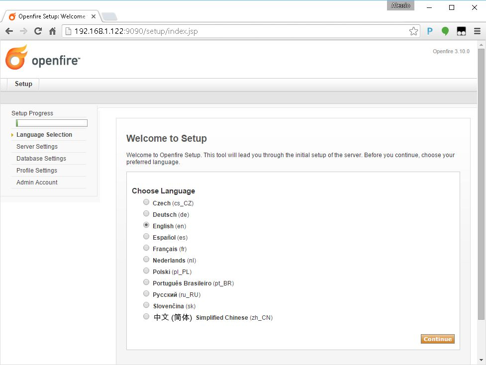

Specify the server Domain as

> `geoserver.org`
>
> 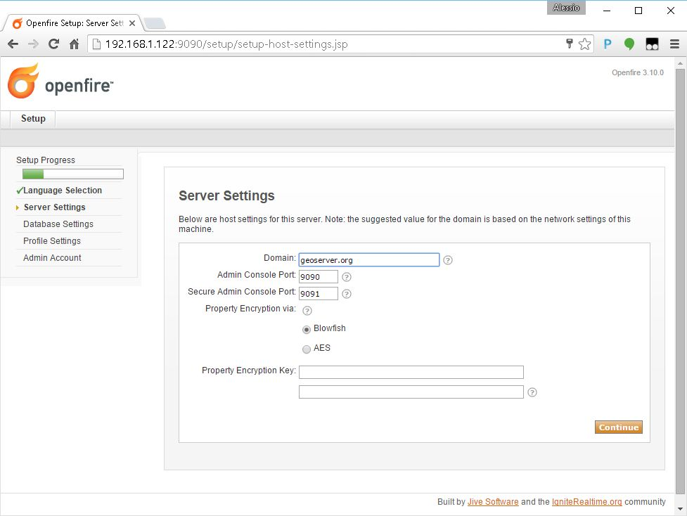

Choose the *Standard Database Connection* in the next section

> 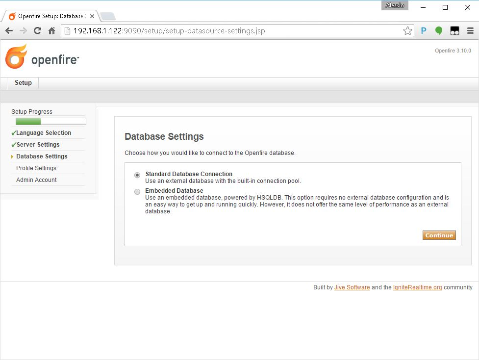

Provide the Database connection parameters for the PostgreSQL DB in the standard connection section.

The password for the user `openfire` is the same provided in the PostgreSQL DB setup (see above).

> 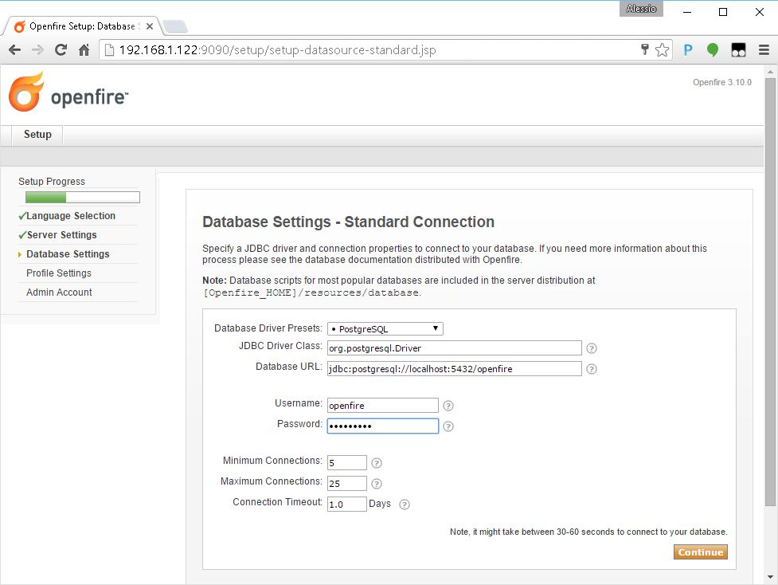

!!! note

    Be sure the `openfire` database and user have been correctly created on PostgreSQL and the passwords provided (see above for instructions).

If there are no connection issues, choose `Default` value on the users profile settings section.

> 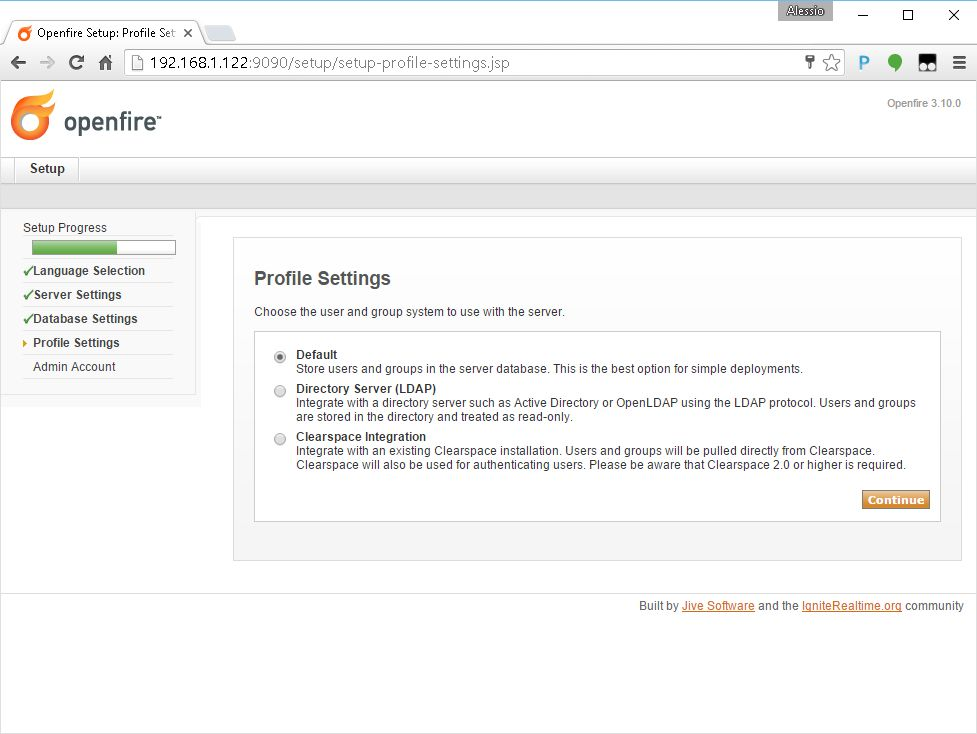

Create the *Administrator* account in the next section.

The password ***must*** match the one specified in the `remoteProcess.properties` file

> `R3m0T3wP5`
>
> 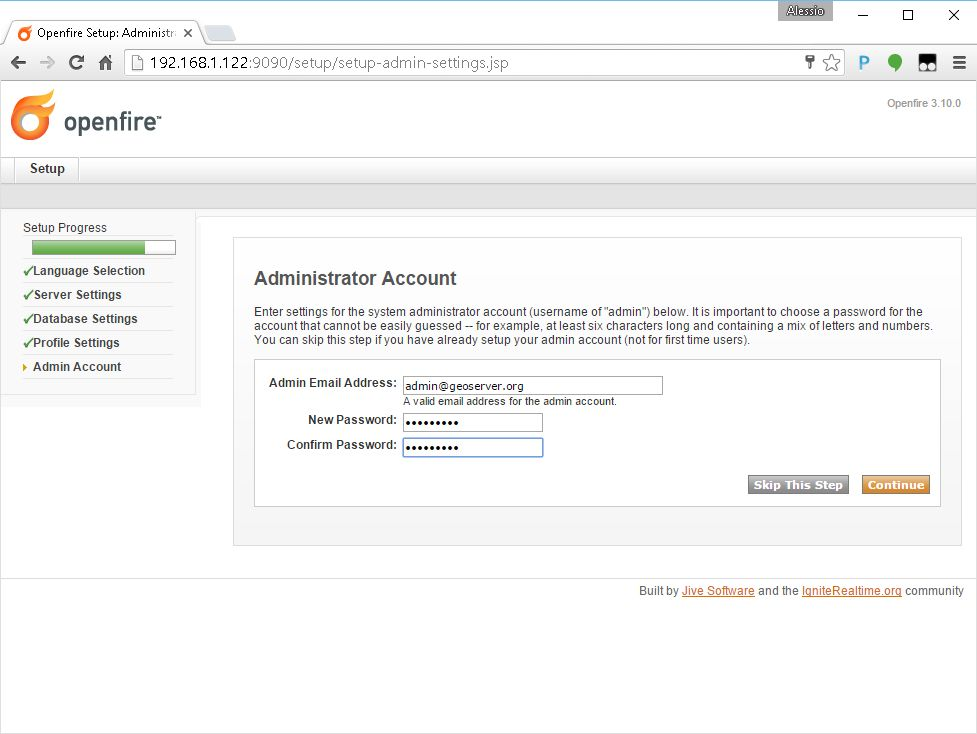

The initial setup is now complete. Log into the system using the newly created *admin* account.

> 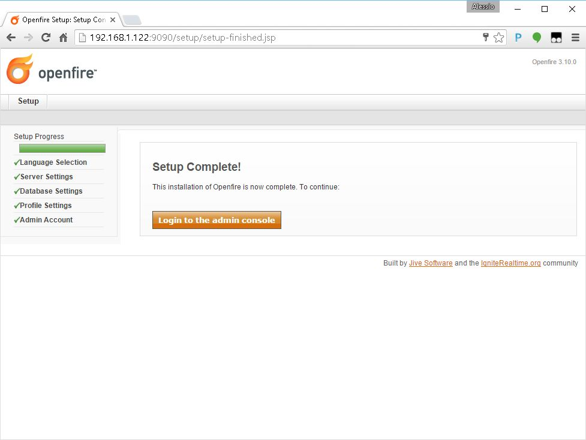
>
> 

Move to the `Server Certificates` section of the `Server Settings` tab panel.

!!! warning

    This passage is not needed anymnore on Openfire 4.0+. At least the management of the certificates is a bit different. Please refer to the specific Openfire documentation for more information.
    
    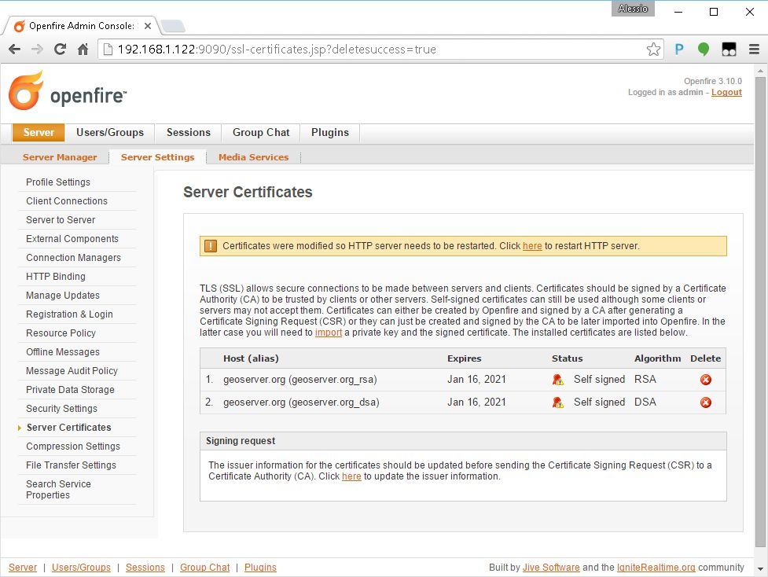

Make sure that the self-signed certificates have been correctly generated and click on `here` in order to restart the server

!!! warning

    This passage is not needed anymnore on Openfire 4.0+. At least the management of the certificates is a bit different. Please refer to the specific Openfire documentation for more information.
    
    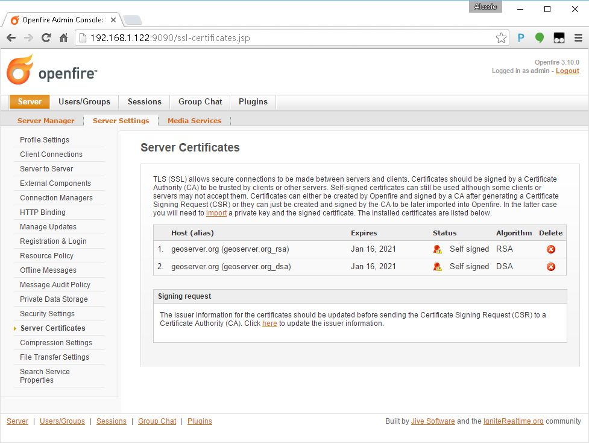

The same section now shows the server certificates and won't ask for another restart unless the certificates are generated again.

Update the `Security Settings` in order to allow the server accepting self-signed certificates on secured connections.

!!! warning

    This passage is not needed anymnore on Openfire 4.0+. At least the management of the certificates is a bit different. Please refer to the specific Openfire documentation for more information.
    
    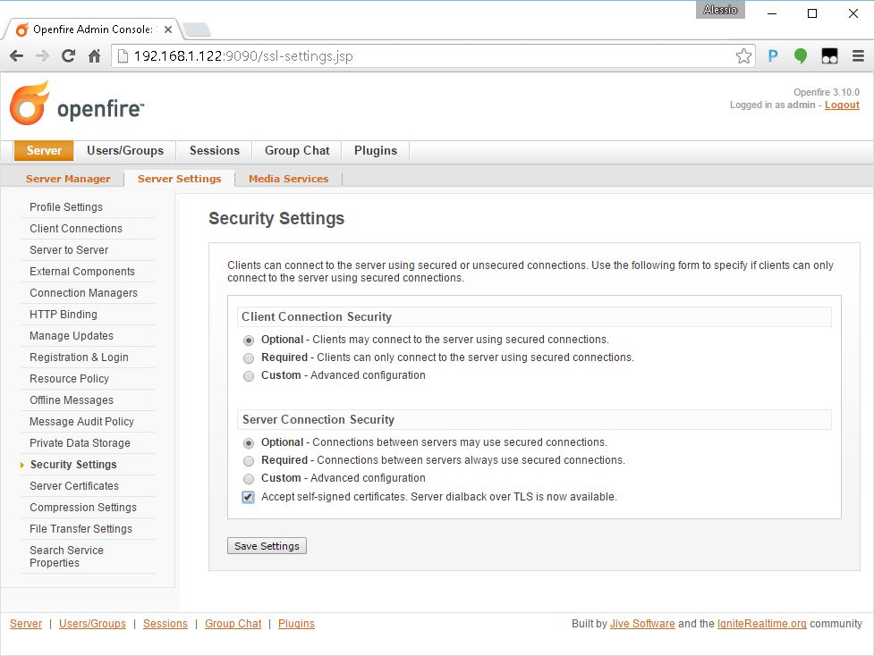

Create the `default` channel as shown in the next figure.

> 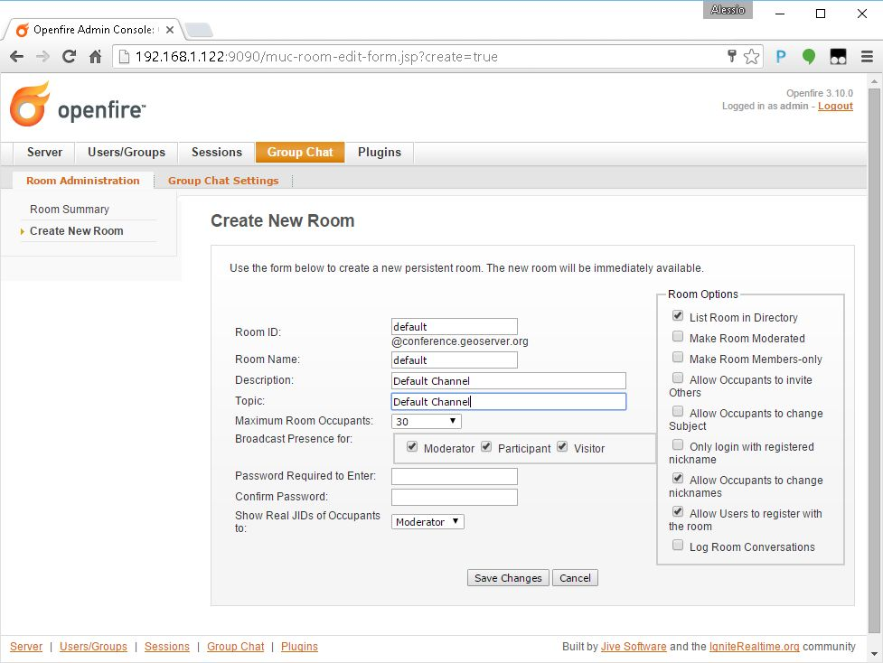

Create the `management` channel as shown in the next figure. Pay attention to the `Room Options` and specify the password for the channel

> `R3m0T3wP5`
>
> 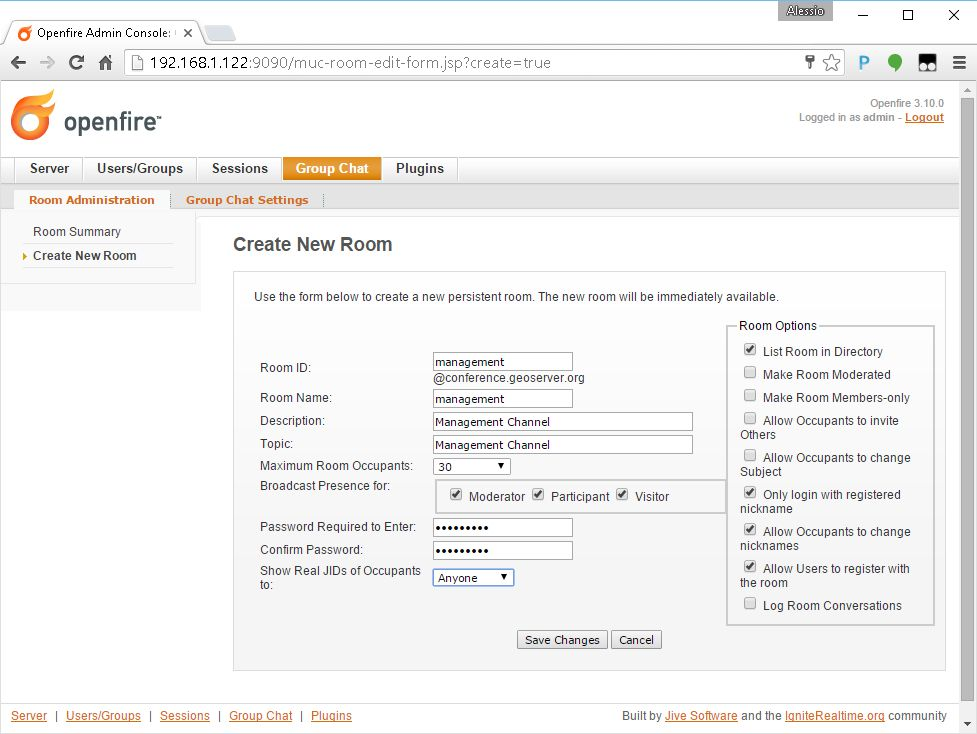

Double check that the channels have been correctly created and they appear in the `Group Chat Rooms`.

> 

*Restart GeoServer*

``` bash
# as root

$> systemctl restart geoserver
```

After the GeoServer has successfully restarted, double check that it is connected to the server using the `admin` credentials.

It is ***very*** important that the user is shown as `Authenticated`.

> 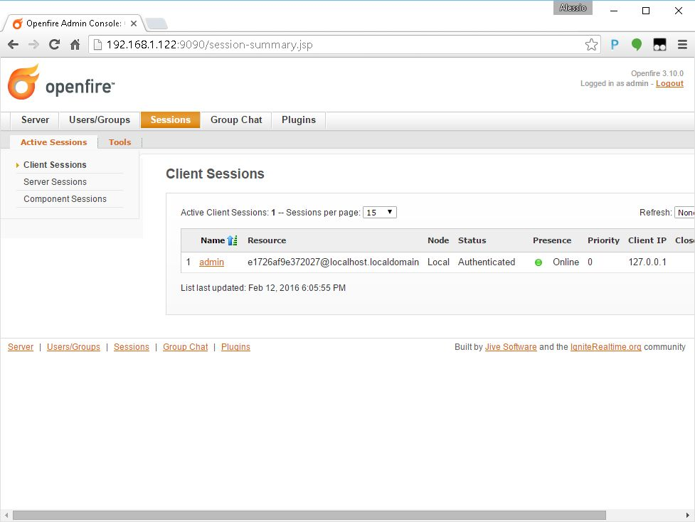

Check also that the user is registered to the XMPP channels created above.

> 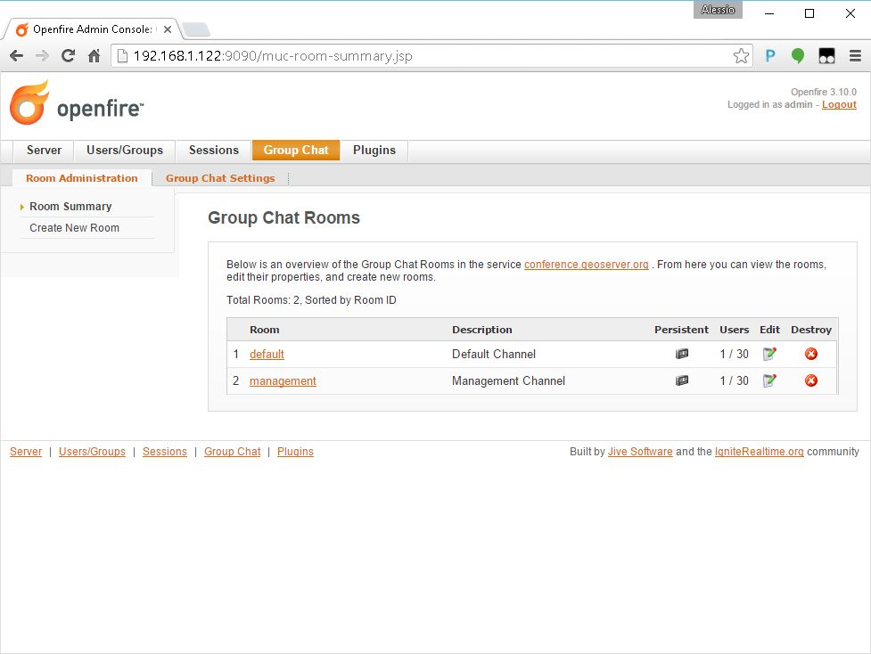

### Firewall Rules For XMPP Ports

By default the TCP Ports where the XMPP Server is listening for incoming connection are closed to the outside. Therefore it is necessary to enable the Firewall rules at least for the Openfire default secured port *5223* unless it has been changed by the user during the server setup.

In order to do that issue the following commands:

``` bash
# as root

# We need to open the firewall ports in order to expose the gui to the outside

$> firewall-cmd --permanent --zone=public --add-port=5222/tcp
$> firewall-cmd --permanent --zone=public --add-port=5223/tcp

$> firewall-cmd --reload
```

### Forward Proxy to Apache HTTPD Server

The procedures described in this section allows to expose GeoServer via HTTPD through Apache HTTPD Server.

Those steps are not mandatory and the procedure may change accordingly to the final deployment on production systems.

In order to install Apache HTTPD Server proceed as follows:

``` bash
# as root

$> yum -y install httpd mod_ssl

$> vi /etc/httpd/conf.d/forward-proxy.conf

   ProxyRequests Off

   ProxyPass /geoserver ajp://localhost:8009/geoserver
   ProxyPassReverse /geoserver ajp://localhost:8009/geoserver

$> systemctl enable httpd.service

$> service httpd restart
```

*Selinux*, enabled by default, needs to be instructed to allow http network connections. This can be done by running the command:

``` bash
# as root

$> /usr/sbin/setsebool -P httpd_can_network_connect 1
```

### Shared Folder through the NFS protocol

The next steps describe how to setup the system in order to expose a Shared Network Folder which will be used to store the outcomes of the remote processing.

The following procedures are not mandatory and the final deployment on the production system may be configured to use different protocols and frameworks to expose shared file-systems.

The setup and initial configuration of the NFS packages can be done by following the next procedure:

``` bash
# as root

$> yum -y install nfs-utils

$> vi /etc/idmapd.conf

   # The following should be set to the local NFSv4 domain name

   # The default is the host's DNS domain name.
   Domain = geoserver.org
```

!!! note

    The domain specified above maybe different depending on the final system deployment and the production environment setup.

Creating and exposing a shared folder is possible by following the next steps:

1.  as root
2.  Create the physical folder structure to be exposed via the Network Filesystem

> ``` bash
> $> mkdir /share
> $> mkdir /share/xmpp_data
> $> mkdir /share/xmpp_data/output
> $> mkdir /share/xmpp_data/resource_dir
> ```

3.  Modify the rights in order to allow

    ``` bash
    ```

    \$> chmod -Rf 777 /share

4.  Once the physical folder is ready it must be exposed via the `exports`

> ``` bash
> $> vi /etc/exports
> ```

4.  write settings for NFS exports

> ``` bash
> /share host_ip/24(rw,no_root_squash)
> ```

4.  Restart the NFS services

> ``` bash
> $> systemctl start rpcbind nfs-server
>
> $> systemctl enable rpcbind nfs-server
> ```

!!! note

    The **host_ip** must be the one of the host exposing the shared folder.

*Selinux*, enabled by default, needs to be instructed to allow NFS connections. This can be done by running the following commands:

``` bash
# as root

$> setsebool -P httpd_use_nfs=1

$> setsebool -P samba_share_nfs=1

$> setsebool -P samba_export_all_ro=1

$> setsebool -P samba_export_all_rw=1
```
