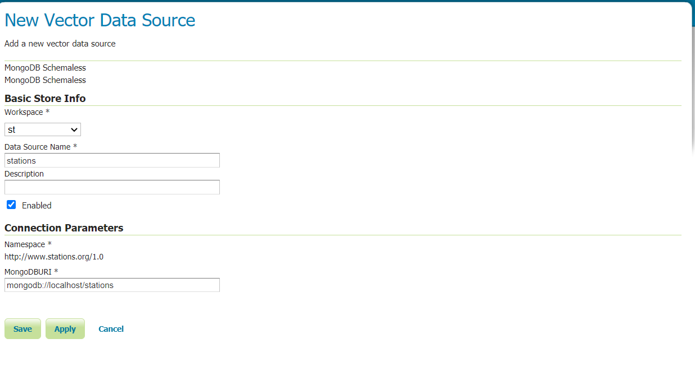

# MongoDB Schemaless Support {: #schemaless_mongo }

By clicking on MongoDB Schemaless we land on the store configuration page. The only needed parameters are the `workspace` and the `MongoDBURI`. For a description of the available MongoDB URI format check [here](https://docs.mongodb.com/manual/reference/connection-string) .



After saving, it will be possible to serve every MongoDB collection found in the database as a layer, by the layer configuration page.

The default geometry can be defined by setting a geometry index on the desired geometry attribute in the MongoDB collection.

As an example of the obtained output we will use the Stations use case. In the MongoDB collection we have the following document among the others being served:

``` json
{
"_id": {
 "$oid": "58e5889ce4b02461ad5af080"
},
"id": "1",
"name": "station 1",
"numericValue": 20,
"contact": {
 "mail": "station1@mail.com"
},
"geometry": {
 "coordinates": [
   50,
   60
 ],
 "type": "Point"
},
"measurements": [
 {
   "name": "temp",
   "unit": "c",
   "values": [
     {
       "time": 1482146800,
       "value": 20
     }
   ]
 },
 {
   "name": "wind",
   "unit": "km/h",
   "values": [
     {
       "time": 1482146833,
       "value": 155
     }
   ]
 }
]
}
```

The GeoJSON output for that specific document will be the following feature:

``` json
{
 "type": "Feature",
 "id": "58e5889ce4b02461ad5af080",
 "geometry": {
   "type": "Point",
   "coordinates": [
     50,
     60
   ]
 },
 "properties": {
   "@featureType": "stations",
   "_id": "58e5889ce4b02461ad5af080",
   "name": "station 1",
   "numericValue": 20,
   "contact": {
     "type": "Feature",
     "id": "fid-3087ff95_17844d87c61_-7aad",
     "geometry": null,
     "properties": {
       "@featureType": "Contact",
       "mail": "station1@mail.com"
     }
   },
   "id": "1",
   "measurements": [
     {
       "values": [
         {
           "value": 20,
           "time": 1482146800
         }
       ],
       "name": "temp",
       "unit": "c"
     },
     {
       "values": [
         {
           "value": 155,
           "time": 1482146833
         }
       ],
       "name": "wind",
       "unit": "km/h"
     }
   ]
  }
}
```

As it is possible to see, the feature object is very close to the appearance of the corresponding MongoDB document.

## Simplified Property Access

Behind the scenes the module builds a complex feature schema on the fly automatically along with the complex features being served. Every array or object in the document is considered to be a nested feature. This might result in a hard time trying to foreseen the xpath needed to access a feature property for styling or filtering purpose, because the internal nested feature representation follows the GML object property model.

To clarify this lets assume that we want to filter the stations features on a measurements value greater than 100. According to the above GeoJSON feature representation the whole filter will look like: `measurements.MeasurementsFeature.values.ValuesFeature.value > 100`.

The property path needs to specify for each nested complex attribute the property name and the feature name. The former coincides with the original attribute name in the document, while the latter with that attribute name with the first letter upper cased and the `re` suffix.

To avoid users needing to deal with this complexity, simplified property access support has been implemented. This allows referencing a property with a path that matches the GeoJSON output format or the document structure.

The previously defined filter could then be: `measurements.values.value > 100`.

As can be seen, the property path can be easily inferred both from the GeoJSON output and from the MongoDB document.
