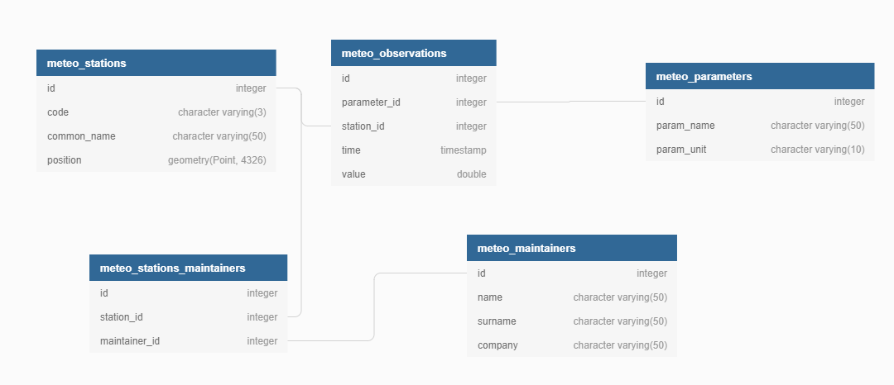
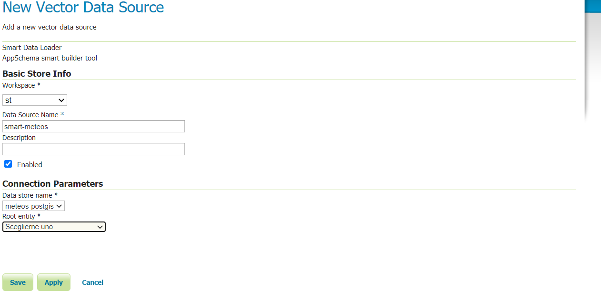

# Smart Data Loader

## Data Store

In addition to the parameters common to each `DataStore` configuration such as `workspace`, `name` and `description`, the page shows the following connection parameters in the dedicated section:

-   `Data store name`: the name of the PostGIS `DataStore` already created under the same workspace. It will be used to access the database and build xsd and mappings file based on the database metadata.
-   `Root entity`: the name of the DB table to be used as the root FeatureType to build the xsd and the mapping file.

Once selected the root entity a diagram of the entities available will appear. Uncheck the attributes that should not be included in the XSD and the mapping file.

## Meteo Stations example

This section provides an example of configuring the `DataStore` with weather station information.

!!! note

    This example is intended to be illustrative of a general approach, and does not reflect a formally defined schema or information model. Also, more complicated scenarios may require significantly more work.

A diagram of the entities involved is shown below:

*Entities diagram*

!!! note

As shown, the dataset consists of:

-   A One to Many relationship between the `meteo_stations` and `meteo_observations` tables.
-   A Many to Many relationship between the `meteo_stations` and `meteo_maintainers` tables, mapped by the relation table `meteo_stations_maintainers`.
-   A Many to One relationship between the `meteo_observations` and the `meteo_parameters` tables.

Assuming a PostGIS datastore named meteos-simple under the st workspace, by opening the Smart Data Loader page we will have to select the desired workspace and the postgis datastore belonging to the selected workspace, in this case the meteos-postgis one:

*Smart Data Loader configuration page*

After having selected the root entity as meteo-stations, a schema, which will be used to generate the XSD and mappings file, will appear. Each attribute/entity can be unchecked to avoid it being included in the generated mappings.

..figure:: images/store-relations.png

> Smart Data Loader configuration page - entities' tree

After pressing the save button, the files will be generated automatically in the store data-dir directory under `app-schema-mappings` directory.

The generated mappings file for this example are explained below.

GML schema definition:

    <?xml version="1.0" encoding="UTF-8"?><xs:schema xmlns:gml="http://www.opengis.net/gml/3.2" xmlns:st="http://www.stations.org/1.0" xmlns:xs="http://www.w3.org/2001/XMLSchema" attributeFormDefault="unqualified" elementFormDefault="qualified" targetNamespace="http://www.stations.org/1.0" version="1.0">
    <xs:import namespace="http://www.opengis.net/gml/3.2" schemaLocation="http://schemas.opengis.net/gml/3.2.1/gml.xsd"/>
    <xs:complexType name="MeteoStationsType">
      <xs:complexContent>
        <xs:extension base="gml:AbstractFeatureType">
          <xs:sequence>
            <xs:element maxOccurs="1" minOccurs="0" name="id" type="xs:int"/>
            <xs:element maxOccurs="1" minOccurs="0" name="code" type="xs:string"/>
            <xs:element maxOccurs="1" minOccurs="0" name="common_name" type="xs:string"/>
            <xs:element maxOccurs="1" minOccurs="0" name="position" type="gml:GeometryPropertyType"/>
            <xs:element maxOccurs="unbounded" minOccurs="0" name="meteoObservations" type="st:MeteoObservationsPropertyType"/>
            <xs:element maxOccurs="unbounded" minOccurs="0" name="meteoStationsMaintainers" type="st:MeteoStationsMaintainersPropertyType"/>
          </xs:sequence>
        </xs:extension>
      </xs:complexContent>
    </xs:complexType>
    <xs:element name="MeteoStationsFeature" substitutionGroup="gml:AbstractFeature" type="st:MeteoStationsType"/>
    <xs:complexType name="MeteoObservationsType">
      <xs:complexContent>
        <xs:extension base="gml:AbstractFeatureType">
          <xs:sequence>
            <xs:element maxOccurs="1" minOccurs="0" name="id" type="xs:int"/>
            <xs:element maxOccurs="1" minOccurs="0" name="time" type="xs:dateTime"/>
            <xs:element maxOccurs="1" minOccurs="0" name="value" type="xs:double"/>
            <xs:element maxOccurs="unbounded" minOccurs="0" name="meteoParameters" type="st:MeteoParametersPropertyType"/>
          </xs:sequence>
        </xs:extension>
      </xs:complexContent>
    </xs:complexType>
    <xs:element name="MeteoObservationsFeature" substitutionGroup="gml:AbstractFeature" type="st:MeteoObservationsType"/>
    <xs:complexType name="MeteoObservationsPropertyType">
      <xs:sequence minOccurs="0">
        <xs:element ref="st:MeteoObservationsFeature"/>
      </xs:sequence>
      <xs:attributeGroup ref="gml:AssociationAttributeGroup"/>
    </xs:complexType>
    <xs:complexType name="MeteoParametersType">
      <xs:complexContent>
        <xs:extension base="gml:AbstractFeatureType">
          <xs:sequence>
            <xs:element maxOccurs="1" minOccurs="0" name="id" type="xs:int"/>
            <xs:element maxOccurs="1" minOccurs="0" name="param_name" type="xs:string"/>
            <xs:element maxOccurs="1" minOccurs="0" name="param_unit" type="xs:string"/>
          </xs:sequence>
        </xs:extension>
      </xs:complexContent>
    </xs:complexType>
    <xs:element name="MeteoParametersFeature" substitutionGroup="gml:AbstractFeature" type="st:MeteoParametersType"/>
    <xs:complexType name="MeteoParametersPropertyType">
      <xs:sequence minOccurs="0">
        <xs:element ref="st:MeteoParametersFeature"/>
      </xs:sequence>
      <xs:attributeGroup ref="gml:AssociationAttributeGroup"/>
    </xs:complexType>
    <xs:complexType name="MeteoStationsMaintainersType">
      <xs:complexContent>
        <xs:extension base="gml:AbstractFeatureType">
          <xs:sequence>
            <xs:element maxOccurs="1" minOccurs="0" name="id" type="xs:int"/>
            <xs:element maxOccurs="unbounded" minOccurs="0" name="meteoMaintainers" type="st:MeteoMaintainersPropertyType"/>
          </xs:sequence>
        </xs:extension>
      </xs:complexContent>
    </xs:complexType>
    <xs:element name="MeteoStationsMaintainersFeature" substitutionGroup="gml:AbstractFeature" type="st:MeteoStationsMaintainersType"/>
    <xs:complexType name="MeteoStationsMaintainersPropertyType">
      <xs:sequence minOccurs="0">
        <xs:element ref="st:MeteoStationsMaintainersFeature"/>
      </xs:sequence>
      <xs:attributeGroup ref="gml:AssociationAttributeGroup"/>
    </xs:complexType>
    <xs:complexType name="MeteoMaintainersType">
      <xs:complexContent>
        <xs:extension base="gml:AbstractFeatureType">
          <xs:sequence>
            <xs:element maxOccurs="1" minOccurs="0" name="id" type="xs:int"/>
            <xs:element maxOccurs="1" minOccurs="0" name="name" type="xs:string"/>
            <xs:element maxOccurs="1" minOccurs="0" name="surname" type="xs:string"/>
            <xs:element maxOccurs="1" minOccurs="0" name="company" type="xs:string"/>
          </xs:sequence>
        </xs:extension>
      </xs:complexContent>
    </xs:complexType>
    <xs:element name="MeteoMaintainersFeature" substitutionGroup="gml:AbstractFeature" type="st:MeteoMaintainersType"/>
    <xs:complexType name="MeteoMaintainersPropertyType">
      <xs:sequence minOccurs="0">
        <xs:element ref="st:MeteoMaintainersFeature"/>
      </xs:sequence>
      <xs:attributeGroup ref="gml:AssociationAttributeGroup"/>
    </xs:complexType>
    </xs:schema>

App-Schema mappings file:

    <?xml version="1.0" encoding="UTF-8"?><ns3:AppSchemaDataAccess xmlns:ns2="http://www.opengis.net/ogc" xmlns:ns3="http://www.geotools.org/app-schema">
    <namespaces>
      <Namespace>
        <prefix>gml</prefix>
        <uri>http://www.opengis.net/gml/3.2</uri>
      </Namespace>
      <Namespace>
        <prefix>st</prefix>
        <uri>http://www.stations.org/1.0</uri>
      </Namespace>
    </namespaces>
    <includedTypes/>
    <targetTypes>
      <FeatureType>
        <schemaUri>./meteo_stations-gml.xsd</schemaUri>
      </FeatureType>
    </targetTypes>
    <typeMappings>
      <FeatureTypeMapping>
        <sourceDataStore>smartappschematest</sourceDataStore>
        <sourceType>meteo_stations</sourceType>
        <targetElement>st:MeteoStationsFeature</targetElement>
        <attributeMappings>
          <AttributeMapping>
            <targetAttribute>st:MeteoStationsFeature</targetAttribute>
            <idExpression>
              <OCQL>strConcat('MeteoStationsFeature.',id)</OCQL>
            </idExpression>
          </AttributeMapping>
          <AttributeMapping>
            <targetAttribute>st:id</targetAttribute>
            <sourceExpression>
              <OCQL>id</OCQL>
            </sourceExpression>
          </AttributeMapping>
          <AttributeMapping>
            <targetAttribute>st:code</targetAttribute>
            <sourceExpression>
              <OCQL>code</OCQL>
            </sourceExpression>
          </AttributeMapping>
          <AttributeMapping>
            <targetAttribute>st:common_name</targetAttribute>
            <sourceExpression>
              <OCQL>common_name</OCQL>
            </sourceExpression>
          </AttributeMapping>
          <AttributeMapping>
            <targetAttribute>st:position</targetAttribute>
            <sourceExpression>
              <OCQL>position</OCQL>
            </sourceExpression>
          </AttributeMapping>
          <AttributeMapping>
            <targetAttribute>meteoObservations</targetAttribute>
            <sourceExpression>
              <linkField>FEATURE_LINK[1]</linkField>
              <linkElement>st:MeteoObservationsFeature</linkElement>
              <OCQL>id</OCQL>
            </sourceExpression>
          </AttributeMapping>
          <AttributeMapping>
            <targetAttribute>meteoStationsMaintainers</targetAttribute>
            <sourceExpression>
              <linkField>FEATURE_LINK[1]</linkField>
              <linkElement>st:MeteoStationsMaintainersFeature</linkElement>
              <OCQL>id</OCQL>
            </sourceExpression>
          </AttributeMapping>
        </attributeMappings>
      </FeatureTypeMapping>
      <FeatureTypeMapping>
        <sourceDataStore>smartappschematest</sourceDataStore>
        <sourceType>meteo_observations</sourceType>
        <targetElement>st:MeteoObservationsFeature</targetElement>
        <attributeMappings>
          <AttributeMapping>
            <targetAttribute>FEATURE_LINK[1]</targetAttribute>
            <sourceExpression>
              <OCQL>station_id</OCQL>
            </sourceExpression>
          </AttributeMapping>
          <AttributeMapping>
            <targetAttribute>st:MeteoObservationsFeature</targetAttribute>
            <idExpression>
              <OCQL>strConcat('MeteoObservationsFeature.',id)</OCQL>
            </idExpression>
          </AttributeMapping>
          <AttributeMapping>
            <targetAttribute>st:id</targetAttribute>
            <sourceExpression>
              <OCQL>id</OCQL>
            </sourceExpression>
          </AttributeMapping>
          <AttributeMapping>
            <targetAttribute>st:time</targetAttribute>
            <sourceExpression>
              <OCQL>time</OCQL>
            </sourceExpression>
          </AttributeMapping>
          <AttributeMapping>
            <targetAttribute>st:value</targetAttribute>
            <sourceExpression>
              <OCQL>value</OCQL>
            </sourceExpression>
          </AttributeMapping>
          <AttributeMapping>
            <targetAttribute>meteoParameters</targetAttribute>
            <sourceExpression>
              <linkField>FEATURE_LINK[1]</linkField>
              <linkElement>st:MeteoParametersFeature</linkElement>
              <OCQL>parameter_id</OCQL>
            </sourceExpression>
          </AttributeMapping>
        </attributeMappings>
      </FeatureTypeMapping>
      <FeatureTypeMapping>
        <sourceDataStore>smartappschematest</sourceDataStore>
        <sourceType>meteo_parameters</sourceType>
        <targetElement>st:MeteoParametersFeature</targetElement>
        <attributeMappings>
          <AttributeMapping>
            <targetAttribute>FEATURE_LINK[1]</targetAttribute>
            <sourceExpression>
              <OCQL>id</OCQL>
            </sourceExpression>
          </AttributeMapping>
          <AttributeMapping>
            <targetAttribute>st:MeteoParametersFeature</targetAttribute>
            <idExpression>
              <OCQL>strConcat('MeteoParametersFeature.',id)</OCQL>
            </idExpression>
          </AttributeMapping>
          <AttributeMapping>
            <targetAttribute>st:id</targetAttribute>
            <sourceExpression>
              <OCQL>id</OCQL>
            </sourceExpression>
          </AttributeMapping>
          <AttributeMapping>
            <targetAttribute>st:param_name</targetAttribute>
            <sourceExpression>
              <OCQL>param_name</OCQL>
            </sourceExpression>
          </AttributeMapping>
          <AttributeMapping>
            <targetAttribute>st:param_unit</targetAttribute>
            <sourceExpression>
              <OCQL>param_unit</OCQL>
            </sourceExpression>
          </AttributeMapping>
        </attributeMappings>
      </FeatureTypeMapping>
      <FeatureTypeMapping>
        <sourceDataStore>smartappschematest</sourceDataStore>
        <sourceType>meteo_stations_maintainers</sourceType>
        <targetElement>st:MeteoStationsMaintainersFeature</targetElement>
        <attributeMappings>
          <AttributeMapping>
            <targetAttribute>FEATURE_LINK[1]</targetAttribute>
            <sourceExpression>
              <OCQL>station_id</OCQL>
            </sourceExpression>
          </AttributeMapping>
          <AttributeMapping>
            <targetAttribute>st:MeteoStationsMaintainersFeature</targetAttribute>
            <idExpression>
              <OCQL>strConcat('MeteoStationsMaintainersFeature.',id)</OCQL>
            </idExpression>
          </AttributeMapping>
          <AttributeMapping>
            <targetAttribute>st:id</targetAttribute>
            <sourceExpression>
              <OCQL>id</OCQL>
            </sourceExpression>
          </AttributeMapping>
          <AttributeMapping>
            <targetAttribute>meteoMaintainers</targetAttribute>
            <sourceExpression>
              <linkField>FEATURE_LINK[1]</linkField>
              <linkElement>st:MeteoMaintainersFeature</linkElement>
              <OCQL>maintainer_id</OCQL>
            </sourceExpression>
          </AttributeMapping>
        </attributeMappings>
      </FeatureTypeMapping>
      <FeatureTypeMapping>
        <sourceDataStore>smartappschematest</sourceDataStore>
        <sourceType>meteo_maintainers</sourceType>
        <targetElement>st:MeteoMaintainersFeature</targetElement>
        <attributeMappings>
          <AttributeMapping>
            <targetAttribute>FEATURE_LINK[1]</targetAttribute>
            <sourceExpression>
              <OCQL>id</OCQL>
            </sourceExpression>
          </AttributeMapping>
          <AttributeMapping>
            <targetAttribute>st:MeteoMaintainersFeature</targetAttribute>
            <idExpression>
              <OCQL>strConcat('MeteoMaintainersFeature.',id)</OCQL>
            </idExpression>
          </AttributeMapping>
          <AttributeMapping>
            <targetAttribute>st:id</targetAttribute>
            <sourceExpression>
              <OCQL>id</OCQL>
            </sourceExpression>
          </AttributeMapping>
          <AttributeMapping>
            <targetAttribute>st:name</targetAttribute>
            <sourceExpression>
              <OCQL>name</OCQL>
            </sourceExpression>
          </AttributeMapping>
          <AttributeMapping>
            <targetAttribute>st:surname</targetAttribute>
            <sourceExpression>
              <OCQL>surname</OCQL>
            </sourceExpression>
          </AttributeMapping>
          <AttributeMapping>
            <targetAttribute>st:company</targetAttribute>
            <sourceExpression>
              <OCQL>company</OCQL>
            </sourceExpression>
          </AttributeMapping>
        </attributeMappings>
      </FeatureTypeMapping>
    </typeMappings>
    <sourceDataStores>
      <DataStore>
        <id>smartappschematest</id>
        <parameters>
          <Parameter>
            <name>schema</name>
            <value>smartappschematest</value>
          </Parameter>
          <Parameter>
            <name>database</name>
            <value>mock?sslmode=DISABLE&amp;binaryTransferEnable=bytea</value>
          </Parameter>
          <Parameter>
            <name>port</name>
            <value>5432</value>
          </Parameter>
          <Parameter>
            <name>passwd</name>
            <value>postgres</value>
          </Parameter>
          <Parameter>
            <name>Expose primary keys</name>
            <value>true</value>
          </Parameter>
          <Parameter>
            <name>dbtype</name>
            <value>postgis</value>
          </Parameter>
          <Parameter>
            <name>host</name>
            <value>localhost</value>
          </Parameter>
          <Parameter>
            <name>user</name>
            <value>postgres</value>
          </Parameter>
        </parameters>
      </DataStore>
    </sourceDataStores>
    </ns3:AppSchemaDataAccess>

## Customize smart-data-loader generated mappings and xsd definition

The Smart Data Loader does not allow direct modification of the mappings and XSD type definition. However it can be used as a starting point to generate configuration files that can be customized as required. This is the suggested workflow for such a use case:

-   Create a new smart-data-loader store, select the desired PostGIS store, and then the root entity and save it.
-   Go to the geoserver datadir and identify the Smart Data Loader store folder under the workspace that was selected while configuring it. An `app-schema-mappings` directory should be in that store folder.
-   Copy and paste the files contained in that directory to another directory and modify them as needed.
-   Delete the Smart Data Loader store, and create a new App-Schema store with a uri parameter pointing to the folder containing the modified files.
