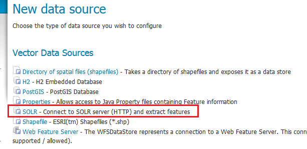
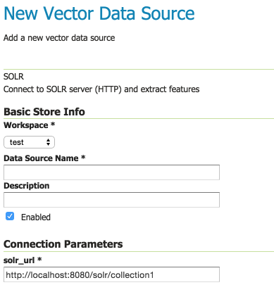
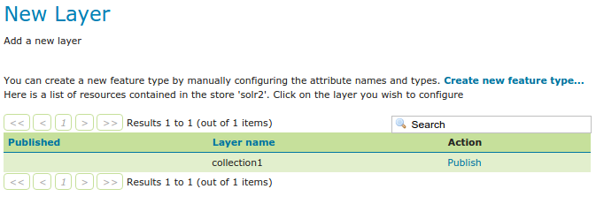
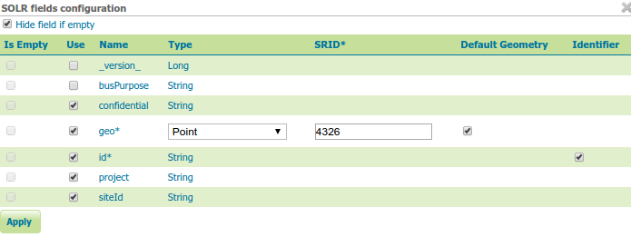
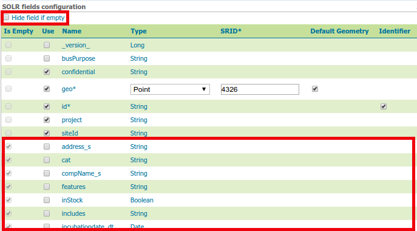
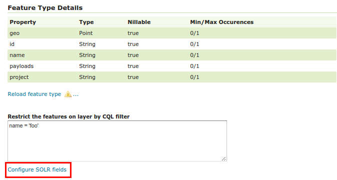

# SOLR layer configuration

## Mapping documents to layers

SOLR indexes almost free form documents, the SOLR instance has a collection of fields, and each document can contain any field, in any combination. On the other side, GeoServer organizes data in fixed structure feature types, and exposes data in separate layers. This leaves the question of how documents in the index should be organized into layers.

By default the store exposes a single layer, normally named after the SOLR collection the store is connected to, by publishing it one can decide which fields to include, and eventually add a filter to select which attributes it will contain.

This single layer can be published multiple times, giving each published layer a different name, set of selected attributes, and a different filter to select the documents contained in the layer.

## Installing the SOLR extension

1.  Download the SOLR extension from the [nightly GeoServer community module builds](https://build.geoserver.org/geoserver/main/community-latest/).

    !!! warning

        Make sure to match the version of the extension to the version of the GeoServer instance.

2.  If GeoServer is running, stop it.

3.  Extract the contents of the archive into the `WEB-INF/lib` directory of the GeoServer installation.

4.  Restart GeoServer, the SOLR data store should show up as an option when going through the new store creation workflow.

## Connecting to a SOLR server

Once the extension is properly installed `SOLR` will show up as an option when creating a new data store.

*SOLR in the list of vector data sources*

## Configuring a SOLR data store {: #community_solr_configure_store }

*Configuring a SOLR data store*

|            |                                                               |
|------------|---------------------------------------------------------------|
| `solr_url` | Provide a link to the SOLR server that provides the documents |

Once the parameters are entered and confirmed, GeoServer will contact the SOLR server and fetch a list of layer names and fill the layer chooser page accordingly:

*List of layers available in the SOLR server*

## Configuring a new SOLR base layer

Once the layer name is chosen, the usual layer configuration panel will appear, with a pop-up showing in a table the fields available:

*The layer field list configuration*

`Is empty`

:   Read only fields, checked if the field has no values in the documents associated to this layer

`Use`

:   Used to select the fields that will make up this layer features

`Name`

:   Name of the field

`Type`

:   Type of the field, as derived from the SOLR schema. For geometry types, you have the option to provide a more specific data type

`SRID`

:   Native spatial reference ID of the geometries

`Default geometry`

:   Indicates if the geometry field is the default one. Useful if the documents contain more than one geometry field, as SLDs and spatial filters will hit the default geometry field unless otherwise specified

`Identifier`

:   Check if the field can be used as the feature identifier

By default the list will contain only the fields that have at least one non null value in the documents associated to the layer, but it is possible to get the full list by un-checking the "Hide field if empty" check-box:

*Showing all fields available in SOLR*

Once the table is filled with the all the required parameters, press the "Apply" button to confirm and go back to the main layer configuration panel. Should the choice of fields be modified, you can click the "Configure SOLR fields" just below the "Feature Type Details" panel.

*Going back to the field list editor*

The rest of the layer configuration works as normal, once all the fields are provided you'll be able to save and use the layer in WMS and WFS.

!!! warning

    In order to compute the bounding box GeoServer will have to fetch all the geometries making up the layer out of SOLR, this operation might take some time, you're advised to manually entered the native bounding box when configuring a layer out of a large document set

## Custom `q` and `fq` parameters

The SOLR store will translate most OGC filters, as specified in SLD, CQL Filter or OGC filter, down into the SOLR engine for native filtering, using the `fq` parameter. However, in some occasions you might need to specify manually either `q` or `fq`, to leverage some native SOLR filtering ability that cannot be expressed via OGC filters.

This can be done by specifying those as `viewparams`, pretty much like in parametric sql views atop relational databases.

For example, the following URL:

    http://localhost:8080/geoserver/nurc/wms?service=WMS&version=1.1.0&request=GetMap
         &layers=nurc:active&styles=geo2&bbox=0.0,0.0,24.0,44.0&width=279&height=512
         &srs=EPSG:4326&format=application/openlayers
         &viewparams=fq:security_ss:WEP

Will send down to SOLR a query looking like:

    omitHeader=true&fl=geo,id&q=*:*&rows=2147483647&sort=id asc
    &fq=status_s:active AND geo:"Intersects(POLYGON ((-0.125 -0.5333333333333333, -0.125 44.53333333333333, 
    24.125 44.53333333333333, 24.125 -0.5333333333333333, -0.125 -0.5333333333333333)))"
    &fq=security_ss:WEP&cursorMark=*

You can notice that:

-   Only the columns needed for the display (in this case, a single geometry) are retrieved
-   The bbox and layer identification filters are specified in the first `fq`
-   The custom `fq` is passed as a second `fq` parameter (SOLR will treat it as being and-ed with the previous one)
