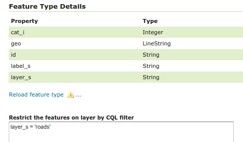
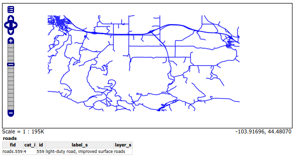

# Loading spatial data into SOLR

This section provides a simple example on how to convert and load a shapefile into a SOLR instance. For more advanced needs and details about spatial support in SOLR consult the SOLR documentation, making sure to read the one associated to the version at hand (spatial support is still rapidly evolving).

The current example has been developed and tested using GDAL 1.11 and SOLR 4.8, different versions of the tools and server might require a different syntax for upload.

The SOLR instance is supposed to have the following definitions in its schema:

``` xml
<field name="geo" type="location_rpt" indexed="true" stored="true" multiValued="true" />  
<dynamicField name="*_i"  type="int"    indexed="true"  stored="true"/>
<dynamicField name="*_s"  type="string"  indexed="true"  stored="true" />
```

The above defines "geo" as explicit fields, leaving the other types to dynamic field interpretation.

The SpatialRecursivePrefixTreeFieldType accepts geometries as WKT, so as a preparation for the import we are going to turn a shapefile into a CSV file with WKT syntax for the geometry. Let's also remember that SOLR needs a unique id field for the records, and that the coordinates are supposed to be in WGS84. The shapefile in question is instead in UTM, has a linestring geometry, and some fields, cat,id and label.

The following command translates the shapefile in CSV (the command should be typed in a single line, it has been split over multiple lines for ease of reading):

    ogr2ogr  -f CSV 
             -sql 'select FID as id, cat as cat_i, label as label_s, 
                  "roads" as layer FROM roads' 
             -lco geometry=AS_WKT -s_srs "EPSG:26713" -t_srs "EPSG:4326"  
             /tmp/roads.csv roads.shp

Some observations:

> -   The SQL is used mostly to include the special FID field into the results (a unique field is required)
> -   The reprojection is performed to ensure the output geometries are in WGS84
> -   The `layer_s` dynamic field is added to

This will generate a CSV file looking as follows:

    WKT,id,cat_i,label_s,layer
    "LINESTRING (-103.763291353072518 44.375039982911382,-103.763393874038698 44.375282535746727,-103.764152625689903 44.376816068582023,-103.763893508430911 44.377653708326527,-103.76287152579593 44.378473197876396,-103.762075892308829 44.379009292692757,-103.76203441159079 44.379195585236509,-103.762124217456204 44.379295262047272,-103.762168141872152 44.379399997909999,-103.762326134985983 44.379527769244149,-103.763328403265064 44.380245486928708,-103.764011871363465 44.381295133519728,-103.76411460103661 44.381526706124056,-103.764953940327757 44.382396618315049,-103.765097289111338 44.382919576408355,-103.765147974157941 44.383073790503197,-103.76593766187851 44.384162856249255,-103.765899236602976 44.384607239970421,-103.765854384388703 44.384597320206453)",0,5,unimproved road,roads
    "LINESTRING (-103.762930948900078 44.385847721442218,-103.763012156628747 44.386002223293282,-103.763510654805799 44.386297912655408,-103.763869052966967 44.386746022746649,-103.763971116268394 44.387444295314552,-103.764244098825387 44.387545690358827,-103.764264649212294 44.387677659170357,-103.764160551326043 44.387951214930865,-103.764540576800869 44.388042632912118,-103.764851624437995 44.388149874425885,-103.764841258550391 44.388303515682807,-103.76484332449354 44.388616502755184,-103.765188923261391 44.388927221995502,-103.765110961905023 44.389448103450221,-103.765245311197177 44.389619574129583,-103.765545516097987 44.389907903843323,-103.765765403056434 44.390420596862072,-103.766285436779711 44.391655378673697,-103.766354640463163 44.39205684519964,-103.76638734105434 44.392364628456725,-103.766410556756725 44.392776645318136,-103.765934443919321 44.393365174368313,-103.766220869020188 44.393571013181166,-103.766661604125247 44.393684955690581,-103.767294323528063 44.393734806102117,-103.767623238680557 44.394127721518785,-103.769273719703676 44.394900867042516,-103.769609703946827 44.395326786724503,-103.769732072038536 44.395745219647871,-103.769609607364416 44.396194309461826,-103.769310708537489 44.396691166475954,-103.768865902286791 44.397236074649896)",1,5,unimproved road,roads

At this point the CSV can be imported into SOLR using CURL:

    curl "http://solr.geo-solutions.it/solr/collection1/update/csv?commit=true&separator=%2C&fieldnames=geo,id,cat_i,label_s,layer_s&header=true" 
         -H 'Content-type:text/csv; charset=utf-8' --data-binary @/tmp/roads.csv

Some observations:

> -   The files gets uploaded as a `text/csv` file, older versions might require a `text/plain` mime type
> -   The `fieldnames` overrides the CSV header and allows us to specify the field name as expected by SOLR

At this point it's possible to configure a layer showing only the roads in the GeoServer UI:


*Setting up the roads layer*

After setting the bounding box and the proper style, the layer preview will show the roads stored in SOLR:


*Preview roads from SOLR layer*
