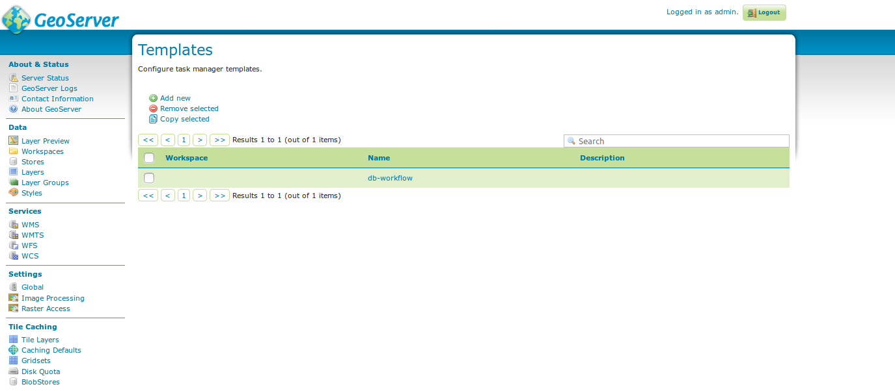
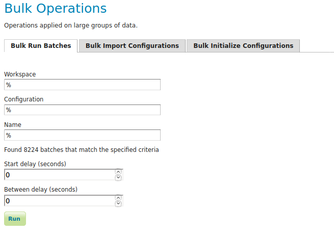
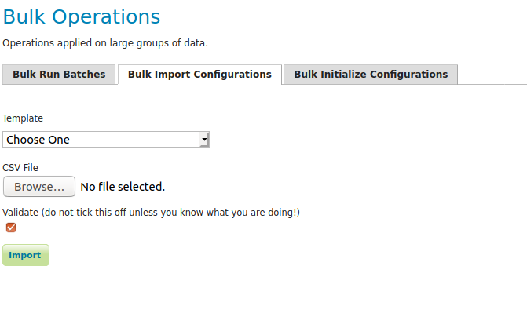
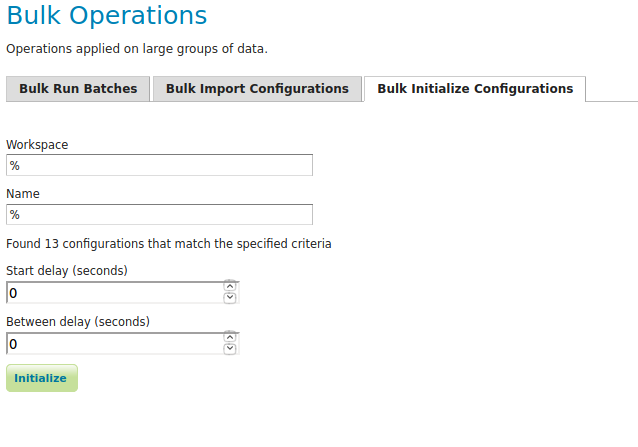
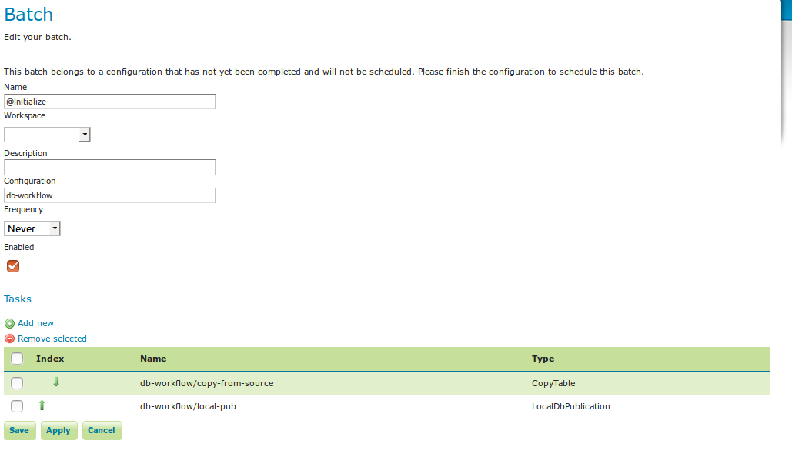
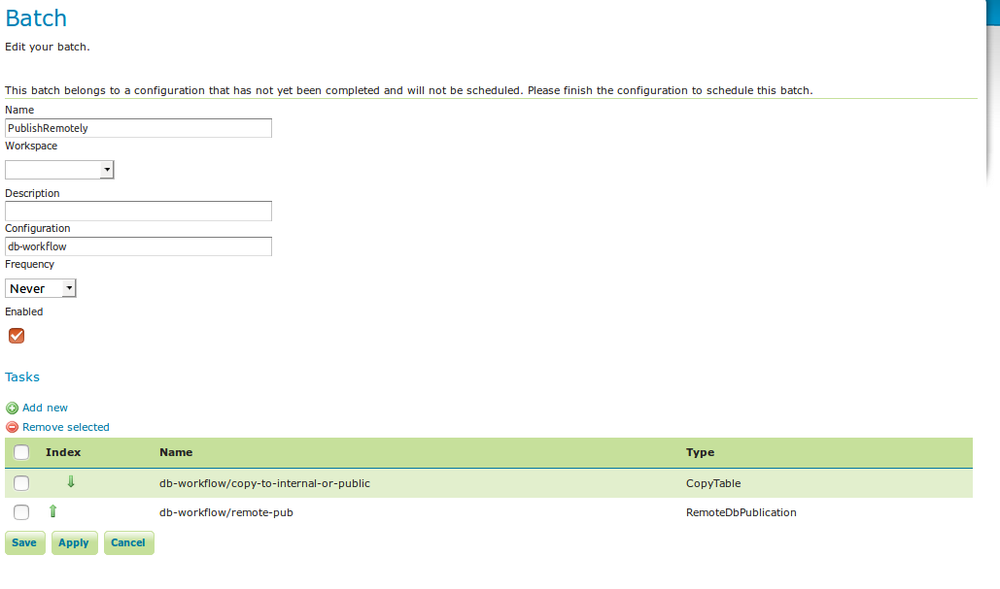
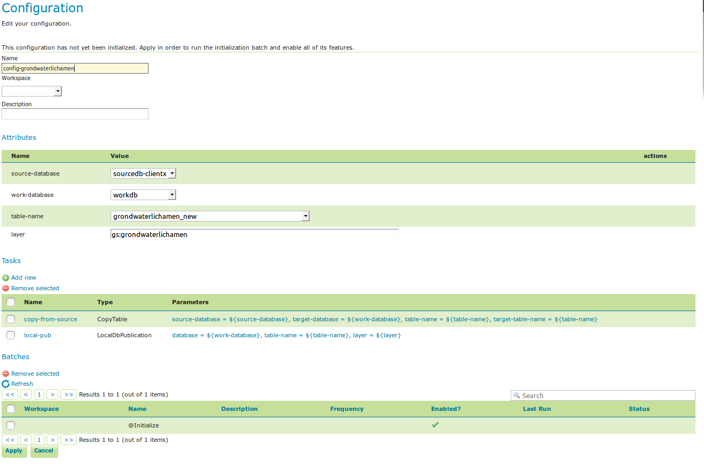
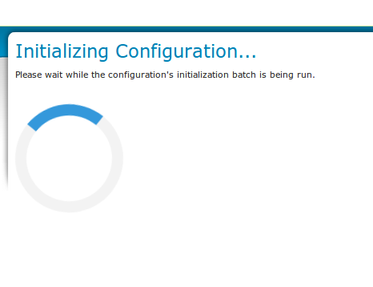

# TaskManager User Guide

## Installation

To install the GeoServer Task Manager extension:

1.  Download the extension from the `GeoServer Download
    Page <download>`{.interpreted-text role="website"} release page: {{ download_community('#s3-file-service','snapshot') }}__, also install the plugin {{ download_community('taskmanager-s3','snapshot') }}
2.  Extract this file and place the JARs in **`WEB-INF/lib`**.
3.  Perform any configuration required by your servlet container, and then restart. On startup, Task Manager will create a configuration directory **`taskmanager`** in the GeoServer Data Directory. You will be able to see the Task Manager configuration pages from the GeoServer WebGUI menu.

## Server Configuration

### Configuration Database & Clustering

By default, Task Manager will create a H2 database in its configuration directory. This can be easily changed to any JDBC resource via the `taskmanager.properties` file.

The configuration directory also contains a Spring configuration file called `taskManager-applicationContext.xml` which allows more advanced configuration.

TaskManager uses [Quartz Scheduler](http://www.quartz-scheduler.org). If you are running Task Manager in a clustered environment, you must configure Quartz to use a database as well as Task Manager. See the commented block in the Spring configuration and the [Quartz documentation](http://www.quartz-scheduler.org/documentation/quartz-2.3.0/configuration/ConfigJDBCJobStoreClustering.html) for further instructions. SQL Scripts to create the required database structures for Quartz can be found [here](https://github.com/quartz-scheduler/quartz/tree/quartz-2.3.x/quartz-core/src/main/resources/org/quartz/impl/jdbcjobstore). Task Manager can create its database automatically, or alternatively [this script](taskmanager.sql) can be used (note: the script was made for postgresql. For any other DBMS, the script might need to be modified, or alternatively, the database could be automatically created in a development environment and then copied for a production environment). It is fine to use a single database both for Quartz and Task Manager.

Furthermore, a property should be added to the `taskmanager.properties` file each of the nodes except for one: `batchJobService.init=false`. This is necessary because otherwise all of the nodes will attempt to load all of the same batches in to the clustered quartz database at the same time at start-up, which is likely to cause issues. This initialisation needs to happen only once for the entire cluster.

### Databases {: #taskmanager_user_databases }

Task Manager allows any number of databases to be used both as sources and targets for data transfer operations. These are configured via the Spring configuration file. Currently only PostGIS is supported as a target (as well as a source), either via JNDI or directly via JDBC.

``` xml
<bean class="org.geoserver.taskmanager.external.impl.PostgisDbSourceImpl"> 
    <property name="name" value="mypostgisdb"/> 
    <property name="host" value="hostname" /> 
    <property name="db" value="dbname" /> 
    <!-- optional --> <property name="schema" value="schema" /> 
    <property name="username" value="username" />
    <property name="password" value="password" /> 
    <!-- optional, for security purposes -->
    <property name="roles">
      <list>
       <value>ROLE1</value>
       <value>ROLE2</value>
      </list>
    </property>
</bean>
```

``` xml
<bean class="org.geoserver.taskmanager.external.impl.PostgisJndiDbSourceImpl">
    <property name="name" value="mypostgisjndidb" />
    <property name="jndiName" value="java:/comp/env/jdbc/my-jndi-source" />
    <!-- optional --> <property name="schema" value="schema" /> 
    <!-- optional, if database has different jndi name on target geoserver servers -->  
     <property name="targetJndiNames">
     <map>
        <entry key="mygs" value="java:/comp/env/jdbc/my-jndi-source-on-mygs" />
     </map>
    </property>
    <!-- optional, for security purposes -->
    <property name="roles">
      <list>
       <value>ROLE1</value>
       <value>ROLE2</value>
      </list>
    </property>
</bean>
```

Roles can be specified for [security](#security) purposes.

Other database systems should generally work as a source database (not for publishing) using the GenericDbSourceImpl (this has been tested with MS SQL).

``` xml
<bean class="org.geoserver.taskmanager.external.impl.GenericDbSourceImpl">
    <property name="name" value="mysqldb" />
    <property name="driver" value="com.microsoft.sqlserver.jdbc.SQLServerDriver"/> 
    <property name="connectionUrl" value="jdbc:sqlserver://mysqldbhost:1433;database=mydb" /> 
    <property name="username" value="username" />
    <property name="password" value="password" /> 
    <property name="schema" value="dbo" /> 
</bean>
```

There is also specific support for Informix as a source database (not for publishing).

``` xml
<bean class="org.geoserver.taskmanager.external.impl.InformixDbSourceImpl">
    <property name="name" value="myinformixdb" />
    <property name="driver" value="com.informix.jdbc.IfxDriver"/> 
    <property name="connectionUrl" value="jdbc:informix-sqli://informix-server:1539" /> 
    <property name="username" value="username" />
    <property name="password" value="password" /> 
</bean>
```

It is also possible to use a source that does not support geometries, and translate them automatically from some raw type. To do this, one must create a table in the database that contains a list of all geometry columns that need to be translated. This can be configured as follows:

``` xml
<bean name="geomtable" class="org.geoserver.taskmanager.external.impl.GeometryTableImpl">
    <!-- the name of your metadata table -->
   <property name="nameTable" value="Metadata_Geo" />
    <!-- the attribute name that contains table name -->
   <property name="attributeNameTable" value="table_name" />
    <!-- the attribute name that contains column name -->
   <property name="attributeNameGeometry" value="column_name" />
    <!-- the attribute name that contains geometry type -->
   <property name="attributeNameType" value="geometry_type" />
    <!-- the attribute name that contains SRID code -->
   <property name="attributeNameSrid" value="srid" />
    <!-- the type of conversion: WKT (string to geometry), WKB (binary to geometry), WKB_HEX (hex string to geometry) -->
   <property name="type" value="WKB_HEX" />
</bean>

<bean class="org.geoserver.taskmanager.external.impl.GenericDbSourceImpl">
    ....  
    <property name="rawGeometryTable" ref="geomtable"/>
</bean>
```

### External GeoServers {: #taskmanager_user_external_geoserver }

Task Manager allows any number of external geoservers to be used as targets for layer publications. These are configured via the Spring configuration file.

``` xml
<bean class="org.geoserver.taskmanager.external.impl.ExternalGSImpl"> 
    <property name="name" value="mygs"/> 
    <property name="url" value="http://my.geoserver/geoserver" /> 
    <property name="username" value="admin" />
    <property name="password" value="geoserver" />
    <property name="supportMetadata" value="true" />
</bean>
```

The ''supportsMetadata'' field indicates whether this target geoserver contains the the [Metadata Community Module](../../extensions/metadata/index.md), which provides additional support for it in certain tasks.

The configuration above will log-in to geoserver using basic authentication. Task Manager also supports geoservers protected with keycloak:

``` xml
<bean class="org.geoserver.taskmanager.external.impl.ExternalKeycloakGSImpl">
    <property name="name" value="keycloakgs"/>
    <property name="url" value="http://my.geoserver/geoserver"/>
    <property name="username" value="keycloak_admin"/>
    <property name="password" value="keycloak_password"/>
    <property name="clientId" value="my clientid"/>
    <property name="clientSecret" value="my clientsecret"/>
    <property name="real" value="my realm"/>
    <property name="authUrl" value="http://my.keycloak.server/auth"/>
    <property name="supportMetadata" value="true" />
</bean>
```

### File Services {: #taskmanager_user_file_services }

File Services are used to upload and access files such as raster layers or vector files. They are configured via the Spring configuration file.

#### Regular File Service

Regular file services provide support for rasters and vector files that are stored on the hard drive.

``` xml
<bean class="org.geoserver.taskmanager.external.impl.FileServiceImpl">
    <property name="rootFolder" value="/tmp"/>
    <property name="name" value="Temporary Directory"/>
    <property name="roles">
      <list>
       <value>ROLE1</value>
       <value>ROLE2</value>
      </list>
    </property>
</bean>
```

Roles can be specified for [security](#security) purposes.

Non-absolute paths as rootFolder will be relative to the GeoServer Data Directory.

Alternatively, it is also possible to use `ResourceFileServiceImpl` (same properties). This one only accepts relative paths and will use the data directory via the geoserver resource store, so that alternative implementations such as [JDBC Store](../jdbcstore/index.md) can be used. This might be useful for [Application Schemas](../../data/app-schema/index.md), for example.

#### S3 File Service

S3 File Services provide support for rasters that are stored on an S3 compatible server.

They do not need to be configured via the application context, but are taken from the properties file provided via the property `s3.properties.location` (see [S3 DataStore](https://github.com/geotools/geotools/tree/main/modules/unsupported/s3-geotiff#geotiffs-hosted-on-other-amazon-s3-compatible-services)).

A service will be created for each service and each bucket. We must add one line per alias to the `s3.properties` file:

`alias.s3.rootfolder=comma,separated,list,of,buckets`

The above example will create five s3 file services: alias-comma, alias-separated, alias-list, alias-of and alias-buckets.

Roles can optionally be specified for [security](#security) purposes as follows:

`alias.bucket.s3.roles=comma,separated,list,of,roles`

#### AWS File Service

Amazon AWS S3 buckets are also supported.

``` xml
<bean class="org.geoserver.taskmanager.external.impl.AWSFileServiceImpl">
    <property name="rootFolder" value="/tmp"/>
    <property name="anonymous" value="false"/>
    <property name="awsRegion" value="us-west-1"/>
    <property name="roles">
      <list>
       <value>ROLE1</value>
       <value>ROLE2</value>
      </list>
    </property>
</bean>
```

Unless anonymous is set to true, the [default AWS client credential chain](https://docs.aws.amazon.com/sdk-for-java/v1/developer-guide/credentials.html#using-the-default-credential-provider-chain) is used.

#### Prepare script

The task manager GUI allows immediate upload of files to file services for local publication. It may be handy to perform some preprocessing tasks on the uploaded data before publication (such as GDAL commands). You may do this by creating a file in the taskmanager configuration directory named ``prepare.sh``. If the user ticks the prepare checkbox in the upload dialog, this script will be run with the uploaded file as its first parameter.

## Security

Each configuration and each independent batch is associated with a workspace in GeoServer (when the workspace field is empty, it is automatically associated with the default workspace in geoserver). The configuration or batch takes its security permissions directly from this workspace.

-   If the user has reading permissions on the workspace, they may view the configuration or batch.
-   If the user has writing permissions on the workspace, they may run the batch or the batches in the configuration.
-   If the user has administrative permissions on the workspace, they may edit the configuration/batch.

Each Database or File Service may be associated with a list of roles. If you do so, only users with those roles will have access to the database or file service in question. If you want to disable security restrictions, do not include the `roles` property at all (because an empty list will result in no access.)

## Graphical User Interface

Currently GeoServer Task Manager can only be configured and operated from the GeoServer WebGUI.

### Templates

From the templates page, new templates can be created (or copied from existing templates), existing templates can be edited and removed.


*templates*

Once you open a new or existing template, attributes, tasks and batches can be edited. The attribute table adjusts automatically based on the information in the tasks table; and only the values must be filled in. In the task table, the name and parameters of each task can be edited, and new tasks can be created. Batches can be created and edited from here as well, however the template must exist in order to be able to do that (in case of a new template, you must click `apply` once before you can create new batches). New tasks must also be saved (again, via the `apply` button) before they can be added to a batch.


*template db workflow*

### Configurations

From the [configurations](basic.html#configurations) page, new configurations can be created from scratch or from templates (or copied from existing configurations), existing configurations can be edited and removed.


*configurations*

When removing a configuration, you have to option to do a *clean-up*, which will attempt to remove all resources (database tables, files, layers) that were created by (tasks of) this configuration. If this (partially) fails, the configuration will still be removed and the user will be notified.

Once you open a new or existing configuration, attributes, tasks and batches can be edited.


*workflow config 2*

The attribute table adjusts automatically based on the information in the tasks table; and only the values must be filled in. In the task table, the name and parameters of each task can be edited, and new tasks can be created. Tasks can only be removed if they are not part of a batch any longer. Batches can only be removed if they are not running anywhere. When removing a task, you have to option to do a *clean-up*, which will attempt to remove all resources (database tables, files, layers) that were created by this task. If this (partially) fails, the task will still be removed and the user will be notified.

Batches can be created and edited from here as well, however the configuration must exist in order to be able to do that (in case of a new configuration, you must click `apply` once before you can create new batches). New tasks must also be saved (again, via the `apply` button) before they can be added to a batch. In case that the [conditions](basic.html#batches) are met, batch runs can be started, and the status/history of current and past batch runs can be displayed. Current batch runs can be interrupted (which is not guaranteed to happen immediately).

#### Import/Export

It is also possible to import/export entire configurations to XML, for example to transfer them from one geoserver to another. The import button is on the configurations page, while the export button is on the page of a specific configuration. The user is responsible for making sure that the configuration is compatible with the other geoserver (available task extensions, attribute values,\...).

### Batches

From the [batches](basic.html#batches) page, new independent batches (not associated with a configuration) can be created, existing batches can be edited and removed. All existing batches - independent as well as belonging to a configuration - are shown, unless they are special (if they start with a `@`) or if the configuration has not yet been completed (see [initializing templates](basic.html#initializing-templates)).


*batches*

In case that the [conditions](basic.html#batches) are met, batch runs can be started, and the status/history of current and past batch runs can be displayed. Current batch runs can be interrupted (which is not guaranteed to happen immediately).


*batchruns*


*batchrun*

Once you open a new or existing batch, one can add or remove tasks from it and change the order of the tasks. You can also enable/disable the batch (if disabled, the batch is not scheduled) and choose the scheduling time. The user can choose between a daily schedule (with time), weekly (with day of week and time), monthly (with day of month and time) or specify a custom [cron expression](http://www.quartz-scheduler.org/documentation/quartz-2.x/tutorials/crontrigger.html).


*batch synchronize*

## Task Types

-   `CopyTableTask` Copy a database table from one database to another. The user can specify a source database, source table name, target database and target table name. The source table name may also be a view. If the source does not contain a primary key column (f.e. if it is a view), an additional column 'generated_id', with an automatically generated primary key will be added to the destination table. The task will also copy all existing indexes. If the source table contains a geometry column but not a spatial index (f.e. if it is a view), a spatial index will automatically be added to the destination table. Supports commit/rollback by creating a temporary table.
-   `CreateViewTask` Create a view based on a single table. The user can specify the database, the table name, the selected fields and (optionally) a where condition. Supports commit/rollback by creating a temporary view.
-   `CreateComplexViewTask` Create a view based on a multiple tables. The user can specify the database and a whole query, where it can use any other configuration attribute in the form of '\${placeholder}'. Supports commit/rollback by creating a temporary view.
-   `CopyFileTask` Copy a file from one file service to another. Commit/rollback is supported by a versioning system, where the version of the file is inserted into the file name. The location of the version number is specified in the path as `###` (or set auto-versioned to `true` to add the placeholder automatically before the extension dot). On commit, the older version is removed. On rollback, the newer version is removed. The publication tasks will automatically publish the latest version.
-   `LocalDbPublicationTask` Publish a database layer locally. The user can specify database, table and a layer name. Supports commit/rollback by advertising or removing the layer it created.
-   `RemoteDbPublicationTask` Publish a database layer to another geoserver. The user can specify a target geoserver, a source layer and a target database. All information is taken from the source layer except for the target database which may be different. Supports commit/rollback through creating a temporary (unadvertised) layer. This task also supports the version place holder or auto-versioning, in order to combine with the `CopyFileTask`.
-   `LocalFilePublicationTask` Publish a file layer locally (raster or shapefile). The user can specify a file service, a file (which can be uploaded unto the service) and a layer name. Supports commit/rollback by advertising or removing the layer it created.
-   `RemoteFilePublicationTask` Publish a file layer locally (taster or shapefile). The user can specify a target geoserver, a source layer and a target file service and path (optional). All information is taken from the source layer except for the file service and path which may be different. Supports commit/rollback through creating a temporary (unadvertised) layer.
-   `MetaDataSyncTask` Synchronise the metadata between a local layer and a layer on another geoserver (without re-publishing). The user can specify a target geoserver, a local and a remote layer. Does not support commit/rollback. If the target geoserver supports the [Metadata Community Module](../../extensions/metadata/index.md) native metadata attributes mapped to custom metadata attributes will be updated. Note that all of the publication tasks will synchronize metadata in the same way.
-   `ConfigureCachedLayer` Configure caching for a layer on a remote geoserver with internal GWC, synchronise the settings with the local geoserver. This task may turn caching on or off depending on local configuration.
-   `ClearCachedLayer` Clear (truncate) all tiles of a cached layer on a remote geoserver with internal GWC.
-   `LocalAppSchemaPublicationTask` Publish an [Application Schema](../../data/app-schema/index.md) layer locally. This is exactly the same as `LocalFilePublicationTask` with the Application Schema mapping file as the file being published, and two additional features.
    -   The mapping file may be provided as a template, with placeholders in the form of `${placeholder}`. The placeholders are replaced by the values of the connection parameters of the database that is provided as parameter to the task. This makes it possible to fill in the underlying source database for different geoservers. For example: specify `${jndiReferenceName}` as source database connection parameter in the mapping file.
    -   Multiple mapping files may be provided for a single layer (when the layer mapping uses included types), in the form of a ZIP file. The main mapping file and the ZIP file must have the same name before the extension.
-   `RemoteAppSchemaPublicationTask` Publish an [Application Schema](../../data/app-schema/index.md) layer remotely. This is exactly the same as `LocalFilePublicationTask` with the Application Schema mapping file as the file being published, and two additional features:
    -   The mapping file may be provided as a template, with placeholders in the form of `${placeholder}`. The placeholders are replaced by the values of the connection parameters of the database that is provided as parameter to the task. This makes it possible to fill in the underlying source database for different geoservers. For example: specify `${jndiReferenceName}` as source database connection parameter in the mapping file.
    -   Multiple mapping files may be provided for a single layer (when the layer mapping uses included types), in the form of a ZIP file. The main mapping file and the ZIP file must have the same name before the extension.
-   `LayerSecuritySync` this task will synchronise all [data access security rules](../../security/layer.md) associated with a layer to the external geoserver. Warning: the task assumes that the same roles exist on both geoservers. Does not support commit/rollback.
-   `WorkspaceSecuritySync` this task will synchronise all [data access security rules](../../security/layer.md) associated with a workspace to the external geoserver. Warning: the task assumes that the same roles exist on both geoservers. Does not support commit/rollback.
-   `TimeStamp` update a time stamp in a layer's metadata that represents the last time a layer's data has been updated. Since the data timestamp is part of the metadata, a metadata timestamp can also be updated. The task must be configured through its Spring Bean properties `timeStampTaskType.dataTimestampProperty` and `timeStampTaskType.metadataTimestampProperty` which represent the key (or key path) in the layer's resource metadata. If you are using the [Metadata Community Module](../../extensions/metadata/index.md) you should set `timeStampTaskType.metadataTimestampProperty=custom._timestamp`.
-   `MetadataTemplateSync` this task requires the [Metadata Community Module](../../extensions/metadata/index.md) and the `taskmanager-metadata` submodule. It will synchronize all metadata linked to a specific metadata template. Useful when you change the template.

## Bulk Operations

The task manager provides a number of bulk operation tools via an additional page in the GUI. The import tool is also available via a REST service.

### Run Batches

A whole series of batches may be scheduled all at once. You specify a workspace, configuration name and batch name pattern to select the series of batches you want to schedule. You may specify how long to wait before starting to execute the batches. You may specify how long to wait in between execution of each batch. This option is strongly recommended not to overload your software and cause failures.



### Import Configurations

The import tool allows bulk creation of an unlimited amount of configurations on the basis of a template and a CSV file with attribute values. Contrary to the rest of the configuration, this function is only exposed via a REST service and not via the GUI. The import tool will generate a new configuration for each line in the CSV file, except for the first. The first line must specify the attribute names which should all match attributes that exist in the template, plus `name` (required), `description` (optional) and `workspace` (optional) for the configuration metadata. The CSV file mustspecify a valid attribute value for each required attribute.

Optionally, you may skip validation (at your own risk).

As an alternative to using the GUI page, you may `POST` your CSV file to `http://{geoserver-host}/geoserver/taskmanager-import/{template}[validate=false]`



### Initialize Configurations

If you have imported configurations in bulk based on an Initializing template, you may also want to initialize them in bulk. This works similarly to running batches in bulk. The configurations will be validated after initialization.



## Examples

Consider the following setup.

Three geoservers:

-   `work geoserver`: a geoserver only available in the local network, only used by administrators. New and updated data is published here as layers for the first time, to test both the validity of data and the publication configuration.
-   `internal geoserver`: a geoserver only available in the local network, for internal users.
-   `public geoserver`: a geoserver available on the internet, for the general public.

Several databases:

-   `multiple source databases`: these are databases provided by partners that provide new and updated data. they are not used to directly publish on a geoserver.
-   `work database`: database used by the `work geoserver` where its vector data is stored.
-   `internal database`: database used by the `internal geoserver` where its vector data is stored.
-   `public database`: database used by the `public geoserver` where its vector data is stored.

A typical workflow for a new layer goes as follows:

1.  A new table is copied from a `source database` to the `work database` and then published on the `work geoserver`
2.  After testing, the table is either copied to the `internal database` and published on the `internal geoserver` or copied to the `public database` and published on the `public geoserver`.
3.  Every week, data is synchronised between the three databases and metadata is synchronised between the two geoservers.

Taskmanager should be installed only on the `work geoserver`. Then we could make the following template:


*template db workflow*

with the following batches:


*template db workflow batches*

The `@Initialize` batch:


*batch initialize*

The `PublishRemotely` batch:


*batch publish remotely*

The `Synchronize` batch:


*batch synchronize*

When we now create a new configuration based on this template we choose a source database, table name and layer name:


*workflow config*

After clicking apply, the configuration is being initialized (the layer is created locally)\...


*initializing...*

We can now fill in the rest of the details, save, and make the remote publication. The synchronization is scheduled weekly.


*workflow config 2*
