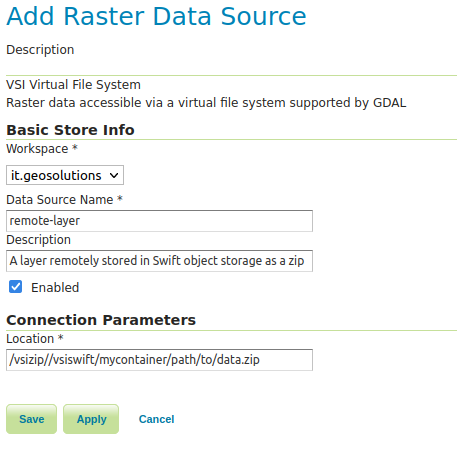

# VSI Virtual File System Support {: #vsi }

Support for GDAL's virtual file systems, accessible via a ``/vsi``-prefixed path.

## Configuration

All configuration parameters are specified in a `vsi.properties` file. Any configuration option listed in [GDAL's documentation](https://gdal.org/user/virtual_file_systems.html). is available as a key in this file. You can specify its location on your system with the `-Dvsi.properties.location` option. An example configuration providing OpenStack credentials may look like:

    OS_IDENTITY_API_VERSION = 3
    OS_AUTH_URL = https://swift.provider.com/v3
    OS_PROJECT_NAME = test-project
    OS_USERNAME = user@example.com
    OS_PASSWORD = example-password
    OS_USER_DOMAIN_NAME = Default
    OS_PROJECT_DOMAIN_NAME = default

## Usage

This extension adds 'VSI Virtual File System' as a possible raster data store type. The only values required when choosing this type is a connection path. This is identical to the connection paths specified in [GDAL's documentation](https://gdal.org/user/virtual_file_systems.html). You may also chain GDAL drivers together by concatenating their prefixes, as in the example below.

*VSI Virtual File System data store configuration*
