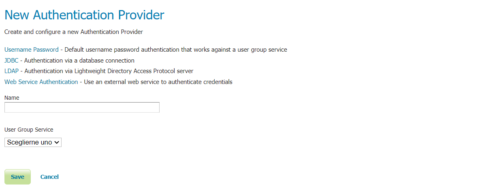
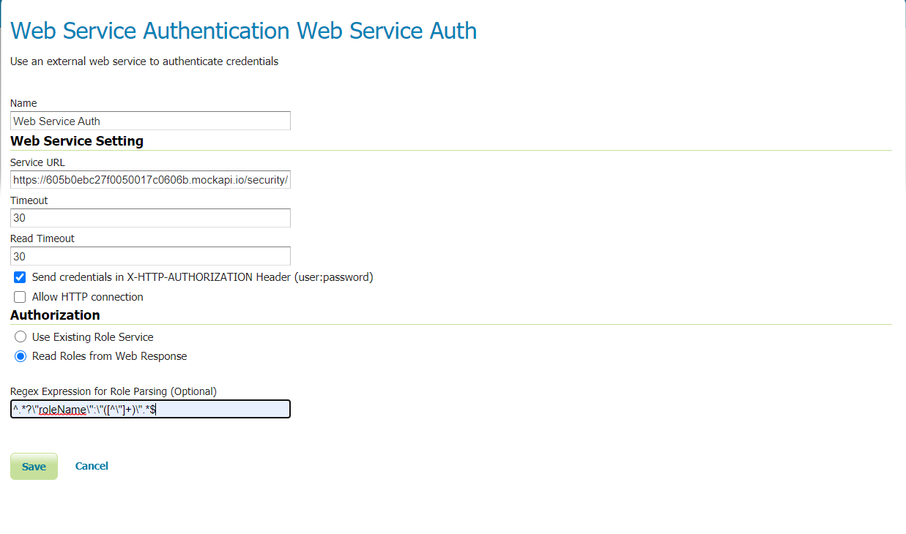
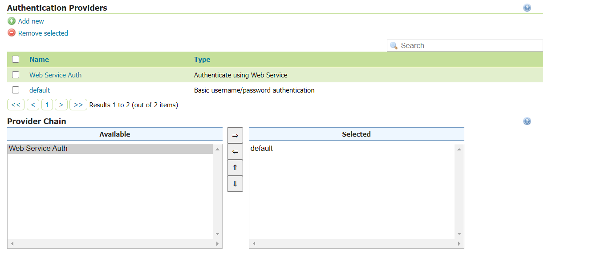

# HTTP Based Authorization configuration

The `HTTP Based Authorization plug-in` will try to authenticate the user on an configured external authentication service. The username and the password will be sent to the service in one of the following ways:

-   In a Header named `X-HTTP-AUTHORIZATION`.
-   As a query parameters or as request path. For this use case the url needs to be configured by inseritng two placeholder, namely `{user}` and `{password}` , where the username and password are expected to be provided eg. `https://my-auth-service?username={username}&password={password}`.

The Authentication Provider will perform a `GET` request, sending credential Base64 encoded. If the response status returned by the external service is different from `200` the user will not be authenticated.

In case the external authentication service is returning the authenticated user's roles in the response body, it is possible to define a regular expression to extract them, allowing for their usage for authorization. There is no limitation to a specific content type.

Once the plug-in is installed, it can be configured by:

-   Opening the *Authentication* option in the *Security* menu
-   Choosing *Authentication provider* and then *add new*.
-   Choose the `Web Service Authentication` option

Clicking on `Web Service Authentication` offers the possibility to enter the provider settings.

Where:

-   `Service URL` is the URL of the external service meant to be used for authentication.
-   `Timeout` is the connection timeout.
-   `Read Timeout` is the timeout on waiting to read response data.
-   The `Send credentials in X-HTTP-AUTHORIZATION Header` checkbox is meant to be flagged if credentials have to be sent through the authorization header. If unchecked (default) GeoServer expects to find placeholders for username and password as `{user}` and `{password}` in the provided URL instead.
-   The `Allow HTTP connection` checkbox if flagged will allow authentication request to be performed toward an external service that uses `HTTP` protocol. By default only `HTTPS` is allowed.
-   In the `Authorization` section the radio button allows to define whether to use a GeoServer `RoleService` to read roles or if roles are meant to be returned by the external authentication service.
-   In case `Read Roles from Web Response` is chosen, a regular expression to extract the roles from the authentication service response needs to be provided.

Once the settings are saved the new `AuthenticationProvider` is added to the list and needs to be added into the list of the providers' chain

