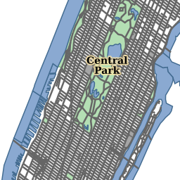
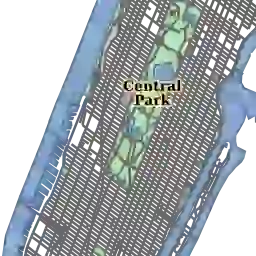

# WebP Processing

**WebP achieves better compression rates by being more complex. The cost of this complexity is that it's slower, particularly at encoding.**

*"Therefore, it's not usually advisable to convert images to WebP on the fly. WebP files should be generated in advance."* ([@webmproject.org](https://groups.google.com/a/webmproject.org/g/webp-discuss/c/Ad6rXupeWZ4))

Detailed information about this image format can be obtained from [Googles WebP Website](https://developers.google.com/speed/webp) and the [WebP Discussion Group](https://groups.google.com/a/webmproject.org/g/webp-discuss).

A simpler representative representation can be found at [Learn Images! WebP](https://web.dev/learn/images/webp).

**Results based on the standard libraries and the ImageIO WebP extension**

> +---------------------+--------------------+-------------------------+-----------------------+
> | tile size [pixel] | ImageIO PNG [ms] | ImageIO Ext WebP [ms] | LibWebP encode [ms] |
> +=====================+====================+=========================+=======================+
> | > 128               | > 5                | > 67                    | > 11.2                |
> +---------------------+--------------------+-------------------------+-----------------------+
> | > 256               | > 15               | > 304                   | > 30.1                |
> +---------------------+--------------------+-------------------------+-----------------------+
> | > 512               | > 64               | > 1034                  | > 91.4                |
> +---------------------+--------------------+-------------------------+-----------------------+
> | > 1024              | > 177              | > 2089                  | > 440.5               |
> +---------------------+--------------------+-------------------------+-----------------------+
> | > 2048              | > 1068             | > 8027                  | > 1595.9              |
> +---------------------+--------------------+-------------------------+-----------------------+

**Table 1**: Comparison of the processing time for different tile sizes and image formats. For the ImageIO images, the average of 1000 .write functions was calculated. With [LibWebP](https://storage.googleapis.com/downloads.webmproject.org/releases/webp/index.html), the average of the encoding duration was calculated for 10 passes. For WebP processing, the default settings were used (lossy, q=75) and Version 1.0.0. [GeoserverRequest](http://localhost:8080/geoserver/tiger/wms?SERVICE=WMS&VERSION=1.3.0&REQUEST=GetMap&FORMAT=image%2Fpng&TRANSPARENT=true&LAYERS=tiger%3Apoly_landmarks%2Ctiger%3Atiger_roads&TILED=true&CRS=EPSG%3A4326&STYLES=&WIDTH=256&HEIGHT=256&BBOX=40.72317044999999%2C-74.01748242500003%2C40.80211814999999%2C-73.93853472500001) for image (256*256).

> +---------------------+--------------+-------------+------------------+---------+
> | tile size [pixel] | PNG original | ImageIO PNG | ImageIO Ext WebP | LibWebP |
> +=====================+==============+=============+==================+=========+
> | > 128               | > 14         | > 13        | > 5              | > 5     |
> +---------------------+--------------+-------------+------------------+---------+
> | > 256               | > 64         | > 60        | > 25             | > 25    |
> +---------------------+--------------+-------------+------------------+---------+
> | > 512               | > 223        | > 204       | > 106            | > 106   |
> +---------------------+--------------+-------------+------------------+---------+
> | > 1024              | > 805        | > 769       | > 352            | > 352   |
> +---------------------+--------------+-------------+------------------+---------+
> | > 2048              | > 2283       | > 2171      | > 1062           | > 1062  |
> +---------------------+--------------+-------------+------------------+---------+

**Table 2**: Comparison of the size in KB for different tile sizes and image formats (see table above).

It is obvious that WebP can never match the performance of PNG images due to its encoding time.

However, this does not explain the much worse results of the ImageIO WebP extension. Unfortunately, the original repository is not available any more, and the main fork [webp_imageio](https://github.com/sejda-pdf/webp-imageio) is outdated and unmaintained. The Geoserver plugin is based on the fork from [GOTSON](https://github.com/gotson/webp-imageio). A hopeful new pure Java implementation is [TwelveMonkeysImageIO WebP](https://github.com/haraldk/TwelveMonkeys), but so far only supports read access. [Scrimage Webp](https://sksamuel.github.io/scrimage/webp/) produced mostly faster results, but does not fit in Geoservers ImageIO ecosystem. Google itself provides for Android [libwebp Java bindings](https://developers.google.com/speed/webp/faq#how_do_i_use_the_libwebp_java_bindings_in_my_android_project).

WebP supports lossless compression (for graphics) and lossy compression (for photos). Default is lossy with compression quality 75.

-   | Lossy compression: A small compression quality factor (q) produces a smaller file with lower quality (best quality q=100).

-   | Lossless compression: A small factor enables faster compression speed, but produces a larger file (maximum compression q=100).

> +-------+-----------------+-----------------+--------------+--------------+
> | q     | lossless [ms] | lossless [kb] | lossy [ms] | lossy [kb] |
> +=======+=================+=================+==============+==============+
> | > 0.0 | > 48            | > 57            | > **18.6**   | > **25**     |
> +-------+-----------------+-----------------+--------------+--------------+
> | > 0.1 | > 48.8          | > 57            | > 19.5       | > 26         |
> +-------+-----------------+-----------------+--------------+--------------+
> | > 0.2 | > 48.7          | > 57            | > 19.7       | > 27         |
> +-------+-----------------+-----------------+--------------+--------------+
> | > 0.3 | > 82.6          | > 45            | > 20.4       | > 27         |
> +-------+-----------------+-----------------+--------------+--------------+
> | > 0.4 | > 84.6          | > 45            | > 20.6       | > 28         |
> +-------+-----------------+-----------------+--------------+--------------+
> | > 0.5 | > 85.6          | > 45            | > 20.8       | > 29         |
> +-------+-----------------+-----------------+--------------+--------------+
> | > 0.6 | > 89.1          | > 45            | > 20.8       | > 29         |
> +-------+-----------------+-----------------+--------------+--------------+
> | > 0.7 | > 93.9          | > 45            | > 21.2       | > 30         |
> +-------+-----------------+-----------------+--------------+--------------+
> | > 0.8 | > 99.3          | > 45            | > 21.4       | > 32         |
> +-------+-----------------+-----------------+--------------+--------------+
> | > 0.9 | > 99.3          | > 45            | > 22.5       | > 36         |
> +-------+-----------------+-----------------+--------------+--------------+
> | > 1.0 | > 1425          | > 44            | > 25.3       | > 46         |
> +-------+-----------------+-----------------+--------------+--------------+

**Table 3**: Comparison of the lossy/lossless mode and compression factor (q) for LibWebP encoding time and file size. Input image, see below. The average of the encoding duration was calculated for 10 passes.

> +-------+-----------------+-----------------+--------------+--------------+
> | q     | lossless [ms] | lossless [kb] | lossy [ms] | lossy [kb] |
> +=======+=================+=================+==============+==============+
> | > 0.0 | > 242           | > 57            | > **113**    | > **25**     |
> +-------+-----------------+-----------------+--------------+--------------+
> | > 0.1 | > 211           | > 57            | > 145        | > 26         |
> +-------+-----------------+-----------------+--------------+--------------+
> | > 0.2 | > 236           | > 57            | > 137        | > 27         |
> +-------+-----------------+-----------------+--------------+--------------+
> | > 0.3 | > 370           | > 45            | > 150        | > 27         |
> +-------+-----------------+-----------------+--------------+--------------+
> | > 0.4 | > 376           | > 45            | > 140        | > 28         |
> +-------+-----------------+-----------------+--------------+--------------+
> | > 0.5 | > 308           | > 45            | > 128        | > 29         |
> +-------+-----------------+-----------------+--------------+--------------+
> | > 0.6 | > 375           | > 45            | > 123        | > 29         |
> +-------+-----------------+-----------------+--------------+--------------+
> | > 0.7 | > 529           | > 45            | > 126        | > 30         |
> +-------+-----------------+-----------------+--------------+--------------+
> | > 0.8 | > 468           | > 45            | > 125        | > 32         |
> +-------+-----------------+-----------------+--------------+--------------+
> | > 0.9 | > 424           | > 45            | > 130        | > 36         |
> +-------+-----------------+-----------------+--------------+--------------+
> | > 1.0 | > 3106          | > 44            | > 184        | > 46         |
> +-------+-----------------+-----------------+--------------+--------------+

**Table 4**: Comparison of the lossy/lossless mode and compression factor (q) for ImageIO WebP extension .write time and file size. Input image, see below. The average of 1000 .write functions was calculated.

**Figure 1**: Input image for comparison in table 3 and 4 (PNG 256 * 256 px, 73 kb).

Unfortunately, the best result regarding speed and size is not really usable (see below).

**Figure 2**: Image of the best result (lossy, q=0).

In general, the default values (lossy, q=0.75) are a good choice.

The significantly longer duration regarding the ImageIO Extension cannot be explained by the writing process alone (compare tables 3 & 4).

**Processing time & energy consumption**

The increased processing time correlates with increased energy consumption.

Measured with a commercial power meter on a local PC for one hour (multiple times).

Stack:

-   | Windows10

-   | Java11

-   | Tomcat9

-   | Chrome Browser

-   | OpenLayers Client

-   | random WMS GetMap requests every 0.5 seconds

Result:

-   | PNG 0.067 kWh

-   | WebP 0.071 kWh

-   | NoRequests 0.047 kWh

This also applies to the JPEG format in a weakened way.

**Browser rendering energy impact for different image formats**

> +--------------+----------------+
> | Image Format | Energie impact |
> +==============+================+
> | > WebP       | > 0.4532       |
> +--------------+----------------+
> | > PNG        | > 0.4545       |
> +--------------+----------------+
> | > PNG8       | > 0.457        |
> +--------------+----------------+
> | > JPEG       | > 0.4414       |
> +--------------+----------------+

**Table 5**: Comparison of the rendering energy consumption for different image formats in Firefox. Average of 1000 WMS GetMap requests.

Firefox "Energy Impact" (about:processes page) shows the processing power being used by the CPU.

Despite the different file sizes of the image formats, no really significant differences can be seen. Of course, more complex coding also requires more complex decoding.
