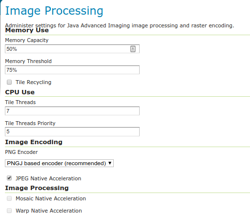
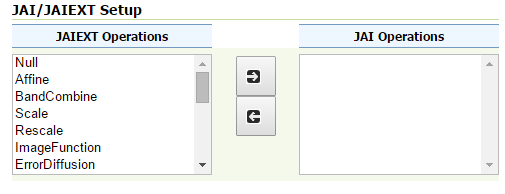

# Image Processing

[Java Advanced Imaging](http://java.sun.com/javase/technologies/desktop/media/jai/) (JAI) is an image processing library built by Sun Microsystems. [JAI Image I/O Tools](https://jai-imageio.dev.java.net/) provides reader, writer, and stream plug-ins for the standard Java Image I/O Framework.

Several JAI parameters, used by both WMS and WCS operations, can be configured in the Image Processing page.


*Image Processing*

## Memory & Tiling

When supporting large images it is efficient to work on image subsets without loading everything to memory. A widely used approach is tiling which basically builds a tessellation of the original image so that image data can be read in parts rather than whole. Since very often processing one tile involves surrounding tiles, tiling needs to be accompanied by a tile-caching mechanism. The following JAI parameters allow you to manage the JAI cache mechanism for optimized performance.

**Memory Capacity**---For memory allocation for tiles, JAI provides an interface called TileCache. Memory Capacity sets the global JAI TileCache as a percentage of the available heap. A number between 0 and 1 exclusive. If the Memory Capacity is smaller than the current capacity, the tiles in the cache are flushed to achieve the desired settings. If you set a large amount of memory for the tile cache, interactive operations are faster but the tile cache fills up very quickly. If you set a low amount of memory for the tile cache, the performance degrades.

**Memory Threshold**---Sets the global JAI TileCache Memory threshold. Refers to the fractional amount of cache memory to retain during tile removal. JAI Memory Threshold value must be between 0.0 and 1.0. The Memory Threshold visible on the [Status](../../extensions/monitoring/reference.md#status) page.

**Tile Threads**---JAI utilizes a TileScheduler for tile calculation. Tile computation may make use of multithreading for improved performance. The Tile Threads parameter sets the TileScheduler, indicating the number of threads to be used when loading tiles.

**Tile Threads Priority**---Sets the global JAI Tile Scheduler thread priorities. Values range from 1 (Min) to 10 (Max), with default priority set to 5 (Normal).

**Tile Recycling**---Enable/Disable JAI Cache Tile Recycling. If selected, Tile Recycling allows JAI to re-use already loaded tiles, which can provide significant performance improvement.

**Native Acceleration**---To improve the computation speed of image processing applications, the JAI comes with both Java Code and native code for many platform. If the Java Virtual Machine (JVM) finds the native code, then that will be used. If the native code is not available, the Java code will be used. As such, the JAI package is able to provide optimized implementations for different platforms that can take advantage of each platform's capabilities.

**JPEG Native Acceleration**---Enables/disable JAI JPEG Native Acceleration. When selected, enables JPEG native code, which may speed performance, but compromise security and crash protection.

**PNG Encoder Type**---Provides a selection of the PNG encoder between the Java own encoder, the JAI ImageIO native one, and a [PNGJ](https://code.google.com/p/pngj/) based one:

> -   The Java standard encoder is always set to maximum compression. It provides the smallest output images, balanced by a high performance cost (up to six times slower than the other two alternatives).
> -   The ImageIO native encoder, available only when the ImageIO native extensions are installed, provided higher performance, but also generated significantly larger PNG images
> -   The PNGJ based encoder provides the best performance and generated PNG images that are just slightly larger than the Java standard encoder. It is the recommended choice, but it's also newer than the other two, so in case of misbehavior the other two encoders are left as an option for the administrator.

**Mosaic Native Acceleration**---To reduce the overhead of handling them, large data sets are often split into smaller chunks and then combined to create an image mosaic. An example of this is aerial imagery which usually comprises thousands of small images at very high resolution. Both native and JAI implementations of mosaic are provided. When selected, Mosaic Native Acceleration use the native implementation for creating mosaics.

**Warp Native Acceleration**---Also for the Warp operation are provided both native and JAI implementations. If the checkbox is enabled, then the native operation is used for the warp operation.

*It is quite important to remember that faster encoders are not necessarily going to visibly improve performance, if data loading and processing/rendering are dominating the response time, choosing a better encoder will likely not provide the expected benefits.*

## JAI-EXT {: #JAIEXT }

The [JAI-EXT](https://github.com/geosolutions-it/jai-ext) library is open-source project which aims to replace closed source JAI project provided by Sun. The main difference between *JAI* and *JAI-EXT* operations is the support for external **Region of Interests** (ROI) and image **NoData** in *JAI-EXT*.

The following panel is be available at the bottom of the JAI Settings page


*JAI/JAIEXT Setup panel*

This panel can be used to selectively enable/disable JAI-EXT operations in favor of JAI ones.

By default, **JAI-EXT** operations are enabled. In case of misbehavior add the following java option to GeoServer startup script and restart GeoServer to disable them.

> ``` xml
> ```
>
> -Dorg.geotools.coverage.jaiext.enabled=false

!!! warning

    Users should take care that *JAI* native libraries are not supported by *JAI-EXT*, since *JAI-EXT* is a pure Java API.
