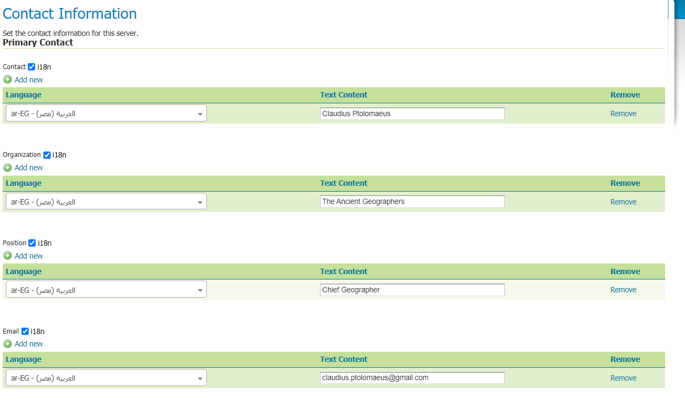

# Internationalization (i18n) {: #internationalization }

GeoServer supports returning a GetCapabilities document in various languages. The functionality is available for the following services:

-   WMS 1.1 and 1.3
-   WFS 2.0
-   WCS 2.0

## Configuration

GeoServer provides an i18n editor for the title and abstract of:

-   Layers configuration page.
-   Layergroups configuration page.
-   WMS, WFS, WCS service configuration pages.
-   For Styles i18n configuration see [i18N in SLD](../../styling/sld/language.md).

The editor is disabled by default and can be enabled from the i18n checkbox:

In the Contact Information page all the fields can be internationalized:

## Service GetCapabilities

The GetCapabilities document language can be selected using the `AcceptLanguages` request parameter. The GeoServer response will vary based on the following rules:

-   The internationalized elements will be titles, abstracts and keywords.

-   If a single language code is specified, e.g. `AcceptLanguages=en` GeoServer will try to return the content in that language.

    If no content is found in the requested language a ServiceExceptionReport will be returned.

-   If multiple language codes are specified, e.g. `AcceptLanguages=en fr` or `AcceptLanguages=en,fr`, for each internationalizable content GeoServer will try to return it in one of the specified language.

    If no content is found for any of the requested languages ServiceExceptionReport will be returned.

-   Languages can be configured and requested also according to local language variants (e.g. `AcceptLanguages=en fr-CA` or `AcceptLanguages=en,fr-CA`).

    If any i18n content has been specified with a local variant and the request parameters specifies only the language code the content will be encoded in the response. Keep in mind that the inverse situation content is recorded using a language code will not be available for local variant requests.

    Example: If the i18n content is specified with the local variant `fr-CA` and the requested only specifies a language code `` AcceptLanguages=fr` the local variant ``fr-CA`content will be used.  Example: If the i18n content is specified with the language code`fr`and the requested only specifies the local variant`AcceptLanguages=fr-CA` the language code `fr` content is unavailable.

-   If a `*` is present among the parameter values, e.g. `AcceptLanguages=en fr *` or `AcceptLanguages=en,fr,*`, GeoServer will try to return the content in one of the specified language code.

    If no content is found content will be returned in a language among those available.

-   If not all the configurable elements have i18n title and abstract available for the requested language, GeoServer will encode those attributes only for services, layers, layergroups and styles that have them defined.

    In case the missing value is the tile, in place of the missing internationalized content an error message like the following, will appear: `DID NOT FIND i18n CONTENT FOR THIS ELEMENT`.

-   When using `AcceptLanguages` parameter GeoServer will encode URL present in the response adding language parameter with the first value retrieved from the `AcceptLanguages` parameter.

## Default Language

GeoServer allows defining a default language to be used when international content has been set in services', layers' and groups' configuration pages, but no `AcceptLanguages` parameter has been specified in a `GetCapabilities` request. The default language can be set from the services' configuration pages (WMS, WFS, WCS) or from global settings from a dropdown as shown below:

It is also possible to set an i18n entry with empty language for each configurable field, acting as the default translation.

When international content is requested, for each internationalized field, GeoServer will behave as follows:

-   The service specific default language, if present, will be used.
-   If not found, the global default language, if present, will be used.
-   If not found the i18n content empty language value, if present, will be used.
-   If not found the first i18n value found for the field will be used.
