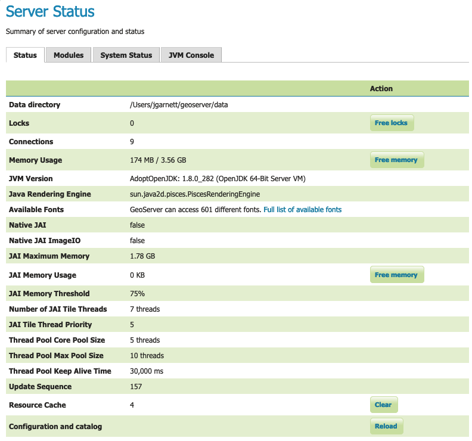
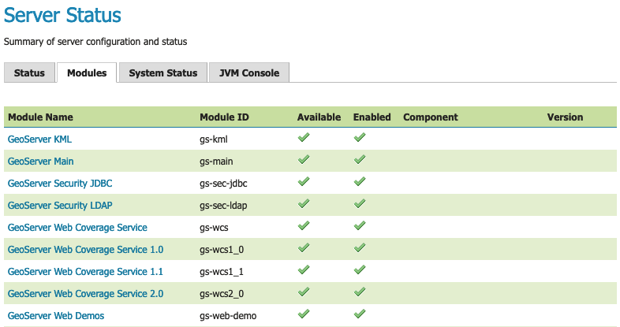
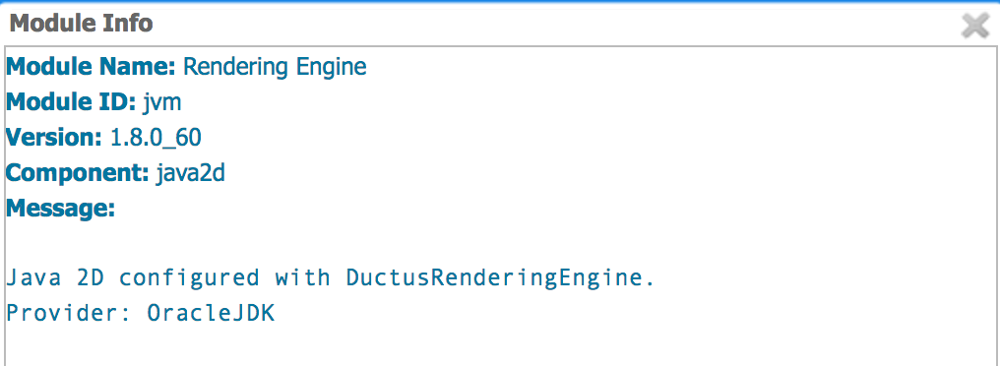
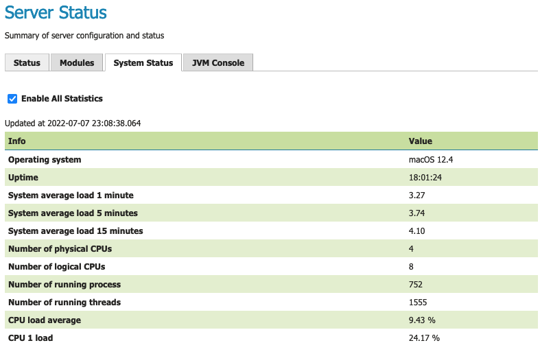
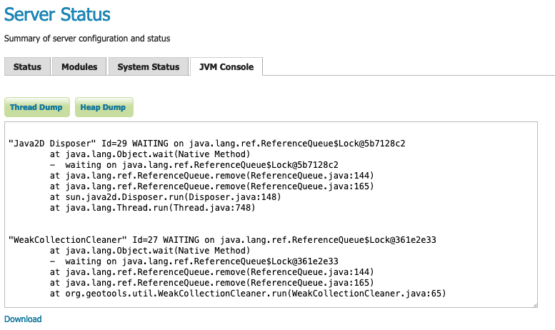
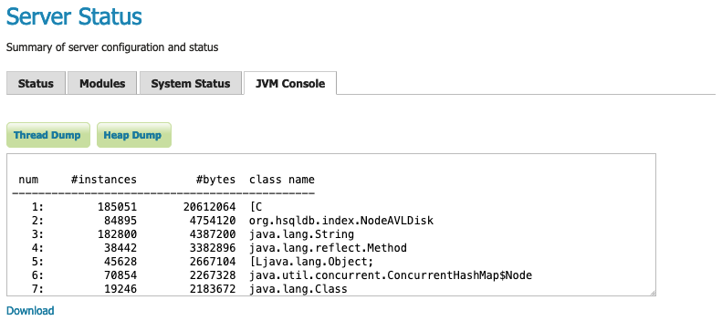

# Status {: #config_serverstatus }

The Server Status page has two tabs to summarize the current status of GeoServer. The Status tab provides a summary of server configuration parameters and run-time status. The modules tab provides the status of the various modules installed on the server. This page provides a useful diagnostic tool in a testing environment.

## Server Status

*Status Page (default tab)*

### Status Field Descriptions

The following table describes the current status indicators.

+-----------------------------+----------------------------------------------------------------------------------------------------------------------------------------------------------------------------------------------------------------------------------------------------------------------------------------------------------------------------------------------------------------------------------------------------------------------+
| Option                      | Description                                                                                                                                                                                                                                                                                                                                                                                                          |
+=============================+======================================================================================================================================================================================================================================================================================================================================================================================================================+
| Data directory              | Shows the path to the GeoServer data directory (`GEOSERVER_DATA_DIR` property).                                                                                                                                                                                                                                                                                                                                      |
+-----------------------------+----------------------------------------------------------------------------------------------------------------------------------------------------------------------------------------------------------------------------------------------------------------------------------------------------------------------------------------------------------------------------------------------------------------------+
| Locks                       | A WFS has the ability to lock features to prevent more than one person from updating the feature at one time. If data is locked, edits can be performed by a single WFS editor. When the edits are posted, the locks are released and features can be edited by other WFS editors. A zero in the locks field means all locks are released. If locks is non-zero then a client has reserved some content for editing. |
|                             |                                                                                                                                                                                                                                                                                                                                                                                                                      |
|                             | Press **Free locks** to release all feature locks currently held by the server and update the field value to zero.                                                                                                                                                                                                                                                                                                   |
+-----------------------------+----------------------------------------------------------------------------------------------------------------------------------------------------------------------------------------------------------------------------------------------------------------------------------------------------------------------------------------------------------------------------------------------------------------------+
| Connections                 | Refers to the numbers of stores GeoServer is connected to, in the above case 9, that are enabled and available.                                                                                                                                                                                                                                                                                                      |
+-----------------------------+----------------------------------------------------------------------------------------------------------------------------------------------------------------------------------------------------------------------------------------------------------------------------------------------------------------------------------------------------------------------------------------------------------------------+
| Memory Usage                | The amount of memory currently used by GeoServer. In the above example, 174 MB of memory used out of a total of 3.56 GB available to Java.                                                                                                                                                                                                                                                                           |
|                             |                                                                                                                                                                                                                                                                                                                                                                                                                      |
|                             | Press **Free Memory** to recycle unused memory by running the garbage collector.                                                                                                                                                                                                                                                                                                                                     |
+-----------------------------+----------------------------------------------------------------------------------------------------------------------------------------------------------------------------------------------------------------------------------------------------------------------------------------------------------------------------------------------------------------------------------------------------------------------+
| JVM Version                 | Denotes which version of the JVM (Java Virtual Machine) is being used to power the server. Here the JVM is AdoptOpenJDK 1.8.0_282.                                                                                                                                                                                                                                                                                   |
+-----------------------------+----------------------------------------------------------------------------------------------------------------------------------------------------------------------------------------------------------------------------------------------------------------------------------------------------------------------------------------------------------------------------------------------------------------------+
| Java Rendering Engine       | Shows the rendering engine used for vector operations.                                                                                                                                                                                                                                                                                                                                                               |
+-----------------------------+----------------------------------------------------------------------------------------------------------------------------------------------------------------------------------------------------------------------------------------------------------------------------------------------------------------------------------------------------------------------------------------------------------------------+
| Available Fonts             | Shows the number of fonts available. Selecting the link will show the full list.                                                                                                                                                                                                                                                                                                                                     |
+-----------------------------+----------------------------------------------------------------------------------------------------------------------------------------------------------------------------------------------------------------------------------------------------------------------------------------------------------------------------------------------------------------------------------------------------------------------+
| Native JAI                  | GeoServer uses [Java Advanced Imaging](https://www.oracle.com/java/technologies/java-archive-downloads-java-client-downloads.html) (JAI) framework for image rendering and coverage manipulation.                                                                                                                                                                                                                    |
|                             |                                                                                                                                                                                                                                                                                                                                                                                                                      |
|                             | We recommend the use of JAI-EXT operations for greater stability.                                                                                                                                                                                                                                                                                                                                                    |
+-----------------------------+----------------------------------------------------------------------------------------------------------------------------------------------------------------------------------------------------------------------------------------------------------------------------------------------------------------------------------------------------------------------------------------------------------------------+
| Native JAI ImageIO          | GeoServer uses [JAI Image IO](https://docs.oracle.com/javase/6/docs/technotes/guides/imageio/) (JAI) framework for raster data loading and image encoding.                                                                                                                                                                                                                                                           |
|                             |                                                                                                                                                                                                                                                                                                                                                                                                                      |
|                             | We recommend use of libjpeg-turbo for those interested in increasing encoding performance.                                                                                                                                                                                                                                                                                                                           |
+-----------------------------+----------------------------------------------------------------------------------------------------------------------------------------------------------------------------------------------------------------------------------------------------------------------------------------------------------------------------------------------------------------------------------------------------------------------+
| JAI Maximum Memory          | The amount of memory available for the image processing tile cache, in this case 1.78 GB.                                                                                                                                                                                                                                                                                                                            |
+-----------------------------+----------------------------------------------------------------------------------------------------------------------------------------------------------------------------------------------------------------------------------------------------------------------------------------------------------------------------------------------------------------------------------------------------------------------+
| JAI Memory Usage            | Run-time amount of memory is used for the tile cache.                                                                                                                                                                                                                                                                                                                                                                |
|                             |                                                                                                                                                                                                                                                                                                                                                                                                                      |
|                             | Press **Free Memory** to clear available JAI memory by flushing the tile cache.                                                                                                                                                                                                                                                                                                                                      |
+-----------------------------+----------------------------------------------------------------------------------------------------------------------------------------------------------------------------------------------------------------------------------------------------------------------------------------------------------------------------------------------------------------------------------------------------------------------+
| JAI Memory Threshold        | Refers to the percentage, e.g. 75, of cache memory to retain during tile removal.                                                                                                                                                                                                                                                                                                                                    |
+-----------------------------+----------------------------------------------------------------------------------------------------------------------------------------------------------------------------------------------------------------------------------------------------------------------------------------------------------------------------------------------------------------------------------------------------------------------+
| Number of JAI Tile Threads  | The number of parallel threads used by the scheduler to handle tiles.                                                                                                                                                                                                                                                                                                                                                |
+-----------------------------+----------------------------------------------------------------------------------------------------------------------------------------------------------------------------------------------------------------------------------------------------------------------------------------------------------------------------------------------------------------------------------------------------------------------+
| JAI Tile Thread Priority    | Schedules the global tile scheduler priority. The priority value defaults to 5, and must fall between 1 and 10.                                                                                                                                                                                                                                                                                                      |
+-----------------------------+----------------------------------------------------------------------------------------------------------------------------------------------------------------------------------------------------------------------------------------------------------------------------------------------------------------------------------------------------------------------------------------------------------------------+
| Thread Pool Core Pool Size  | Number of threads that the ThreadPoolExecutor will create. This is underlying Java runtime functionality - see the Java documentation for ThreadPoolExecutor for more information.                                                                                                                                                                                                                                   |
+-----------------------------+----------------------------------------------------------------------------------------------------------------------------------------------------------------------------------------------------------------------------------------------------------------------------------------------------------------------------------------------------------------------------------------------------------------------+
| Thread Pool Max Pool Size   | Maximum number of threads that the ThreadPoolExecutor will create. This is underlying Java runtime functionality - see the Java documentation for ThreadPoolExecutor for more information.                                                                                                                                                                                                                           |
+-----------------------------+----------------------------------------------------------------------------------------------------------------------------------------------------------------------------------------------------------------------------------------------------------------------------------------------------------------------------------------------------------------------------------------------------------------------+
| Thread Pool Keep Alive Time | Timeout for threads to be terminated if they are idle and more than the core pool number exist. This is underlying Java runtime functionality - see the Java documentation for ThreadPoolExecutor for more information.                                                                                                                                                                                              |
+-----------------------------+----------------------------------------------------------------------------------------------------------------------------------------------------------------------------------------------------------------------------------------------------------------------------------------------------------------------------------------------------------------------------------------------------------------------+
| Update Sequence             | Refers to the number of times, e.g. 157, the server configuration has been modified.                                                                                                                                                                                                                                                                                                                                 |
+-----------------------------+----------------------------------------------------------------------------------------------------------------------------------------------------------------------------------------------------------------------------------------------------------------------------------------------------------------------------------------------------------------------------------------------------------------------+
| Resource cache              | GeoServer maintains a resource cache with connections to stores, feature type definitions, external graphics, font definitions, and CRS definitions. This includes custom CRS definitions defined in data directory **`user_projections/epsg.properties`**.                                                                                                                                                        |
|                             |                                                                                                                                                                                                                                                                                                                                                                                                                      |
|                             | Press **Clear** to empty the resource cache. This will force GeoServer to reconnect to stores, reconnect to databases, re-read icon and font information, and reload custom CRS definitions.                                                                                                                                                                                                                         |
+-----------------------------+----------------------------------------------------------------------------------------------------------------------------------------------------------------------------------------------------------------------------------------------------------------------------------------------------------------------------------------------------------------------------------------------------------------------+
| Configuration and catalog   | GeoServer keeps its configuration data in memory.                                                                                                                                                                                                                                                                                                                                                                    |
|                             |                                                                                                                                                                                                                                                                                                                                                                                                                      |
|                             | Press **Reload** to force GeoServer to reload all of its configuration from disk. This is useful if for any reason that configuration information has become stale (e.g., an external utility has modified the configuration on disk).                                                                                                                                                                               |
+-----------------------------+----------------------------------------------------------------------------------------------------------------------------------------------------------------------------------------------------------------------------------------------------------------------------------------------------------------------------------------------------------------------------------------------------------------------+

## Module Status {: #config_serverstatus_module }

The **Modules** tab provides a summary of the status of all installed modules in the running server.

*Module Status*

### Field Descriptions

+-----------------+----------------------------------------------------------------------------------------------------------------------+
| Module Name     | Human readable name of the module, this links to a popup containing the full details and messages of the module      |
+=================+======================================================================================================================+
| Module ID       | The internal package name of the module                                                                              |
+-----------------+----------------------------------------------------------------------------------------------------------------------+
| Available       | Whether the module is available to GeoServer.                                                                        |
|                 |                                                                                                                      |
|                 | A database extension requiring a third-party database driver to be installed would not be available for use.         |
+-----------------+----------------------------------------------------------------------------------------------------------------------+
| Enabled         | Whether the module is enabled in the current GeoServer configuration                                                 |
+-----------------+----------------------------------------------------------------------------------------------------------------------+
| Component       | Functional component provided by the module.                                                                         |
+-----------------+----------------------------------------------------------------------------------------------------------------------+
| Version         | The version of the installed module                                                                                  |
+-----------------+----------------------------------------------------------------------------------------------------------------------+
| Message (popup) | Status message such as what Java rendering engine is in use, or the library path if the module/driver is unavailable |
+-----------------+----------------------------------------------------------------------------------------------------------------------+

*Module Status popup*

## System Status {: #config_serverstatus_system }

The **System Status** tab provides extra information about the system environment GeoServer is running in. This provides an overview of the status of the GeoServer instance.

*System status*

This information is also available via the REST API to troubleshoot remote systems. The library [OSHI](https://github.com/oshi/oshi/) is used to retrieve system-level information without depending on native libraries or DLLs, relying solely on [Apache JNA](https://github.com/java-native-access/jna/). Major operating systems (Linux, Windows and MacOS) are supported out of the box.

Use the checkbox **Enable All Statistics** to start and stop the collecting and displaying system status information. Disabling is useful if GeoServer is generating a high CPU load due to system status collection.

The available system information is:

  ------------------------------- --------------- ------------------------------------------------------------
  **Info**                        **Example**     **Description**

  Operating system                Linux Mint 18   Name of the operating system and the used version

  Uptime                          08:34:50        Up time of the system

  System average load 1 minute    0.90            System average load for the last minute

  System average load 5 minutes   1.12            System average load for the last five minute

  System average load 15 minute   0.68            System average load for the last fifteen minute

  Number of physical CPUs         4               Number of physical CPUs / cores available

  Number of logical CPUs          8               Number of logical CPUs / cores available

  Number of running process       316             Total number of process running in the system

  Number of running threads       1094            Total number of threads running in the system

  CPU load average                4.12 %          Average load of the CPU in the last second

  CPU * load                     11.43 %         Load of a specific core in the last second

  Used physical memory            31.58 %         Percentage of the system memory used

  Total physical memory           31.4 GiB        System total memory

  Free physical memory            21.4 GiB        System memory available for use

  Used swap memory                0.00%           Percentage of swap memory used

  Total swap memory               32.0 GiB        System total swap memory

  Free swap memory                32.0 GiB        Free swap memory

  File system usage               65.47 %         File system usage taking in account all partitions

  Partition * used space         54.8 %          Percentage of space used in a specific partition

  Partition * total space        338.9 GiB       Total space of a specific partition

  Partition * free space         117.0 GiB       Free space on a specific partition

  Network interfaces send         42.0 MiB        Data send through all the available network interfaces

  Network interfaces received     700.4 MiB       Data received through all the available network interfaces

  Network interface * send       25.0 MiB        Data send through a specific network interface

  Network interface * received   250.4 MiB       Data received through a specific network interface

  CPU temperature                 52.00 ºC        CPU temperature

  CPU voltage                     1.5 V           CPU voltage

  GeoServer CPU usage             3.5 %           Percentage of CPU used by GeoServer in the last second

  GeoServer threads               49              Number of threads created by GeoServer

  GeoServer JVM memory usage      5.83 %          Percentage of the JVM memory used by GeoServer
  ------------------------------- --------------- ------------------------------------------------------------

If some information is not available the special term `NOT AVAILABLE` will appear. Values will be automatically converted to best human readable unit.

## JVM Console {: #config_serverstatus_jvm }

For information on the live Java Runtime Environment the **JVM Console** tab provides access to two useful troubleshooting tools.

Press **Thread Dump** for a summary of all active threads. This is primarily used to troubleshoot performance issues and a non-responsive system. This can be used to identify when significant work is happening in the background, or if threads are stuck waiting on a resource.

*Thread Dump console output*

Press **Heap Dump** for an overview of memory use. This can be used to troubleshoot systems that are encountering a memory leak over time. .. code-block:: raw_markdown

> \ *Heap Dump console output*

-   Click **Download** link to download the JVM Console contents.

For more information on effective use see [Troubleshooting](../production/troubleshooting.md).
