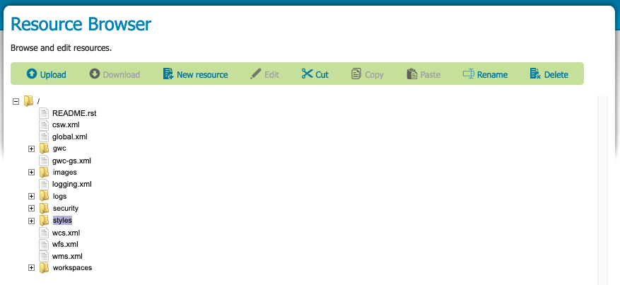
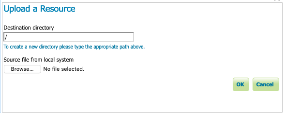
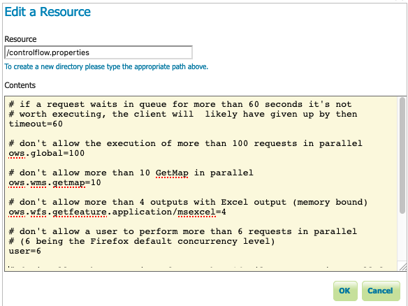
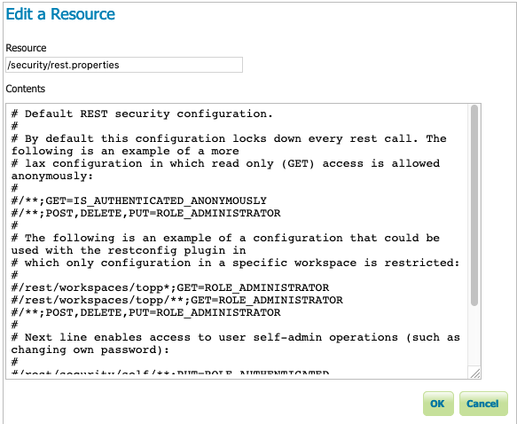
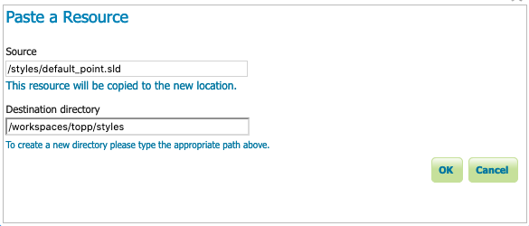

# Resource Browser

The **Resource Browser** provides a tree showing configuration folders, along with actions to edit and manage resources.

*Resource Browser*

User interface elements:

-   **Resource tree** is used to explore configuration folders and resource items.

-   **Upload** uploads files to GeoServer. Select a directory to enable this tool.

    
    *Upload a resource*

-   **Download** is used to download a selected resource from GeoServer as a file.

-   **New resource** creates a new text file in the selected directory. The **Edit Resource** dialog is used to record the resource location, and the contents.

    
    *Edit a Resource (New File)*

-   **Edit** a selected resource.

    
    *Edit a Resource (Existing File)*

-   Use **Cut**, **Copy**, and **Paste** to move resources between folders.

    
    *Paste a Resource*

-   **Rename** to rename a selected resource.

    > 
    > *Rename a Resource*

-   **Delete** to remove a selected resource.

    > 
    > *Delete a resource*

## Before you start

The resource browser is used to manage configuration resources in environments that do not provide direct disk access:

-   When running GeoServer on a remote machine it can be difficult mange the icons and fonts used for effective styling
-   Some cloud deployments of GeoServer operate without a data directory. In these environments the resource browser is used to manage items stored in a database or cloud storage rather than a file system.
-   Folders are visual only, when creating or uploading a resource you can type a path and folders will be created as needed.

!!! warning

    Please use this tool with caution:
    
    -   Configuration files managed by the web administration application can be reviewed and even modified using this tool.
    -   It is not advised to edit these files directly as GeoServer must reload its Catalog to notice these changes.
