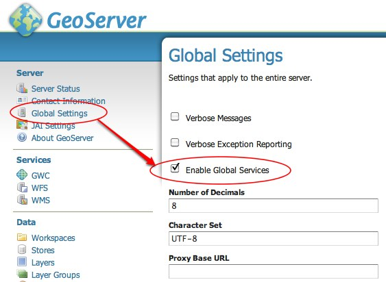
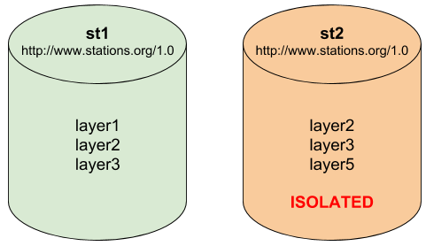

# Virtual Services

The different types of services in GeoServer include WFS, WMS, and WCS, commonly referred to as "Open Web Services (OWS)" services. These services are global in that each service publishes every layer configured on the server. WFS publishes all vector layer (feature types), WCS publishes all raster layers (coverages), and WMS publishes everything.

A *virtual service* is a view of the global service that consists only of a subset of the layers. Virtual services are based on GeoServer workspaces. For each workspace that exists a virtual service exists along with it. The virtual service publishes only those layers that fall under the corresponding workspace.

!!! warning

    Virtual services only apply to the core OWS services, and not OWS services accessed through GeoWebCache. It also does not apply to other subsystems such as REST.

When a client accesses a virtual service that client only has access to those layers published by that virtual service. Access to layers in the global service via the virtual service will result in an exception. This makes virtual services ideal for compartmentalizing access to layers. A service provider may wish to create multiple services for different clients handing one service url to one client, and a different service url to another client. Virtual services allow the service provider to achieve this with a single GeoServer instance.

## Filtering by workspace

Consider the following snippets of the WFS capabilities document from the GeoServer release configuration that list all the feature types:

    http://localhost:8080/geoserver/wfs?request=GetCapabilities

    <wfs:WFS_Capabilities>

      <FeatureType xmlns:tiger="http://www.census.gov">
       <Name>tiger:poly_landmarks</Name>
    --
      <FeatureType xmlns:tiger="http://www.census.gov">
       <Name>tiger:poi</Name>
    --
      <FeatureType xmlns:tiger="http://www.census.gov">
       <Name>tiger:tiger_roads</Name>
    --
      <FeatureType xmlns:sf="http://www.openplans.org/spearfish">
       <Name>sf:archsites</Name>
    --
      <FeatureType xmlns:sf="http://www.openplans.org/spearfish">
       <Name>sf:bugsites</Name>
    --
      <FeatureType xmlns:sf="http://www.openplans.org/spearfish">
       <Name>sf:restricted</Name>
    --
      <FeatureType xmlns:sf="http://www.openplans.org/spearfish">
       <Name>sf:roads</Name>
    --
      <FeatureType xmlns:sf="http://www.openplans.org/spearfish">
       <Name>sf:streams</Name>
    --
      <FeatureType xmlns:topp="http://www.openplans.org/topp">
       <Name>topp:tasmania_cities</Name>
    --
      <FeatureType xmlns:topp="http://www.openplans.org/topp">
       <Name>topp:tasmania_roads</Name>
    --
      <FeatureType xmlns:topp="http://www.openplans.org/topp">
       <Name>topp:tasmania_state_boundaries</Name>
    --
      <FeatureType xmlns:topp="http://www.openplans.org/topp">
       <Name>topp:tasmania_water_bodies</Name>
    --
      <FeatureType xmlns:topp="http://www.openplans.org/topp">
       <Name>topp:states</Name>
    --
      <FeatureType xmlns:tiger="http://www.census.gov">
       <Name>tiger:giant_polygon</Name>

    </wfs:WFS_Capabilities>

The above document lists every feature type configured on the server. Now consider the following capabilities request:

    http://localhost:8080/geoserver/topp/wfs?request=GetCapabilities

The part of interest in the above request is the "topp" prefix to the wfs service. The above url results in the following feature types in the capabilities document:

    <wfs:WFS_Capabilities>

       <FeatureType xmlns:topp="http://www.openplans.org/topp">
        <Name>topp:tasmania_cities</Name>
     --
       <FeatureType xmlns:topp="http://www.openplans.org/topp">
        <Name>topp:tasmania_roads</Name>
     --
       <FeatureType xmlns:topp="http://www.openplans.org/topp">
        <Name>topp:tasmania_state_boundaries</Name>
     --
       <FeatureType xmlns:topp="http://www.openplans.org/topp">
        <Name>topp:tasmania_water_bodies</Name>
     --
       <FeatureType xmlns:topp="http://www.openplans.org/topp">
        <Name>topp:states</Name>

     </wfs:WFS_Capabilities>

The above feature types correspond to those configured on the server as part of the "topp" workspace.

The consequence of a virtual service is not only limited to the capabilities document of the service. When a client accesses a virtual service it is restricted to only those layers for all operations. For instance, consider the following WFS feature request:

    http://localhost:8080/geoserver/topp/wfs?request=GetFeature&typename=tiger:roads

The above request results in an exception. Since the request feature type "tiger:roads" is not in the "topp" workspace the client will receive an error stating that the requested feature type does not exist.

## Filtering by layer

It is possible to further filter a global service by specifying the name of layer as part of the virtual service. For instance consider the following capabilities document:

    http://localhost:8080/geoserver/topp/states/wfs?request=GetCapabilities

The part of interest is the "states" prefix to the wfs service. The above url results in the following capabilities document that contains a single feature type:

    <wfs:WFS_Capabilities>

      <FeatureType xmlns:topp="http://www.openplans.org/topp">
       <Name>topp:states</Name>

    <wfs:WFS_Capabilities>

## Turning off global services {: #global_services_off }

It is possible to completely restrict access to the global OWS services by setting a configuration flag. When global access is disabled OWS services may only occur through a virtual service. Any client that tries to access a service globally will receive an exception.

To disable global services, log into the GeoServer web administration interface and navigate to "Global Settings". Uncheck the "Enable Global Services" check box.

> 

### Isolated Workspaces {: #workspace_isolated }

Isolated workspaces content is only visible and queryable in the context of a virtual service bound to the isolated workspace. This means that isolated workspaces content will not show up in global capabilities documents and global services cannot query isolated workspaces contents. Note that these restrictions do not apply to the REST API.

A workspace can be made isolated by checking the **Isolated Workspace** checkbox when creating or editing a workspace.

*Making a workspace isolated*

An isolated workspace will be able to reuse a namespace already used by another workspace, but its resources (layers, styles, etc \...) can only be retrieved when using that workspace virtual services and will only show up in those virtual services capabilities documents.

It is only possible to create two or more workspaces with the same namespace in GeoServer if only one of them is non isolated, i.e. isolated workspaces have no restrictions in namespaces usage but two non isolated workspaces can't use the same namespace.

The following situation will be valid:

> -   Prefix: st1 Namespace: <http://www.stations.org/1.0> Isolated: false
> -   Prefix: st2 Namespace: <http://www.stations.org/1.0> Isolated: true
> -   Prefix: st3 Namespace: <http://www.stations.org/1.0> Isolated: true

But not the following one:

> -   Prefix: st1 Namespace: <http://www.stations.org/1.0> Isolated: false
> -   **Prefix: st2 Namespace: http://www.stations.org/1.0 Isolated: false**
> -   Prefix: st3 Namespace: <http://www.stations.org/1.0> Isolated: true

At most only one non isolated workspace can use a certain namespace.

Consider the following image which shows to workspaces (st1 and st2) that use the same namespace (<http://www.stations.org/1.0>) and several layers contained by them:

*Two workspaces using the same namespace, one of them is isolated.*

In the example above st2 is the isolated workspace. Consider the following WFS GetFeature requests:

> 1.  <http://localhost:8080/geoserver/ows?service=WFS&version=2.0.0&request=DescribeFeatureType&typeName=layer2>
> 2.  <http://localhost:8080/geoserver/st2/ows?service=WFS&version=2.0.0&request=DescribeFeatureType&typeName=layer2>
> 3.  <http://localhost:8080/geoserver/ows?service=WFS&version=2.0.0&request=DescribeFeatureType&typeName=st1:layer2>
> 4.  <http://localhost:8080/geoserver/st2/ows?service=WFS&version=2.0.0&request=DescribeFeatureType&typeName=st2:layer2>
> 5.  <http://localhost:8080/geoserver/ows?service=WFS&version=2.0.0&request=DescribeFeatureType&typeName=st2:layer2>
> 6.  <http://localhost:8080/geoserver/ows?service=WFS&version=2.0.0&request=DescribeFeatureType&typeName=layer5>

The first request is targeting WFS global service and requesting layer2, this request will use layer2 contained by workspace st1. The second request is targeting st2 workspace WFS virtual service, layer2 belonging to workspace st2 will be used. Request three and four will use layer2 belonging to workspace, respectively, st1 and st2. The last two requests will fail saying that the feature type was not found, isolated workspaces content is not visible globally.

**The rule of thumb is that resources (layers, styles, etc \...) belonging to an isolated workspace can only be retrieved when using that workspaces virtual services and will only show up in those virtual services capabilities documents.**
