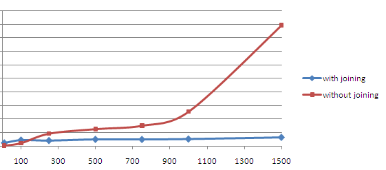

# Joining Support For Performance {: #app-schema.joining }

App-schema joining is a optional configuration parameter that tells app-schema to use a different implementation for `app-schema.feature-chaining`{.interpreted-text role="ref"}, which in many cases can improve performance considerably, by reducing the amount of SQL queries sent to the DBMS.

## Conditions

In order to use App-schema Joining, the following configuration conditions must be met:

-   All feature mappings used must be mapped to JDBC datastores.
-   All feature mappings that are chained to each other must map to the same physical database.
-   In your mappings, there are restrictions on the CQL expressions specified in the <SourceExpression> of both the referencing field in the parent feature as well as the referenced field in the nested feature (like FEATURE_LINK). Any operators or functions used in this expression must be supported by the filter capabilities, i.e. geotools must be able to translate them directly to SQL code. This can be different for each DBMS, though as a general rule it can assumed that comparison operators, logical operators and arithmetic operators are all supported but functions are not. Using simple field names for feature chaining is guaranteed to always work.

Failing to comply with any of these three restrictions when turning on Joining will result in exceptions thrown at run-time.

When using app-schema with Joining turned on, the following restrictions exist with respect to normal behaviour:

-   XPaths specified inside Filters do not support handling referenced features (see `app-schema.feature-chaining-by-reference`{.interpreted-text role="ref"}) as if they were actual nested features, i.e. XPaths can only be evaluated when they can be evaluated against the actual XML code produced by WFS according to the XPath standard.

## Configuration

Joining is turned on by default. It is disabled by adding this simple line to your app-schema.properties file (see `app-schema.property-interpolation`{.interpreted-text role="ref"}) :

    app-schema.joining = false

Or, alternatively, by setting the value of the Java System Property "app-schema.joining" to "false", for example :

    java -DGEOSERVER_DATA_DIR=... -Dapp-schema.joining=false Start

Not specifying "app-schema.joining" parameter will enable joining by default.

## Database Design Guidelines

-   Databases should be optimised for fast on-the-fly joining and ordering.
-   Make sure to put indexes on all fields used as identifiers and for feature chaining, unique indexes where possible. Lack of indices may result in data being encoded in the wrong order or corrupted output when feature chaining is involved.
-   Map your features preferably to normalised tables.
-   It is recommended to apply feature chaining to regular one-to-many relationships, i.e. there should be a unique constraint defined on one of the fields used for the chaining, and if possible a foreign key constraint defined on the other field.

## Effects on Performance

Typical curves of response time for configurations with and without joining against the amount of features produced will be shaped like this:

In the default implementation, response time increases rapidly with respect to the amount of produced features. This is because feature chaining is implemented by sending multiple SQL requests to the DBMS per feature, so the amount of requests increases with the amount of features produced. When Joining is turned on, response time will be almost constant with respect to the number of features. This is because in this implementation a small amount of larger queries is sent to the DBMS, independent of the amount of features produced. In summary, difference in performance becomes greater as the amount of features requested gets bigger. General performance of joining will be dependant on database and mapping design (see above) and database size.

Using joining is strongly recommended when a large number of features need to be produced, for example when producing maps with WMS (see `app-schema.wms-support`{.interpreted-text role="ref"}).

Optimising the performance of the database will maximise the benefit of using joining, including for small queries.

## Native Encoding of Filters on Nested Attributes

When App-Schema Joining is active, filters operating on nested attributes (i.e. attributes of features that are joined to the queried type via `app-schema.feature-chaining`{.interpreted-text role="ref"}) are translated to SQL and executed directly in the database backend, rather than being evaluated in memory after all features have been loaded (which was standard behavior in earlier versions of GeoServer). Native encoding can yield significant performance improvements, especially when the total number of features in the database is high (several thousands or more), but only a few of them would satisfy the filter.

There are, however, a few limitations in the current implementation:

1.  Joining support must not have been explicitly disabled and all its pre-conditions must be met (see above)
2.  Only binary comparison operators (e.g. `PropertyIsEqualTo`, `PropertyIsGreaterThan`, etc\...), `PropertyIsLike` and `PropertyIsNull` filters are translated to SQL
3.  Filters involving conditional polymorphic mappings are evaluated in memory
4.  Filters comparing two or more different nested attributes are evaluated in memory
5.  Filters matching multiple nested attribute mappings are evaluated in memory

Much like joining support, native encoding of nested filters is turned on by default, and it is disabled by adding to your app-schema.properties file the line :

    app-schema.encodeNestedFilters = false

Or, alternatively, by setting the value of the Java System Property "app-schema.encodeNestedFilters" to "false", for example :

    java -DGEOSERVER_DATA_DIR=... -Dapp-schema.encodeNestedFilters=false Start

## UNION performance improvement for OR conditions

OR conditions are difficult to optimize for postgresql and are usually slow. App-Schema improves OR condition performance using UNION clauses instead OR for nested filter subqueries.

With UNION improvement enabled main OR binary operator on nested filter subquery will rebuild normal OR query like:

    SELECT id, name FROM table WHERE name = "A" OR name = "B"

to:

    SELECT id, name FROM table WHERE name = "A" UNION SELECT id, name FROM table WHERE name = "B"

UNION improvement is enabled by default, and it is disabled by adding to your app-schema.properties file the line :

    app-schema.orUnionReplace = false

Or, alternatively, by setting the value of the Java System Property "app-schema.orUnionReplace" to "false", for example :

    java -DGEOSERVER_DATA_DIR=... -Dapp-schema.orUnionReplace=false Start

!!! note

    This optimization will only be applied when a PostgresSQL database is being used.
