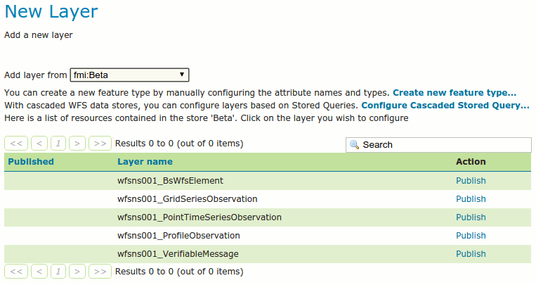
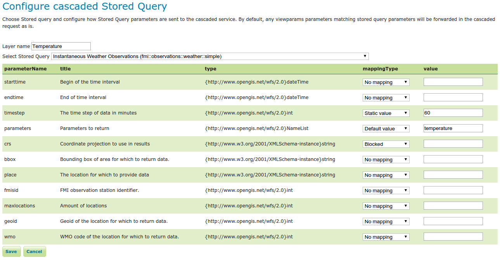

# Cascaded Web Feature Service Stored Queries

Stored query is a feature of Web Feature Services. It allows servers to serve pre-configured filter queries or even queries that cannot be expressed as GetFeature filter queries. This feature of GeoServer allows to create cascaded layers out of stored queries.

Stored queries are read-only, and layers derived from cascaded stored queries cannot be updated with WFS-T.

## Cascaded stored query parameters

The relationship between stored query parameters and the schema returned by the query is not well defined. For cascaded stored queries to work, the relationship between the query received by GeoServer and the parameters passed to the stored query must be defined.

When you set up a layer based on a stored query, you have to select which stored query to cascade and what values are passed to each parameter. Cascaded stored queries can leverage view parameters passed to the query. This is similar to how arbitrary parameters are passed to [SQL Views](../database/sqlview.md). GeoServer supports multiple strategies to pass these values. See below for a full list.

  -------------------- -------------------------------------------------------------------------------------------------------------------------------------------------------
  **Parameter type**   **Explanation**

  **No mapping**       The value of the view parameter will be passed as is to the stored query. No parameter will be passed if there is no view parameter of the same name.

  **Blocked**          This parameter will never be passed to the stored query

  **Default**          The specified value is used unless overwritten by a view parameter

  **Static**           The specified value is always used (view parameter value will be ignored)

  **CQL Expression**   An expression that will be evaluated on every request (see below for more details)
  -------------------- -------------------------------------------------------------------------------------------------------------------------------------------------------

See [Using a parametric SQL View](../database/sqlview.rst#using_a_parametric_sql_view) for more details how clients pass view parameters to GeoServer.

## CQL expressions

Parameter mappings configured as CQL expressions are evaluated for each request using a context derived from the request query and the view parameters. General information on CQL expressions is available here [Expression](../../filter/ecql_reference.rst#ecql_expr).

The context contains the following properties that may be used in the expressions:

  --------------------------------------------- -------------------------------------------------------------------
  **Property name**                             **Explanation**

  `bboxMinX` `bboxMinY` `bboxMaxX` `bboxMaxY`   Evaluates to a corner coordinate of the full extent of the query

  `defaultSRS`                                  Evaluates to the default SRS of the feature type

  `viewparam:name`                              Evaluates to the value of the view parameter *name* in this query
  --------------------------------------------- -------------------------------------------------------------------

## Configuring a cascaded stored query layer

In order to create a cascaded stored query layer the administrator invokes the Create new layer page. When an [External Web Feature Server](wfs.md) is selected, the usual list of tables and views available for publication appears, a link **Configure Cascaded Stored Query\...** also appears:

Selecting the **Configure Cascaded Stored Query\...** link opens a new page where the parameter mapping is set up. By default all parameters are set up as **No mapping**.

