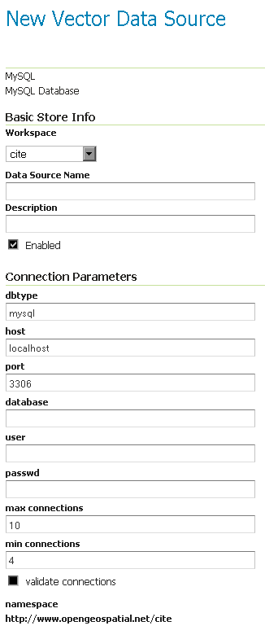

# MySQL

!!! note

    GeoServer does not come built-in with support for MySQL; it must be installed through an extension. Proceed to [Installing the MySQL extension](mysql.md#mysql_install) for installation details.

!!! warning

    Currently the MySQL extension is unmaintained and carries unsupported status. While still usable, do not expect the same reliability as with other extensions.

[MySQL](http://www.mysql.com) is an open source relational database with some limited spatial functionality.

## Installing the MySQL extension {: #mysql_install }

1.  Visit the [website download](https://geoserver.org/download) page, locate your release, and download: `mysql`{.interpreted-text role="download_extension"}

    !!! warning

        Ensure to match plugin (example {{ release }} above) version to the version of the GeoServer instance.

2.  Extract the contents of the archive into the **`WEB-INF/lib`** directory of the GeoServer installation.

## Adding a MySQL database

Once the extension is properly installed `MySQL` will show up as an option when creating a new data store.

*MySQL in the list of data sources*

## Configuring a MySQL data store

*Configuring a MySQL data store*

+------------------------+------------------------------------------------------------------------------------------------------------------------------+
| `host`                 | The mysql server host name or ip address.                                                                                    |
+------------------------+------------------------------------------------------------------------------------------------------------------------------+
| `port`                 | The port on which the mysql server is accepting connections.                                                                 |
+------------------------+------------------------------------------------------------------------------------------------------------------------------+
| `database`             | The name of the database to connect to. Can also contain a suffix with a connection URL query, such as mydbname?useSSL=false |
+------------------------+------------------------------------------------------------------------------------------------------------------------------+
| `user`                 | The name of the user to connect to the mysql database as.                                                                    |
+------------------------+------------------------------------------------------------------------------------------------------------------------------+
| `password`             | The password to use when connecting to the database. Left blank for no password.                                             |
+------------------------+------------------------------------------------------------------------------------------------------------------------------+
| `max connections`      | Connection pool configuration parameters. See the [Database Connection Pooling](connection-pooling.md) section for details. |
|                        |                                                                                                                              |
| `min connections`      |                                                                                                                              |
|                        |                                                                                                                              |
| `validate connections` |                                                                                                                              |
+------------------------+------------------------------------------------------------------------------------------------------------------------------+
