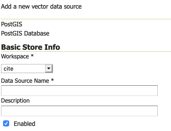
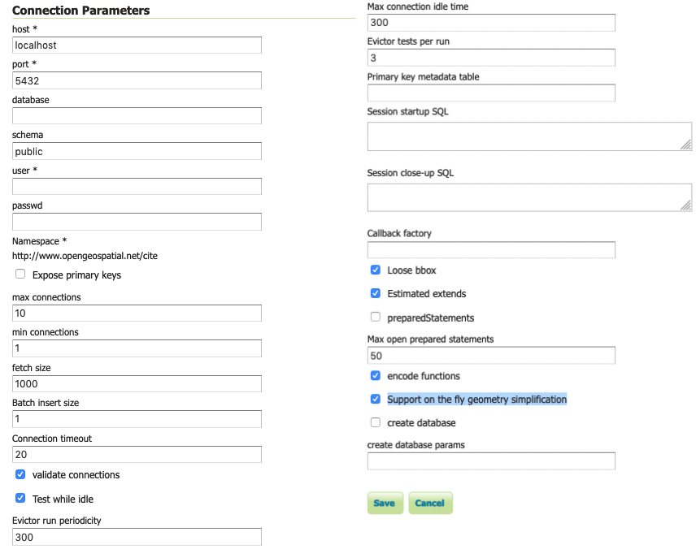
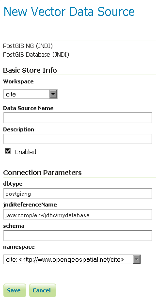

# PostGIS

[PostGIS](http://postgis.net) is an open source spatial database based on [PostgreSQL](http://postgresql.com/), and is currently one of the most popular open source spatial databases today.

## Adding a PostGIS database

As with all formats, adding a shapefile to GeoServer involves adding a new store to the existing [Stores](../webadmin/stores.md) through the [Web administration interface](../../webadmin/index.md).

### Using default connection

To begin, navigate to **Stores --> Add a new store --> PostGIS NG**.

Fill in the *Basic Store Info* used to identify the database when managing layers.


*Adding a PostGIS database*

| Basic Store Info     | Description                                                                                                                         |
|----------------------|-------------------------------------------------------------------------------------------------------------------------------------|
| **Workspace**        | Name of the workspace to contain the database. This will also be the prefix of any layer names created from tables in the database. |
| **Data Source Name** | Name of the database. This can be different from the name as known to PostgreSQL/PostGIS.                                           |
| **Description**      | Description of the database/store.                                                                                                  |
| **Enabled**          | Enables the store. If disabled, no data in the database will be served.                                                             |

Move on to the connection parameters used to connect and interact with the database.


*PostGIS connection parameters*

The `dbtype` and `namespace` connection parameters are not directly editable. The **dbtype** parameter is for internal use only (and only accessible via the REST API).

| Connection Parameter | Description                                                                                         |
|----------------------|-----------------------------------------------------------------------------------------------------|
| **dbtype**           | Type of database. Internal value, leave this value as the default.                                  |
| **namespace**        | Namespace to be associated with the database. This field is altered by changing the workspace name. |

Connection parameters establishing a database connection (see [Database Connection Pooling](connection-pooling.md)):

| Connection Parameter         | Description                                                                                         |
|------------------------------|-----------------------------------------------------------------------------------------------------|
| **host**                     | Host name where the database exists.                                                                |
| **port**                     | Port number to connect to the above host.                                                           |
| **database**                 | Name of the database as known on the host.                                                          |
| **schema**                   | Schema in the above database.                                                                       |
| **user**                     | Username to connect to the database.                                                                |
| **passwd**                   | Password associated with the above user.                                                            |
| **max connections**          | Maximum amount of open connections to the database.                                                 |
| **min connections**          | Minimum number of pooled connections.                                                               |
| **fetch size**               | Number of records read with each interaction with the database.                                     |
| **Connection timeout**       | Time (in seconds) the connection pool will wait before timing out.                                  |
| **validate connections**     | Checks the connection is alive before using it.                                                     |
| **Evictor run periodicity**  | Number of seconds between idle object evictor runs.                                                 |
| **Max connection idle time** | Number of seconds a connection needs to stay idle before the evictor starts to consider closing it. |
| **Evictor tests per run**    | Number of connections checked by the idle connection evictor for each of its runs.                  |

Connection parameters managing SQL generation:

| Connection Parameter             | Description                                                                                                                                 |
|----------------------------------|---------------------------------------------------------------------------------------------------------------------------------------------|
| **Expose primary keys**          | Expose primary key columns as values suitable for filtering.                                                                                |
| **Primary key metadata table**   | Provide table defining how primary keys values are generated (see [Controlling feature ID generation in spatial databases](primarykey.md)) |
| **Session startup SQL**          | SQL applied to connection before use (see [Custom SQL session start/stop scripts](sqlsession.md))                                          |
| **Session close-up SQL**         | SQL applied to connection after use (see [Custom SQL session start/stop scripts](sqlsession.md))                                           |
| **preparedStatements**           | Enables prepared statements for SQL generation, rather than text substitution.                                                              |
| **Max open prepared statements** | Number of prepared statements available.                                                                                                    |

Connection parameters managing database interaction:

| Connection Parameter                           | Description                                                                                                                                      |
|------------------------------------------------|--------------------------------------------------------------------------------------------------------------------------------------------------|
| **Loose bbox**                                 | Performs only the primary filter on the bounding box. See the section on [Using loose bounding box](postgis.md#postgis_loose_bbox) for details. |
| **Estimated extends**                          | Use spatial index to quickly estimate bounds, rather than check every row.                                                                       |
| **Encode functions**                           | Generate supported filter functions into their SQL equivalent.                                                                                   |
| **Support on the fly geometry simplification** | Enables use of PostGIS geometry simplification                                                                                                   |

Connection parameters supporting initial database creation:

| Connection Parameter       | Description                                                                        |
|----------------------------|------------------------------------------------------------------------------------|
| **create database**        | Enable to define a new database on connection                                      |
| **create database params** | Additional CREATE DATABASE definition, example ``WITH TEMPLATE=postgis`` |

When finished, click **Save**.

### Using JNDI

GeoServer can also connect to a PostGIS database using [JNDI](https://docs.oracle.com/javase/tutorial/jndi/overview/index.html) (Java Naming and Directory Interface). This is used to allow a PostGIS DataStore to share a named connection pool of PostGIS connections configured in your application server.

To begin, navigate to **Stores --> Add a new store --> PostGIS NG (JNDI)**.


*Adding a PostGIS database (using JNDI)*

| Option                | Description                                                                                                                |
|-----------------------|----------------------------------------------------------------------------------------------------------------------------|
| **Workspace**         | Name of the workspace to contain the store. This will also be the prefix of all of the layer names created from the store. |
| **Data Source Name**  | Name of the database. This can be different from the name as known to PostgreSQL/PostGIS.                                  |
| **Description**       | Description of the database/store.                                                                                         |
| **Enabled**           | Enables the store. If disabled, no data in the database will be served.                                                    |
| **dbtype**            | Type of database. Leave this value as the default.                                                                         |
| **jndiReferenceName** | JNDI path to the database.                                                                                                 |
| **schema**            | Schema for the above database.                                                                                             |
| **namespace**         | Namespace to be associated with the database. This field is altered by changing the workspace name.                        |

When finished, click **Save**.

## Configuring PostGIS layers

When properly loaded, all tables in the database will be visible to GeoServer, but they will need to be individually configured before being served by GeoServer. See the section on [Layers](../webadmin/layers.md) for how to add and edit new layers.

## Using loose bounding box {: #postgis_loose_bbox }

When the option **loose bbox** is enabled, only the bounding box of a geometry is used. This can result in a significant performance gain, but at the expense of total accuracy; some geometries may be considered inside of a bounding box when they are technically not.

If primarily connecting to this data via WMS, this flag can be set safely since a loss of some accuracy is usually acceptable. However, if using WFS and especially if making use of BBOX filtering capabilities, this flag should not be set.

## Publishing a PostGIS view

Publishing a view follows the same process as publishing a table. The only additional step is to manually ensure that the view has an entry in the `geometry_columns` table.

For example consider a table with the schema:

    my_table( id int PRIMARY KEY, name VARCHAR, the_geom GEOMETRY )

Consider also the following view:

    CREATE VIEW my_view as SELECT id, the_geom FROM my_table;

Before this view can be served by GeoServer, the following step is necessary to manually create the `geometry_columns` entry:

    INSERT INTO geometry_columns VALUES ('','public','my_view','my_geom', 2, 4326, 'POINT' );

## Performance considerations

### GEOS

[GEOS](http://trac.osgeo.org/geos/) (Geometry Engine, Open Source) is an optional component of a PostGIS installation. It is recommended that GEOS be installed with any PostGIS instance used by GeoServer, as this allows GeoServer to make use of its functionality when doing spatial operations. When GEOS is not available, these operations are performed internally which can result in degraded performance.

### Spatial indexing

It is strongly recommended to create a spatial index on tables with a spatial component (i.e. containing a geometry column). Any table of which does not have a spatial index will likely respond slowly to queries.

## Common problems

### Primary keys

In order to enable transactional extensions on a table (for transactional WFS), the table must have a primary key. A table without a primary key is considered read-only to GeoServer.

GeoServer has an option to expose primary key values (to make filters easier). Please keep in mind that these values are only exposed for your convenience - any attempted to modify these values using WFS-T update will be silently ignored. This restriction is in place as the primary key value is used to define the FeatureId. If you must change the FeatureId you can use WFS-T delete and add in a single Transaction request to define a replacement feature.

### Multi-line

To insert multi-line text (for use with labeling) remember to use escaped text:

    INSERT INTO place VALUES (ST_GeomFromText('POINT(-71.060316 48.432044)', 4326), E'Westfield\nTower');

## JsonPointer Function support

GeoServer is able to translate the `jsonPointer` function to a query using PostgreSQL support for JSON types. The following are the main characteristics of the implementation:

-   The jsonPointer function syntax is like the following: `jsonPointer(attributeName,'/path/to/json/attribute')`.
-   The function is able to select attributes inside json arrays by specifying the index of the target element in the json path eg. `'/path/to/array/element/0'`.
-   When accessing a JSON property it is implicitly assumed that the same property will have the same type on all features, otherwise a cast exception will be thrown by the database.
-   GeoServer will perform a cast automatically to the expect type from the evaluation; the cast is completely delegated to the database.
-   If the property doesn't exists no errors will be issued, but the features that have that property will be excluded; hence the property we wish to query is not mandatory in all features.

### Examples

Having a json column storing jsonvalues like the following,

> { "name": "city name",
>
> :   "description": "the city description", "districts": [ { "name":"district1", "population": 2000 }, { "name":"district2", "population": 5000 } ] "population":{ "average_age": 35, "toal": 50000 }
>
> }

and assuming an attribute name as `city`, valid jsonPointer functions would be:

-   `jsonPointer(city, '/name')`.
-   `jsonPointer(city, '/population/average_age')`.
-   `jsonPointer(city, '/districts/0/name')`.

An example cql_filter would then be `jsonPointer(city, '/population/average_age') > 30`.

While an example rule in a sld style sheet could be:

``` xml
<Rule>
  <Name>Cities</Name>
     <ogc:Filter>
       <ogc:PropertyIsEqualTo>
         <ogc:Function name="jsonPointer">
           <ogc:PropertyName>city</ogc:PropertyName>
           <ogc:Literal>/population/average_age</ogc:Literal>
         </ogc:Function>
         <ogc:Literal>35</ogc:Literal>
       </ogc:PropertyIsEqualTo>
       </ogc:Filter>          
     <PointSymbolizer>
       <Graphic>
         <Mark>
           <WellKnownName>square</WellKnownName>
             <Fill>
               <CssParameter name="fill">#FF0000</CssParameter>
             </Fill>
         </Mark>
         <Size>16</Size>
       </Graphic>
    </PointSymbolizer>
 </Rule>
```

### DataTypes

PostgreSQL defines two JSON datatypes:

> -   `json` that stores an exact copy of the input text.
> -   `jsonb` which store the value in a decomposed binary format.

The jsonPointer function supports both, as well as the text format if it contains a valid json representation. Anyways, the PostgreSQL documentation recommends usage of jsonb, as it is faster to process.

PostgreSQL supports also indexing on json types. And index on a specific json attribute can be created as follow:

`CREATE INDEX description_index ON table_name  ((column_name -> path -> to ->> json_attribute ))`.

Index can also be specified in partial way:

`CREATE INDEX description_index ON table_name ((column_name -> path -> to ->> json_attribute ))  WHERE (column_name -> path -> to ->> json_attribute) IS NOT NULL`.
