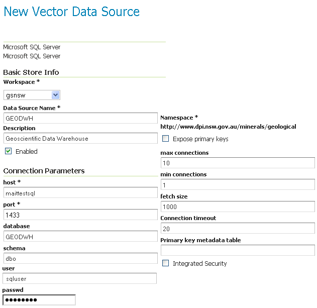

# Microsoft SQL Server and SQL Azure {: #data_sqlserver }

!!! note

    GeoServer does not come built-in with support for SQL Server; it must be installed through an extension. Proceed to [Installing the SQL Server extension](sqlserver.md#sqlserver_install) for installation details.

Microsoft's [SQL Server](http://www.microsoft.com/sqlserver) is a relational database with spatial functionality. SQL Azure is the database option provided in the Azure cloud solution which is in many respects similar to SQL Server.

## Supported versions

The extension supports SQL Server 2008 - 2019 and SQL Azure.

## Installing the SQL Server extension {: #sqlserver_install }

### GeoServer files

1.  Visit the [website download](https://geoserver.org/download) page, locate your release, and download: `sqlserver`{.interpreted-text role="download_extension"}

    !!! warning

        Ensure to match plugin (example {{ release }} above) version to the version of the GeoServer instance.

2.  Extract the contents of the archive into the **`WEB-INF/lib`** directory of the GeoServer installation.

3.  Restart the GeoServer to load the extension.

## Adding a SQL Server database

Once the extension is properly installed `SQL Server` will show up as an option when creating a new data store.

*SQL Server in the list of vector data sources*

## Configuring a SQL Server data store

*Configuring a SQL Server data store*

+-------------------+-------------------------------------------------------------------------------------------------------------------------------------------------------------------------------------------------------------------------------------------------------------------------------------+
| `host`            | The sql server instance host name or ip address, only. Note that `server\instance` notation is not accepted - specify the port below, instead, if you have a non-default instance.                                                                                                  |
+-------------------+-------------------------------------------------------------------------------------------------------------------------------------------------------------------------------------------------------------------------------------------------------------------------------------+
| `port`            | The port on which the SQL server instance is accepting connections. See the [note](sqlserver.md#port_notes) below.                                                                                                                                                                 |
+-------------------+-------------------------------------------------------------------------------------------------------------------------------------------------------------------------------------------------------------------------------------------------------------------------------------+
| `database`        | The name of the database to connect to. Might be left blank if the user connecting to SQL Server has a "default database" set in the user configuration                                                                                                                           |
+-------------------+-------------------------------------------------------------------------------------------------------------------------------------------------------------------------------------------------------------------------------------------------------------------------------------+
| `schema`          | The database schema to access tables from (optional).                                                                                                                                                                                                                               |
+-------------------+-------------------------------------------------------------------------------------------------------------------------------------------------------------------------------------------------------------------------------------------------------------------------------------+
| `user`            | The name of the user to connect to the database as.                                                                                                                                                                                                                                 |
+-------------------+-------------------------------------------------------------------------------------------------------------------------------------------------------------------------------------------------------------------------------------------------------------------------------------+
| `password`        | The password to use when connecting to the database. Leave blank for no password.                                                                                                                                                                                                   |
+-------------------+-------------------------------------------------------------------------------------------------------------------------------------------------------------------------------------------------------------------------------------------------------------------------------------+
| `max connections` | Connection pool configuration parameters. See the [Database Connection Pooling](connection-pooling.md) section for details. If you are connecting to SQL Azure make sure to set the `validate connections` flag as SQL Azure closes inactive connections after a very short delay. |
|                   |                                                                                                                                                                                                                                                                                     |
| `min connections` |                                                                                                                                                                                                                                                                                     |
+-------------------+-------------------------------------------------------------------------------------------------------------------------------------------------------------------------------------------------------------------------------------------------------------------------------------+

### Determining the port used by the SQL Server instance {: #port_notes }

You can determine the port in use by connecting to your SQL server instance using some other software, and then using ***netstat*** to display details on network connections. In the following example on a Windows PC, the port is 2646 :

    C:>netstat -a | find "sql1"
    TCP   DPI908194:1918   maittestsql1.dpi.nsw.gov.au:2646   ESTABLISHED

### Using the geometry metadata table

The SQL server data store can determine the geometry type and native SRID of a particular column only by data inspection, by looking at the first row in the table. Of course this is error prone, and works only if there is data in the table. The administrator can address the above issue by manually creating a geometry metadata table describing each geometry column. Its presence is indicated via the SQL Server datastore connection parameter named *Geometry metadata table* (which may be a simple table name or a schema-qualified one). The table has the following structure (the table name is flexible, just specify the one chosen in the data store connection parameter):

    CREATE TABLE GEOMETRY_COLUMNS(
       F_TABLE_SCHEMA VARCHAR(30) NOT NULL,
       F_TABLE_NAME VARCHAR(30) NOT NULL,
       F_GEOMETRY_COLUMN VARCHAR(30) NOT NULL,
       COORD_DIMENSION INTEGER,
       SRID INTEGER NOT NULL,
       TYPE VARCHAR(30) NOT NULL,
       UNIQUE(F_TABLE_SCHEMA, F_TABLE_NAME, F_GEOMETRY_COLUMN),
       CHECK(TYPE IN ('POINT', 'LINESTRING', 'POLYGON', 'MULTIPOINT', 'MULTILINESTRING', 'MULTIPOLYGON', 'GEOMETRYCOLLECTION') ));

When the table is present the store first searches it for information about each geometry column to be classified, and falls back on data inspection only if the table does not contain any information.
