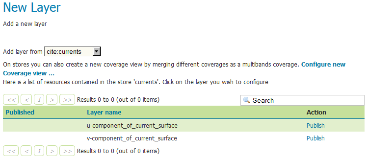
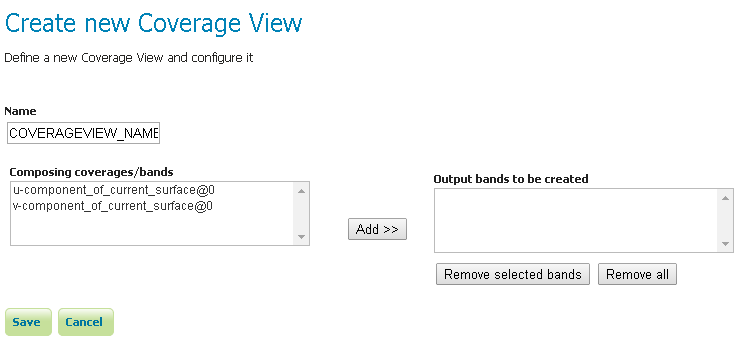
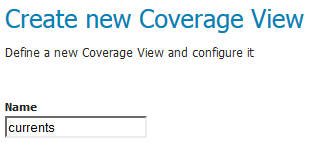
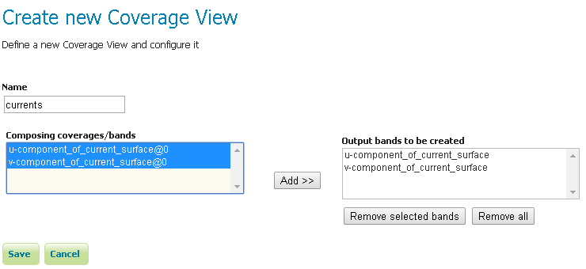
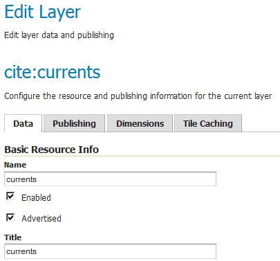
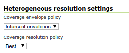
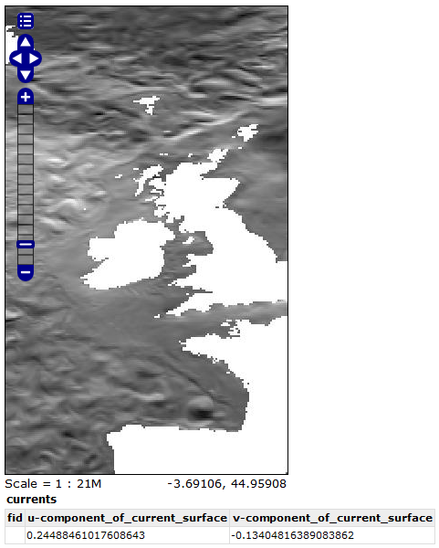

# Coverage Views

Starting with GeoServer 2.6.0, You can define a new raster layer as a Coverage View. Coverage Views allow defining a View made of different bands originally available inside coverages (either bands of the same coverage or different coverages) of the same Coverage Store.

## Creating a Coverage View

In order to create a Coverage View the administrator invokes the **Create new layer** page. When a Coverage store is selected, the usual list of coverages available for publication appears. A link **Configure new Coverage view\...** also appears:

Selecting the **Configure new Coverage view\...** link opens a new page where you can configure the coverage view:

The upper text box allows to specify the name to be assigned to this coverage view. (In the following picture we want to create as example, a **currents** view merging together both u and v components of the currents, which are exposed as separated 1band coverages).

Next step is defining the output bands to be put in the coverage view. It is possible to specify which input coverage bands need to be put on the view by selecting them from the **Composing coverages/bands\...**.

Once selected, they needs to be added to the output bands of the coverage view, using the **add** button.

Optionally, is it possible to remove the newly added bands using the **remove** and **remove all** buttons. Once done, clicking on the **save** button will redirect to the standard Layer configuration page.

Scrolling down to the end of the page, is it possible to see the bands composing the coverage (and verify they are the one previously selected).

At any moment, the Coverage View can be refined and updated by selecting the **Edit Coverage view\...** link available before the Coverage Bands details section.

Once all the properties of the layer have been configured, by selecting the **Save** button, the coverage will be saved in the catalog and it will become visible as a new layer.

## Heterogeneous coverage views

In case the various coverages bound in the view have different resolution, the UI will present two extra controls:

The **coverage envelope policy** defines how the bounding box of the output is calculated for metadata purposes. Having different resolutions, the coverages are unlikely to share the same bounding box. The possible values are:

-   **Intersect envelopes**: Use the intersection of all input coverage envelopes
-   **Union envelopes**: Use the union of all input coverage envelopes

The **coverage resolution policy** defines which target resolution is used when generating outputs:

-   **Best**: Use the best resolution available among the chosen bands (e.g., in a set having 60m, 20m and 10m the 10m resolution will be chosen)
-   **Worst**: Use the worst resolution available among the chosen bands (e.g., in a set having 60m, 20m and 10m the 60m resolution will be chosen)

The coverage resolution policy is *context sensitive*. Assume the input is a 12 bands Sentinel 2 dataset at three different resolution, 10, 20 and 30 meters, and a false color image is generated by performing a band selection in the SLD. If the policy is *best* and the SLD selects only bands at 20 and 60 meters, the output will be at 20 meters instead of 10 meters.

## Coverage View in action

A Layer preview of the newly created coverage view will show the rendering of the view. Note that clicking on a point on the map will result into a GetFeatureInfo call which will report the values of the bands composing the coverage view.

