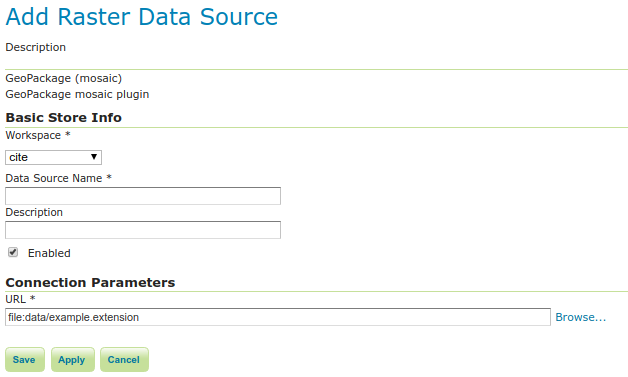

# GeoPackage {: #data_geopkg_raster }

[GeoPackage](http://www.opengeospatial.org/projects/groups/geopackageswg/) is an SQLite based standard format that is able to hold multiple vector and raster data layers in a single file.

GeoPackage files can be used both as Vector Data Stores as well as Raster Data Stores (so that both kinds of layers can published).

## Adding a GeoPackage Raster (Mosaic) Data Store

By default, **GeoPackage (mosaic)** will be an option in the **Raster Data Sources** list when creating a new data store.

*GeoPackage (mosaic) in the list of raster data stores*

*Configuring a GeoPackage (mosaic) data store*

  -------------------- -----------------------------------------------------------------------------------------------------------------------------------------------------------------------------------------------------------
  **Option**           **Description**

  `Workspace`          Name of the workspace to contain the GeoPackage Mosaic store. This will also be the prefix of the raster layers created from the store.

  `Data Source Name`   Name of the GeoPackage Mosaic Store as it will be known to GeoServer. This can be different from the filename. )

  `Description`        A full free-form description of the GeoPackage Mosaic Store.

  `Enabled`            If checked, it enables the store. If unchecked (disabled), no data in the GeoPackage Mosaic Store will be served from GeoServer.

  `URL`                Location of the GeoPackage file. This can be an absolute path (such as **`file:C:\Data\landbase.gpkg`**) or a path relative to GeoServer's data directory (such as **`file:data/landbase.gpkg`**).
  -------------------- -----------------------------------------------------------------------------------------------------------------------------------------------------------------------------------------------------------

When finished, click **Save**.
