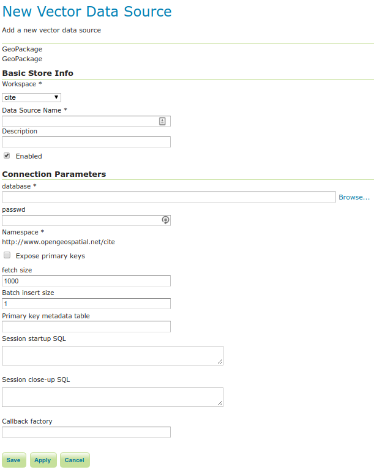

# GeoPackage {: #data_geopkg_vector }

[GeoPackage](http://www.opengeospatial.org/projects/groups/geopackageswg/) is an SQLite based standard format that is able to hold multiple vector and raster data layers in a single file.

GeoPackage files can be used both as Raster Data Stores as well as Vector Data Stores (so that both kinds of layers can published).

## Adding a GeoPackage Vector Data Store

When the extension has been installed, **GeoPackage** will be an option in the **Vector Data Sources** list when creating a new data store.

*GeoPackage in the list of vector data stores*

*Configuring a GeoPackage Vector data store*

  -------------------------- -----------------------------------------------------------------------------------------------------
  **Option**                 **Description**

  **database**               URI specifying geopackage file.

  **user**                   User to access database.

  **passwd**                 Password to access database.

  **namespace**              Namespace to be associated with the database. This field is altered by changing the workspace name.

  **max connections**        Maximum amount of open connections to the database.

  **min connections**        Minimum number of pooled connections.

  **fetch size**             Number of records read with each interaction with the database.

  **Connection timeout**     Time (in seconds) the connection pool will wait before timing out.

  **validate connections**   Checks the connection is alive before using it.
  -------------------------- -----------------------------------------------------------------------------------------------------

When finished, click **Save**.
