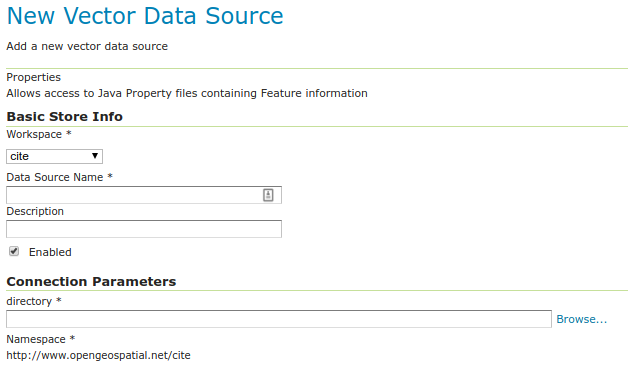

# Java Properties

The Properties data store provides access to one or more feature types (layers) stored in Java property files; these are plain text files stored on the local filesystem. The Properties data store was never intended to be shipped with GeoServer. It originated in a GeoTools tutorial, and later found widespread use by developers in automated tests that required a convenient store for small snippets of data. It slipped into GeoServer through the completeness of the packaging process, and was automatically detected and offered to users via the web interface. The Property data store has proved useful in tutorials and examples.

-   We do not recommend the use the Properties data store for large amounts of data, with either many features or large geometries. Its performance will be terrible.
-   For small data sets, such as collections of a few dozen points, you may find it to be satisfactory. For example, if you have a few points you wish to add as an extra layer, and no convenient database in which store them, the Properties data store provides a straightforward means of delivering them.
-   Changes to a property file are immediately reflected in GeoServer responses. There is no need to recreate the data store unless the first line of a property file is changed, or property files are added or removed.

## Adding a Properties data store

By default, **Properties** will be an option in the **Vector Data Sources** list when creating a new data store.

*Properties in the list of vector data stores*

## Configuring a Properties data store

*Configuring a Properties data store*

|                    |                                                                                                                  |
|--------------------|------------------------------------------------------------------------------------------------------------------|
| **Option**         | **Description**                                                                                                  |
| `Workspace`        | Sets the namespace prefix of the feature types (layers) and their properties                                     |
| `Data Source Name` | Unique identifier to distinguish this data store                                                                 |
| `Description`      | Optional text giving a verbose description of the data store                                                     |
| `Enabled`          | Features will be delivered only if this option is checked                                                        |
| `directory`        | Filesystem path to a directory containing one or more property files, for example `/usr/local/geoserver/data/ex` |

Every property file `TYPENAME.properties` in the designated directory is served as a feature type `TYPENAME` (the name of the file without the `.properties`), in the namespace of the data store.

Before a feature type (layer) can be used, you must edit it to ensure that its bounding box and other metadata is configured.

## Property file format

The property file format is a subset of the Java properties format: a list of lines of the form `KEY=VALUE`.

This example `stations.properties` defines four features of the feature type (layer) `stations`:

    _=id:Integer,code:String,name:String,location:Geometry:srid=4326
    stations.27=27|ALIC|Alice Springs|POINT(133.8855 -23.6701)
    stations.4=4|NORF|Norfolk Island|POINT(167.9388 -29.0434)
    stations.12=12|COCO|Cocos|POINT(96.8339 -12.1883)
    stations.31=31|ALBY|Albany|POINT(117.8102 -34.9502)

-   Blank lines are not permitted anywhere in the file.
-   The first line of the property file begins with `_=` and defines the type information required to interpret the following lines.
    -   Comma separated values are of the form `NAME:TYPE`
    -   Names are the property name that are used to encode the property in WFS responses.
    -   Types include `Integer`, `String`, `Float`, and `Geometry`
    -   `Geometry` can have an extra suffix `:srid=XXXX` that defines the Spatial Reference System by its numeric EPSG code. Note that geometries defined in this way are in longitude/latitude order.
-   Subsequent lines define features, one per line.
    -   The key before the `=` is the feature ID (`fid` or `gml:id` in WFS responses). Each must be an [NCName](http://www.w3.org/TR/1999/REC-xml-names-19990114/#NT-NCName).
    -   Feature data follows the `=` separated by vertical bars (`|`). The types of the data must match the declaration on the first line.
    -   Leave a field empty if you want it to be null; in this case the property will be ignored.

Note that in this example `srid=4326` sets the spatial reference system (SRS) to `EPSG:4326`, which is by convention in longitude/latitude order when referred to in the short form. If you request these features in GML 3 you will see that GeoServer correctly translates the geometry to the URN form SRS `urn:x-ogc:def:crs:EPSG:4326` in latitude/longitude form. See the [WFS settings](../../services/wfs/webadmin.md) page for more on SRS axis order options.
