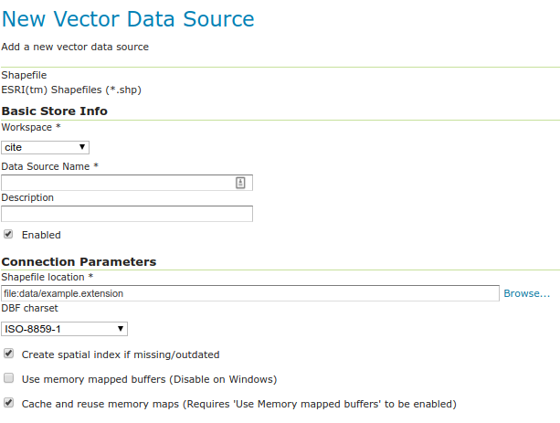

# Shapefile {: #data_shapefile }

A shapefile is a popular geospatial vector data format.

!!! note

    While GeoServer has robust support for the shapefile format, it is not the recommended format of choice in a production environment. Databases such as PostGIS are more suitable in production and offer better performance and scalability. See the section on [Running in a production environment](../../production/index.md) for more information.

## Adding a shapefile

A shapefile is actually a collection of files (with the extensions: `.shp`, `.dbf`, `.shx`, `.prj`, and sometimes others). All of these files need to be present in the same directory in order for GeoServer to accurately read them. As with all formats, adding a shapefile to GeoServer involves adding a new store to the existing [Stores](../webadmin/stores.md) through the [Web administration interface](../../webadmin/index.md).

!!! warning

    The `.prj` file, while not mandatory, is strongly recommended when working with GeoServer as it contains valuable projection info. GeoServer may not be able to load your shapefile without it!

To begin, navigate to **Stores --> Add a new store --> Shapefile**.

*Adding a shapefile as a store*

  ---------------------------------------------------------- --------------------------------------------------------------------------------------------------------------------------------------------------------------------------------------
  **Option**                                                 **Description**

  **Workspace**                                              Name of the workspace to contain the store. This will also be the prefix of the layer created from the store.

  **Data Source Name**                                       Name of the shapefile as known to GeoServer. Can be different from the filename. The combination of the workspace name and this name will be the full layer name (ex: topp:states).

  **Description**                                            Description of the shapefile/store.

  **Enabled**                                                Enables the store. If unchecked, no data in the shapefile will be served.

  **URL**                                                    Location of the shapefile. Can be an absolute path (such as **`file:C:\Data\shapefile.shp`**) or a path relative to the data directory (such as **`file:data/shapefile.shp`**.

  **namespace**                                              Namespace to be associated with the shapefile. This field is altered by changing the workspace name.

  **create spatial index**                                   Enables the automatic creation of a spatial index.

  **charset**                                                Character set used to decode strings from the `.dbf` file.

  **memory mapped buffer** **Cache and reuse memory maps**   Enables the use of memory mapped I/O, improving caching of the file in memory. **Turn off on Windows servers**.
  ---------------------------------------------------------- --------------------------------------------------------------------------------------------------------------------------------------------------------------------------------------

When finished, click **Save**.

## Configuring a shapefile layer

Shapefiles contain exactly one layer, which needs to be added as a new layer before it will be able to be served by GeoServer. See the section on [Layers](../webadmin/layers.md) for how to add and edit a new layer.
