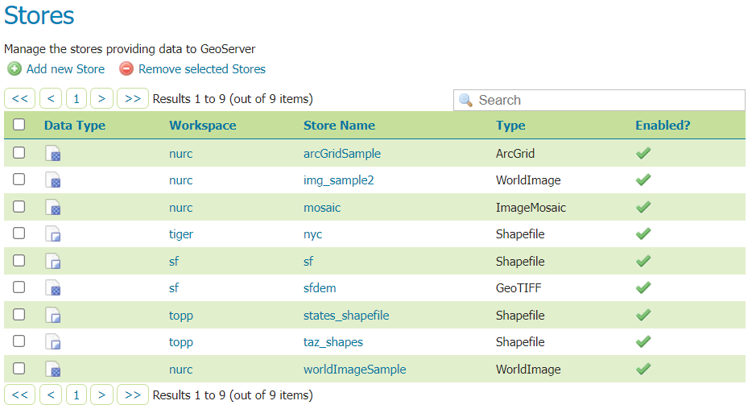
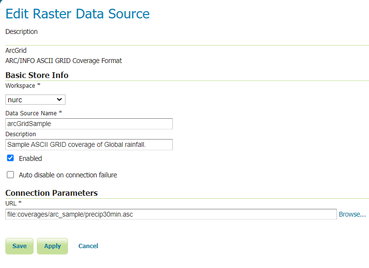
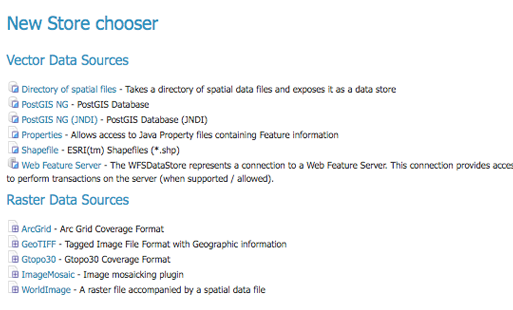
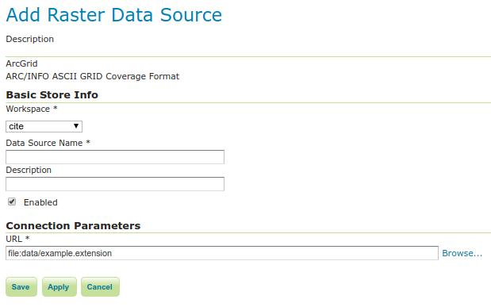
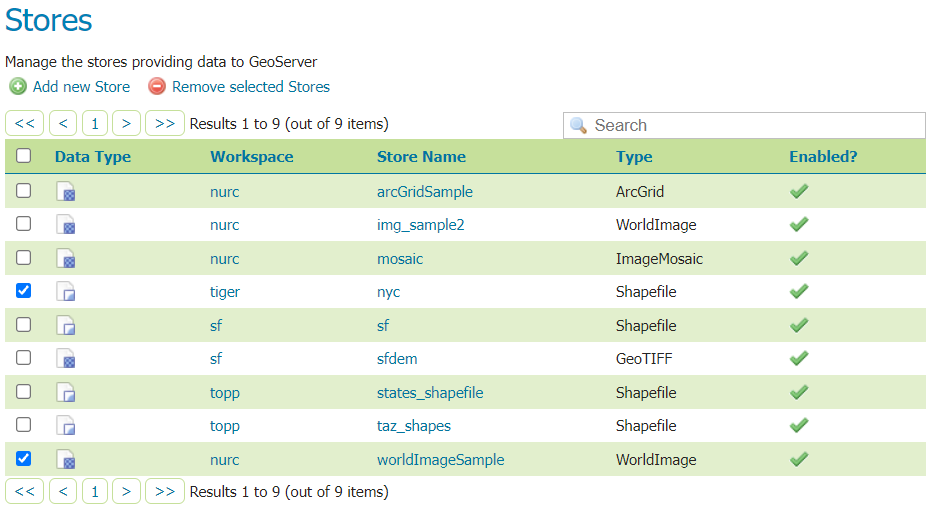
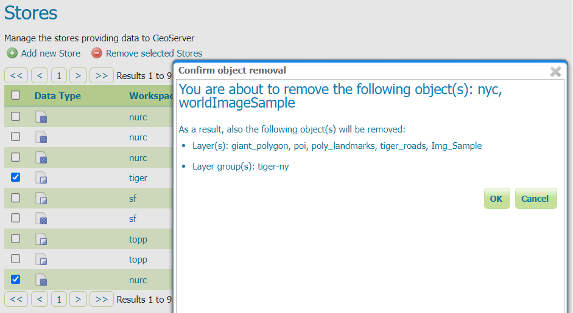

# Stores

A store connects to a data source that contains raster or vector data. A data source can be a file or group of files, a table in a database, a single raster file, or a directory (for example, a Vector Product Format library). The store construct allows connection parameters to be defined once, rather than for each dataset in a source. As such, it is necessary to register a store before configuring datasets within it.

*Stores View*

## Store types

While there are many potential formats for data sources, there are only four kinds of stores. For raster data, a store can be a file. For vector data, a store can be a file, database, or server.

  --------------------------------------------------------------------------------------------------
  Type Icon                             Description
  ------------------------------------- ------------------------------------------------------------
     raster data in a file

     vector data in a file

     vector data in a database

     vector server (web feature server)
  --------------------------------------------------------------------------------------------------

## Edit a Store

To view or edit a store, click the store name. A store configuration page will be displayed. The exact contents of this page depend on the specific format of the store. See the sections [Vector data](../vector/index.md), [Raster data](../raster/index.md), and [Databases](../database/index.md) for information about specific data formats. The example shows the configuration for the `nurc:ArcGridSample` store.

*Editing a raster data store*

### Basic Store Info

The basic information is common for all formats.

-   **Workspace** - the store is assigned to the selected workspace
-   **Data Source Name** - the store name as listed on the view page
-   **Description** - (optional) a description that displays in the administration interface
-   **Enabled** - enables or disables access to the store, along with all datasets defined for it
-   **Auto disable on connection failure** - auto disables access to the store if any issue happens when geoserver tries to acquire access to the store

### Connection Parameters

The connection parameters vary depending on data format.

## Add a Store {: #data_webadmin_stores_add_a_store }

The buttons for adding and removing a store can be found at the top of the Stores page.

*Buttons to add and remove a Store*

To add a store, select the **Add new Store** button. You will be prompted to choose a data source. GeoServer natively supports many formats (with more available via extensions). Click the appropriate data source to continue.

*Choosing the data source for a new store*

The next page configures the store. Since connection parameters differ across data sources, the exact contents of this page depend on the store's specific format. See the sections [Vector data](../vector/index.md), [Raster data](../raster/index.md), and [Databases](../database/index.md) for information on specific data formats. The example below shows the ArcGrid raster configuration page.

*Configuration page for an ArcGrid raster data source*

## Remove a Store

To remove a store, click the checkbox next to the store. Multiple stores can be selected, or all can be selected by clicking the checkbox in the header.

*Stores selected for removal*

Click the **Remove selected Stores** button. You will be asked to confirm the removal of the configuration for the store(s) and all resources defined under them. Clicking **OK** removes the selected store(s), and returns to the Stores page.

*Confirm removal of stores*
