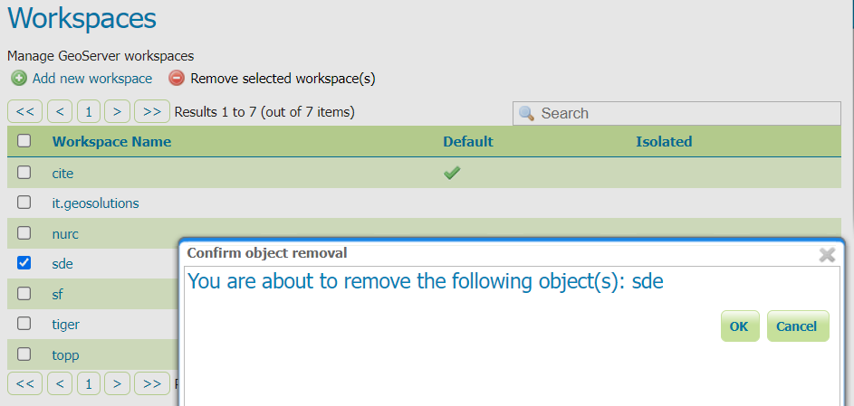
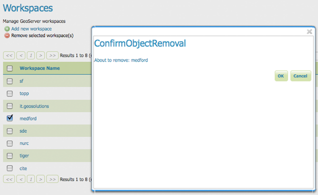
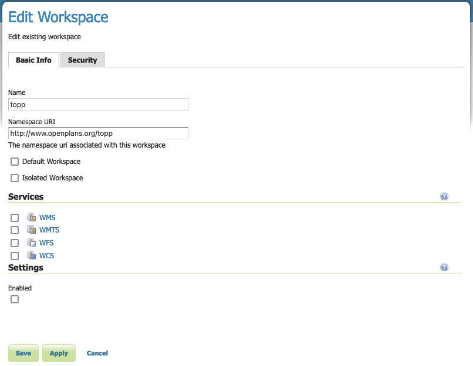
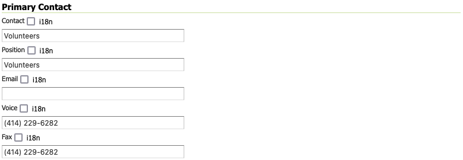
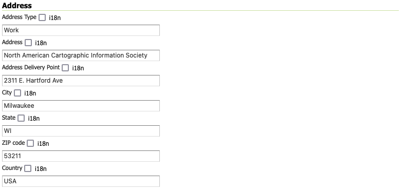
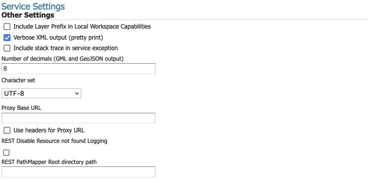
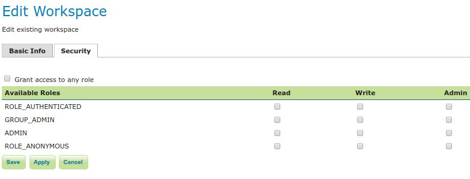

# Workspaces

This section describes how to view and configure workspaces. Analogous to a namespace, a workspace is a container which organizes other items. In GeoServer, a workspace is often used to group similar layers together. Layers may be referred to by their workspace name, colon, layer name (for example `topp:states`). Two different layers can have the same name as long as they belong to different workspaces (for example `sf:states` and `topp:states`).

*Workspaces page*

## Add a Workspace {#data_webadmin_workspaces_add_workspace}

The buttons for adding and removing a workspace can be found at the top of the Workspaces view page.

*Buttons to add and remove*

To add a workspace, select the **Add new workspace** button. You will be prompted to enter the workspace name and URI (as described in [Edit a Workspace](workspaces.rst#data_webadmin_workspaces_edit) below).

*New Workspace page with example*

## Remove a Workspace

To remove a workspace, select it by clicking the checkbox next to the workspace. Multiple workspaces can be selected, or all can be selected by clicking the checkbox in the header. Click the **Remove selected workspaces(s)** button. You will be asked to confirm or cancel the removal. Clicking **OK** removes the selected workspace(s).

*Workspace removal confirmation*

## Edit a Workspace {#data_webadmin_workspaces_edit}

To view or edit a workspace, click the workspace name. A workspace configuration page will be displayed.

*Workspace named "topp"*

A workspace is defined by a name and a Namespace URI (Uniform Resource Identifier).

-   **Name**: The workspace name, may not contain whitespace.

    The workspace name is used as an XML prefix for the Namespace URI when generating xml documents.

    The workspace name is used as a prefix when naming individual layers (unless **Default workspace** is used as described below).

-   **Namespace URI**: A URI is similar to a URL, except URIs do not need to point to an actual location on the web, and only need to be a unique identifier.

    For a Workspace URI, we recommend using a URL associated with your project, with perhaps a different trailing identifier. For example, `http://www.openplans.org/topp` is the URI for the "topp" workspace.

-   **Default Workspace**: One workspace can be nominated as the default.

    Layers belonging to the default workspace can be accessed directly, and do not require the workspace name as a prefix.

    A GeoServer configured with one workspace can use this setting to avoid using the workspace name when referencing layers. Keep in mind the workspace name will still be used in the generation of xml documents (where the name is used as an XML prefix to reference the workspace Namespace URI).

-   **Isolated workspace**: Isolated workspaces content so they are not included as part of global web services.

    The workspace contents will only be visible and queryable in the context of a [Virtual Services](../../configuration/virtual-services.md) as described below [Isolated Workspaces](../../configuration/virtual-services.md#workspace_isolated).

### Workspace Services {#workspace_services}

Use the checkbox located next to each service to override the global service definition for the associated service.

*Enable workspace services to provide default service description*

Once enabled clicking on the service link will open the settings page for the service, allowing default values for service title, abstract and other details to be supplied.

*Workspace WMS Settings*

Clients accessing this workspace as a [Virtual Services](../../configuration/virtual-services.md) will use the service metadata and settings provided here.

### Workspace Settings {#workspace_settings}

Use **Enabled** checkbox to override the global configuration and contact information for this workspace.

*Enable workspace settings to provide default contact information*

#### Contact Information

Clients accessing this workspace as a [Virtual Services](../../configuration/virtual-services.md) will use the contact information provided here.

Organization contact information:

-   The **Welcome** message is used as an introduction in the welcome page header for this workspace.
-   The **Organization** name and **Online Resource** are combined to form an organization link in the welcome page header for this workspace.

*Workspace Organization*

Primary contact information:

-   The **email** address if provided, will be used as the administrator contact in the welcome page footer for this workspace.

*Workspace Primary Contact*

Address contact information:

*Workspace address*

If this information is not provided the contact information from the global [Contact Information](../../configuration/contact.md) page is used.

#### Service Settings

Other settings provide additional [Global Settings](../../configuration/globalsettings.md) can be overridden on a workspace-by-workspace basis.

-   **Include Layer Prefix in Local Workspace Capabilities**: Enable this setting to force the inclusion of the workspace name as a prefix when accessing workspace contents as a virtual web service. The layer `ne:countries` is always referenced as `ne:countries` with this setting enabled.

    With this setting disabled layers may be referenced directly (with no prefix) when accessed by a virtual web service. The layer `ne:countries` can be referenced as `countries` when this setting is disabled (and the layer is being accessed via a `ne` virtual web service).

-   **Root Directory for REST PathMapper**: setting used by the RESTful API as the `ry` for uploaded files, following the structure:

        ${rootDirectory}/workspace/store[/<file>]

    !!! note

        This parameter is only used when the **Enabled** parameter of the *Settings* section is checked.

*Other Settings*

If this information is not provided the global settings will be used. For details on other settings see [Global Settings](../../configuration/globalsettings.md).

### Security {#workspace_security}

The Security tab allows to set data access rules at workspace level.

!!! note

    For more information on data access rules, please see the section on [Data](../../security/webadmin/data.md).

To create/edit the workspace's data access rules, check/uncheck checkboxes according to the desired role. The Grant access to any role checkbox grant each role for any access mode.
