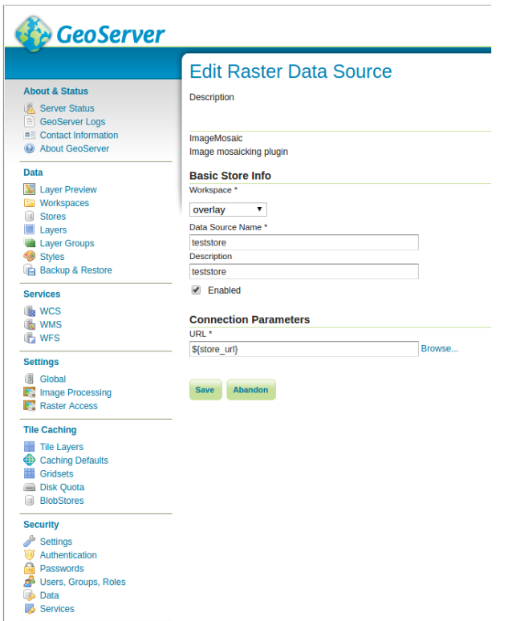
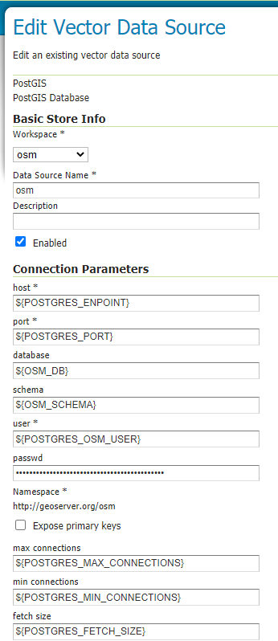

# Parameterize catalog settings

Environment parametrization allows to parameterize some of the settings in GeoServer's catalog by means of a templating mechanism to tailor GeoServer's settings to the environment in which is run.

For example, there might be the need to move the latest changes made from a GeoServer instance running on machine **A** to another instance running on machine **B**, but there are some differences in the way the two environments are set up (e.g. the password used to connect to the database is different). In such scenario if a simple backup of the catalog from instance **A** is created and restored on instance **B**, the stores configured on the database will not be accessible and the corresponding layers will not work properly.

Another example can be the need to have different connection pool configuration for two different GeoServer instances, with respect to the max number of connections available in the pool.

To enable env parametrization the following flag needs to be set via system variable to GeoServer's environment:

>     -DALLOW_ENV_PARAMETRIZATION=true

A `properties` file holding the parametrized settings needs to be created. It can be provided by naming it `geoserver-environment.properties` and by placing it in the root directory of the GeoServer's DATA_DIR.

GeoServer is also able to use a `properties` file outside the GeoServer's DATA_DIR. In this case the path to the `properties` file must be defined in one of the following ways:

> -   By providing a system variable `-DENV_PROPERTIES={properties filepath}`.
> -   By providing an environment variable named `ENV_PROPERTIES` and the path to the properties file as the value.
> -   By providing a context parameter in the `WEB-INF/web.xml` file for the GeoServer application:

``` xml
<web-app>
  ...
  <context-param>
    <param-name>ENV_PROPERTIES</param-name>
    <param-value>/var/lib/geoserver_data</param-value>
  </context-param>
  ...
</web-app>
```

Once a strategy to load the `ENV_PROPERTIES` has been defined and set, it is possible to edit GeoServer's configuration files of the source machine that needs to be parametrized. For example, let's parameterize the URL of a store (this can also be done via GeoServer admin UI):

> `vim coveragestore.xml` :
>
>     ...
>      <enabled>true</enabled>
>       <workspace>
>         <id>WorkspaceInfoImpl--134aa31e:1564c12ef68:-7ffe</id>
>       </workspace>
>       <__default>false</__default>
>       <url>${store_url}</url>
>     </coverageStore>

A definition for the variable **store_url** needs to be added in

> `geoserver-environment.properties` :
>
>     store_url = file:///var/geoserver/store/teststore

Once GeoServer has been restarted, it is possible to see that the URL in "Connection Parameters" settings now refers the variable **store_url** whose value is defined in the `geoserver-environment.properties` file.



Another common use case is parameterizing connection details for a vector datastore. Hostname, credentials and connection pool parameters for the databases tend to change between environments. Once the variables are set in the `geoserver-environment.properties` file, the Datastore can be configured as follows:


