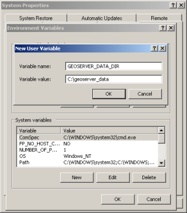

# Setting the data directory location {: #datadir_setting }

The procedure for setting the location of the GeoServer data directory is dependent on the type of GeoServer installation. Follow the instructions below specific to the target platform.

!!! note

    If the location of the GeoServer data directory is not set explicitly, the directory `data_dir` under the root of the GeoServer installation will be chosen by default.

## Windows

On Windows platforms the location of the GeoServer data directory is controlled by the `GEOSERVER_DATA_DIR` environment variable.

To set the environment variable:

1.  Open the System Control Panel.

2.  Click **Advanced System Properties**.

3.  Click **Environment Variables**.

4.  Click the `New` button and create a environment variable called `GEOSERVER_DATA_DIR` and set it to the desired location.

    
    *Setting an environment variable on Windows*

## Linux

On Linux platforms the location of the GeoServer data directory is controlled by the `GEOSERVER_DATA_DIR` environment variable. Setting the variable can be achieved with the following command (in the terminal):

``` console
export GEOSERVER_DATA_DIR=/var/lib/geoserver_data
```

To make the variable persist, place the command in the `.bash_profile` or `.bashrc` file. Ensure that this done for the user running GeoServer.

## Mac OS X

For the binary install of GeoServer on Mac OS X, the data directory is set in the same way as for Linux.

For the Mac OS X install, set the `GEOSERVER_DATA_DIR` environment variable to the desired directory location. See [this page](http://developer.apple.com/mac/library/qa/qa2001/qa1067.html) for details on how to set an environment variable in Mac OS X.

## Web archive

When running a GeoServer WAR inside a servlet container, the data directory can be specified in a number of ways. The recommended method is to set a **servlet context parameter**. An alternative is to set a **Java system property**.

### Context parameter

To specify the data directory using a servlet context parameter, create the following `<context-param>` element in the `WEB-INF/web.xml` file for the GeoServer application:

``` xml
<web-app>
  ...
  <context-param>
    <param-name>GEOSERVER_DATA_DIR</param-name>
    <param-value>/var/lib/geoserver_data</param-value>
  </context-param>
  ...
</web-app>
```

### Java system property

It is also possible to specify the data directory location with a Java system property. This method can be useful during upgrades, as it avoids the need to set the data directory after every upgrade.

!!! warning

    Using a Java system property will typically set the property for all applications running in the servlet container, not just GeoServer.

The method of setting the Java system property is dependent on the servlet container:

-   For **Tomcat**, edit the file **`bin/setclasspath.sh`** under the root of the Tomcat installation. Specify the `GEOSERVER_DATA_DIR` system property by setting the `CATALINA_OPTS` variable:

    ``` console
    CATALINA_OPTS="-DGEOSERVER_DATA_DIR=/var/lib/geoserver_data"
    ```

-   For **Glassfish**, edit the file **`domains/<<domain>>/config/domain.xml`** under the root of the Glassfish installation, where `<<domain>>` refers to the domain that the GeoServer web application is deployed under. Add a `<jvm-options>` element inside the `<java-config>` element:

    ``` xml
    ...
    <java-config>
       ...
      <jvm-options>-DGEOSERVER_DATA_DIR=/var/lib/geoserver_data</jvm-options>  
    </java-config>
    ...
    ```

## Require files to exist

If the data directory is on a network filesystem, it can be desirable for security reasons to require one or more files or directories to exist before GeoServer will start, to prevent GeoServer from falling back into a default insecure configuration if the data directory appears to be empty because of the loss of this network resource.

To require files or directories to exist, use any of the methods above to set `GEOSERVER_REQUIRE_FILE`. Do not specify a mount point as this will still exist if a network filesystem is unavailable; instead specify a file or directory *inside* a network mount. For example:

Environment variable:

``` console
export GEOSERVER_REQUIRE_FILE=/mnt/server/geoserver_data/global.xml
```

Servlet context parameter:

``` xml
<web-app>
  ...
  <context-param>
    <param-name>GEOSERVER_REQUIRE_FILE</param-name>
    <param-value>/mnt/server/geoserver_data/global.xml</param-value>
  </context-param>
  ...
</web-app>
```

Java system property:

``` console
CATALINA_OPTS="-DGEOSERVER_REQUIRE_FILE=/mnt/server/geoserver_data/global.xml"
```

### Multiple files

To specify multiple files or directories that must exist, separate them with the path separator (`:` on Linux, `;` on Windows):

Environment variable:

``` console
export GEOSERVER_REQUIRE_FILE=/mnt/server/geoserver_data/global.xml:/mnt/server/data
```

Servlet context parameter:

``` xml
<web-app>
  ...
  <context-param>
    <param-name>GEOSERVER_REQUIRE_FILE</param-name>
    <param-value>/mnt/server/geoserver_data/global.xml:/mnt/server/data</param-value>
  </context-param>
  ...
</web-app>
```

Java system property:

``` console
CATALINA_OPTS="-DGEOSERVER_REQUIRE_FILE=/mnt/server/geoserver_data/global.xml:/mnt/server/data"
```
