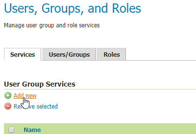
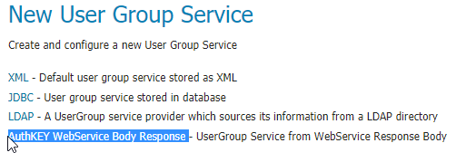
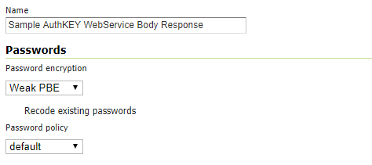
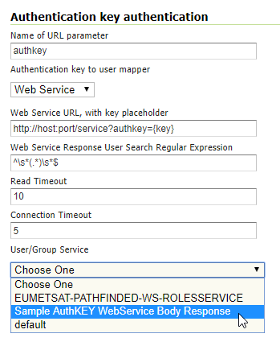
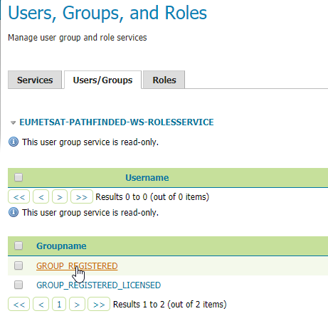
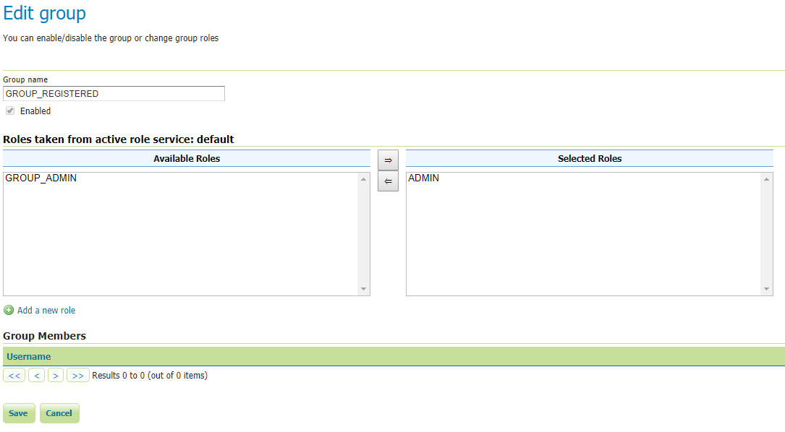
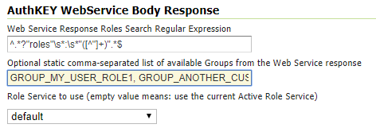
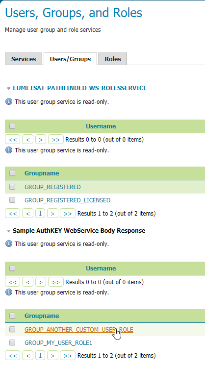
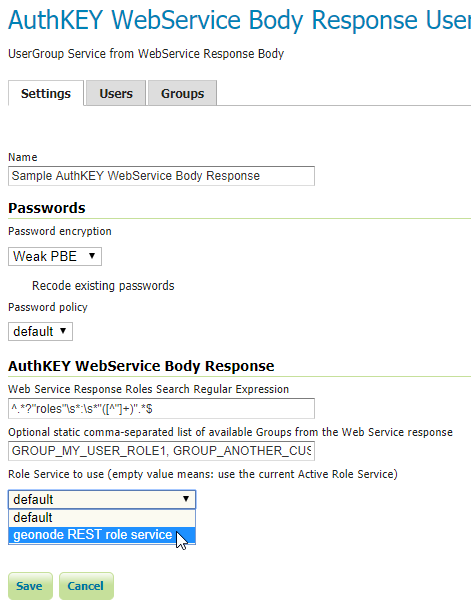
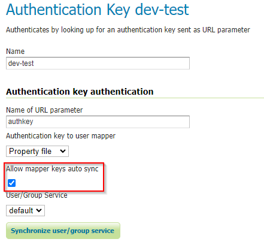

# Key authentication module

The `authkey` module for GeoServer allows for a very simple authentication protocol designed for OGC clients that cannot handle any kind of security protocol, not even the HTTP basic authentication.

For these clients the module allows a minimal form of authentication by appending a unique key in the URL that is used as the sole authentication token. Obviously this approach is open to security token sniffing and must always be associated with the use of HTTPS connections.

A sample authenticated request looks like:

    http://localhost:8080/geoserver/topp/wms?service=WMS&version=1.3.0&request=GetCapabilities&authkey=ef18d7e7-963b-470f-9230-c7f9de166888

Where `authkey=ef18d7e7-963b-470f-9230-c7f9de166888` is associated to a specific user (more on this later). The capabilities document contains backlinks to the server itself, linking to the URLs that can be used to perform GetMap, GetFeatureInfo and so on. When the `authkey` parameter is provided the backlinks will contain the authentication key as well, allowing any compliant WMS client to access secured resources.

## Limitations

The `authkey` module is meant to be used with OGC services. It won't work properly against the administration GUI, nor RESTConfig.

The `authkey` module replaces the default basic authentication provider, therefore when editing a user the Enabled checkbox does not affect the `authkey` provider and you cannot disable users this way.

## Key providers

Key providers are responsible for mapping the authentication keys to a user. The authentication key itself is a UUID (Universally Unique IDentifier (UUID)). A key provider needs a user/group service and it is responsible for synchronizing the authentication keys with the users contained in this service.

### Key provider using user properties

This key provider uses a user property `UUID` to map the authentication key to the user. User properties are stored in the user/group service. Synchronizing is simple since the logic has to search for users not having the property `UUID` and add it. The property value is a generated UUID.

`UUID=b52d2068-0a9b-45d7-aacc-144d16322018`

If the user/group service is read only, the property has to be added from outside, no synchronizing is possible.

### Key provider using a property file

This key provider uses a property file named `authkeys.properties`. The default user/group service is named `default`. The `authkeys.properties` for this service would be located at

`$GEOSERVER_DATA_DIR/security/usergroup/default/authkeys.propeties`

A sample file looks as follows:

    # Format is authkey=username
    b52d2068-0a9b-45d7-aacc-144d16322018=admin
    1825efd3-20e1-4c18-9648-62c97d3ee5cb=sf
    ef18d7e7-963b-470f-9230-c7f9de166888=topp

This key provider also works for read only user/group services. Synchronizing adds new users not having an entry in this file and removes entries for users deleted in the user/group service.

### Key provider using an external web service

This key provider calls an external URL to map the authentication key to the user. This allows GeoServer to integrate into an existing security infrastructure, where a session token is shared among applications and managed through dedicated web services.

The web service URL and some other parameters can be specified to configure the mapper in detail:

| **Option**                                            | **Description**                                                                                                                                                                                                                                                                              |
|-------------------------------------------------------|----------------------------------------------------------------------------------------------------------------------------------------------------------------------------------------------------------------------------------------------------------------------------------------------|
| `Web Service URL, with key placeholder`               | the complete URL of the key mapping webservice, with a special placeholder ({key}) that will be replaced by the current authentication key                                                                                                                                                   |
| `Web Service Response User Search Regular Expression` | a regular expression used to extract the username from the webservice response; the first matched group (the part included in parentheses) in the regular expression will be used as the username; the default (\^\\s*(.*)\\s*\$) takes all the response text, trimming spaces at both ends |
| `Connection Timeout`                                  | timeout to connect to the webservice                                                                                                                                                                                                                                                         |
| `Read Timeout`                                        | timeout to read data from the webservice                                                                                                                                                                                                                                                     |

The mapper will call the webservice using an HTTP GET request (webservice requiring POST are not supported yet), replacing the {key} placeholder in the configured URL with the actual authentication key.

If a response is received, it is parsed using the configured regular expression to extract the username from it. New lines are automatically stripped from the response. Some examples of regular expression that can be used are:

| **Regular Expression**               | **Usage**                                                                  |
|--------------------------------------|----------------------------------------------------------------------------|
| `^\s*(.*)\s*$`                       | all text trimming spaces at both ends                                      |
| `^.*?"user"\s*:\s*"([^"]+)".*$` | json response where the username is contained in a property named **user** |
| `^.*?<username>(.*?)</username>.*$`  | xml response where the username is contained in a tag named **username**   |

Synchronizing users with the user/group service means clearing the current Security context cache. The keys cached in memory will be removed and re-created at the next call.

#### AuthKEY WebService Body Response UserGroup Service

When using an external web service to get Auth details, it is possible to define a custom `GeoServer UserGroup Service` being able to fetch Authorities - aka user's Roles - from the HTTP Body Response.

The rationale is mostly the same; that kind of `GeoServer UserGroup Service` will apply a `rolesRegex` - Roles Regular Expression - to the body response - which can be either XML, JSON or Plain Text/HTML - in order to fetch the list of available Authorities.

In order to do this, it is possible to configure instances of **AuthKEY WebService Body Response** User Group Service.

**First**:

1.  Login as an `Administrator`

2.  Move to `Security` > `Users, Groups, Roles` and select `Add new` from `User Group Services`

    
    *add new user group service*

3.  Click on `AuthKEY WebService Body Response`

    
    *AuthKEY WebService Body Response*

4.  Provide a `Name` and select anything you want from `Passwords` - those won't be used by this service, but they are still mandatory for GeoServer -

    
    *user group service name*

5.  Provide a suitable `Roles Regex` to apply to your Web Service Response

    This is the only real mandatory value to provide. The others are optional and will allow you to customize the User Group Service behavior (see below)

    
    *user group service roles regex*

**Second**: Once the new `GeoServer UserGroup Service` has been configured, next it can be linked to the `Key Provider Web Service Mapper`.

1.  From `Authentication` > `Authentication Filters`, select - or add new - `AuthKEY` using `Web Service` as key mapper

2.  Select the newly defined `UserGroup Service` and save

    
    *user group service save*

**Additional Options:**

1.  *Optional static comma-separated list of available Groups from the Web Service response*

    It is worth notice that this `UserGroup Service` will **always** translate fetched Roles in the form `ROLE_<ROLENAME>`

    As an instance, if the `Roles Regular Expression` will match something like:

        my_user_role1, another_custom_user_role, role_External_Role_X

    this will be converted into **3** different `GeoServer User Roles` named as:

        ROLE_MY_USER_ROLE1
        ROLE_ANOTHER_CUSTOM_USER_ROLE
        ROLE_EXTERNAL_ROLE_X

    Of course the role names are known only at runtime; nevertheless it is possible to **statically** specify associated `GeoServer User Groups` to be mapped later to other internal `GeoServer User Roles`.

    What does this mean? A `GeoServer User Group` can be defined on the GeoServer Catalog and can be mapped by the active `Role Services` to one or more specific `GeoServer User Roles`.

    This mainly depends on the `GeoServer Role Service` you use. By default, the internal `GeoServer Role Service` can map Roles and Groups through static configuration stored on the GeoServer Data Dir. This is possible by editing `GeoServer User Group` details from the `Users, Groups, and Roles` panel

    

    

    Now, this custom `UserGroup Service` maps dynamically `GeoServer User Role` to `GeoServer User Group` as follows:

        ROLE_MY_USER_ROLE1              <> GROUP_MY_USER_ROLE1
        ROLE_ANOTHER_CUSTOM_USER_ROLE   <> GROUP_ANOTHER_CUSTOM_USER_ROLE
        ROLE_EXTERNAL_ROLE_X            <> GROUP_EXTERNAL_ROLE_X

    In order to be able to assign any `GeoServer User Group` to other internal `GeoServer User Roles`, since those are known only at runtime, the `UserGroup Service` allows us to **statically** specify the `GeoServer User Groups` the Web Service can use; this possible by setting the `Optional static comma-separated list of available Groups from the Web Service response` option:

    

    Once this is correctly configured, it will be possible to edit and assign `GeoServer User Roles` to the Groups by using the standard way

    

2.  *Role Service to use*

    By default, if no `Role Service` specified, the `UserGroup Service` will use the `GeoServer Active Role Service` to resolve `GeoServer User Roles` from `GeoServer User Groups` - as specified above -

    
    *Role service*

    It is possible to define a `Custom Role Service` to use instead, to resole `GeoServer User Roles`; this is possible simply by selecting the `Role Service` to use from the `Role Service to use` option

    
    *Custom role service*

## Configuration

Configuration can be done using the administrator GUI. There is a new type of authentication filter named **authkey** offering the following options.

1.  URL parameter name. This the name of URL parameter used in client HTTP requests. Default is `authkey`.
2.  Key Provider. GeoServer offers the providers described above.
3.  User/group service to be used.

Some of the key providers can require additional configuration parameter. These will appear under the Key Provider combo-box when one of those is selected.

After configuring the filter it is necessary to put this filter on the authentication filter chain(s).

!!! note

    The administrator GUI for this filter has button **Synchronize**. Clicking on this button saves the current configuration and triggers a synchronize. If users are added/removed from the backing user/group service, the synchronize logic should be triggered.

## Enabling Mappers' Auto-Synchronization

The following check is available for all provides.


*Auto-synchronization*

If enabled, the service will automatically invoke the corresponding mapper synchronize method; the one associated to the current AuthKey provider.

By default the synchronization happens every 60 seconds. In the case an administrator needs to change the auto-sync frequency, he will need to:

1.  Edit the file ``applicationContext.xml`` within the ``gs-authkey`` jar file
2.  Edit the property ``autoSyncDelaySeconds`` of the ``authenticationKeyProvider`` bean
3.  Restart GeoServer

## Provider pluggability

With some Java programming it is possible to programmatically create and register a new key to user name mapper that works under a different logic. For example, you could have daily tokens, token generators and the like.

In order to provide your custom mapper you have to implement the `org.geoserver.security.AuthenticationKeyMapper` interface and then register said bean in the Spring application context. Alternatively it is possible to subclass from `org.geoserver.security.AbstractAuthenticationKeyMapper`. A mapper (key provider) has to implement

``` java
/**
 * 
 * Maps a unique authentication key to a username. Since usernames are
 * unique within a {@link GeoServerUserGroupService} an individual mapper
 * is needed for each service offering this feature.
 * 
 * @author Andrea Aime - GeoSolution
 */
public interface AuthenticationKeyMapper extends BeanNameAware {

    /**
     * Maps the key provided in the request to the {@link GeoServerUser} object
     * of the corresponding user, or returns null
     * if no corresponding user is found
     * 
     * Returns <code>null</code> if the user is disabled
     * 
     * @param key
     * @return
     */
    GeoServerUser getUser(String key) throws IOException;

    /**
     * Assures that each user in the corresponding {@link GeoServerUserGroupService} has
     * an authentication key.
     * 
     * returns the number of added authentication keys
     * 
     * @throws IOException
     */
    int synchronize() throws IOException;

    /**
     * Returns <code>true</code> it the mapper can deal with read only u 
     * user/group services
     * 
     * @return 
     */
    boolean supportsReadOnlyUserGroupService();

    String getBeanName();

    void setUserGroupServiceName(String serviceName);
    String getUserGroupServiceName();

    public GeoServerSecurityManager getSecurityManager();
    public void setSecurityManager(GeoServerSecurityManager securityManager);

 }
```

The mapper would have to be registered in the Spring application context in a `applicationContext.xml` file in the root of your jar. Example for an implementation named `com.mycompany.security.SuperpowersMapper`:

``` xml
<?xml version="1.0" encoding="UTF-8"?>
<!DOCTYPE beans PUBLIC "-//SPRING//DTD BEAN//EN" "http://www.springframework.org/dtd/spring-beans.dtd">
<beans>
  <bean id="superpowersMapper" class="com.mycompany.security.SuperpowersMapper"/>
</beans>
```

At this point you can drop the `authkey` jar along with your custom mapper jar and use it in the administrator GUI of the authentication key filter.
