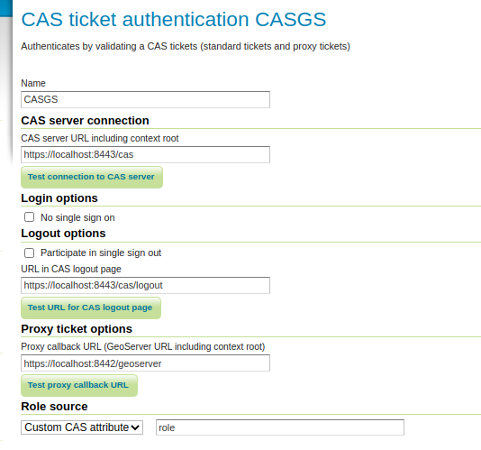
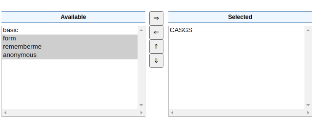
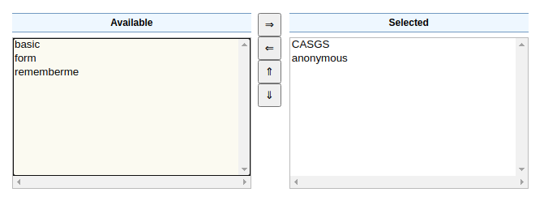
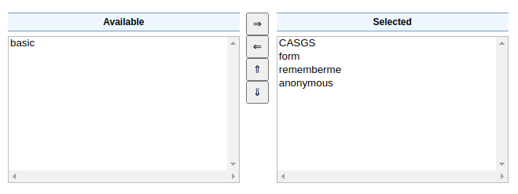

# CAS integration

The CAS module allows to integrate GeoServer with the [Central Authentication Service (CAS)](https://www.apereo.org/projects/cas) Single Sign On (SSO), in particular, using standard tickets and proxy tickets.

## Installation

To install the CAS module:

1.  Visit the [website download](https://geoserver.org/download) page, locate your release, and download: {{ download_extension('cas') }} (nightly {{ download_extension('cas','snapshot') }})

    The download link will be in the **Extensions** section under **Security**.

    !!! warning

        Ensure to match plugin (example {{ release }} above) version to the version of the GeoServer instance.

> 1.  Extract the files in this archive to the **`WEB-INF/lib`** directory of your GeoServer installation.
> 2.  Restart GeoServer

## Configuration

The CAS integration is a authentication filter module, hence in order to use it one has to:

-   Go to the authentication page, add the CAS filter and configure it
-   Add it to the authentication chains, taking care of removing the other authentication methods (or the CAS authentication won't trigger and redirect users to the CAS login page)

This page serves as a reference for configuration options, but a step by step tutorial is also available, see [Authentication with CAS](../../security/tutorials/cas/index.md).

> 

| Key                                   | Description                                                                                                                                                       |
|---------------------------------------|-------------------------------------------------------------------------------------------------------------------------------------------------------------------|
| Name                                  | Name of the filter                                                                                                                                                |
| CAS server URL including context root | The CAS server location (GeoServer will redirect to it, for example, in order to login, adding the necessary extra path elements)                                 |
| No single sign on                     | If checkecd, will send the "renew=true" options to the CAS server, forcing the user to login on the server at each request (unless session creation is allowed) |
| Participate in single sign out        | Whether GeoServer should receive and handle callbacks for Single Sign Out.                                                                                        |
| URL in CAS loutput page               | CAS logout page location                                                                                                                                          |
| Proxy callback URL                    | The URL CAS will call back to after proxy ticket authentication                                                                                                   |
| Role source                           | A choice of role sources for the user authenticated via CAS                                                                                                       |

Specifically for the **role source**, the following options are available:

| Source               | Description                                                                                                                                                                                                                                         |
|----------------------|-----------------------------------------------------------------------------------------------------------------------------------------------------------------------------------------------------------------------------------------------------|
| User group service   | Locate the user in a the specified user group service, extract the roles from it.                                                                                                                                                                   |
| Role service         | Locate user roles from the specified role service                                                                                                                                                                                                   |
| Header attribute     | Look up the roles in the specified HTTP header of the CAS response                                                                                                                                                                                  |
| Custom CAS attribute | Extract the roles from a CAS custom attribute in the `<cas:serviceResponse>` received from the server. The attributes must be configured, on the CAS side, via an attribute repository, and then released for publication in service configuration. |

## Example CAS configuration

In order to use the CAS custom attributes the server must be configured to extract the attributes from a given attribute repository, and then allow their release in the GeoServer service configuration.

For example, the following `cas.properties` file sets up a JDBC user source, as well as JDBC attribute repository (this configuration file might useful for testing purposes, but not setup for production):

``` none
cas.server.name=https://localhost:8443
cas.server.prefix=${cas.server.name}/cas
server.ssl.key-store=file:/etc/cas/config/thekeystore
server.ssl.key-store-password=changeit
logging.config=file:/etc/cas/config/log4j2.xml
# cas.authn.accept.users=

cas.authn.jdbc.query[0].driver-class=org.postgresql.Driver
cas.authn.jdbc.query[0].url=jdbc:postgresql://localhost:5432/cas_users
cas.authn.jdbc.query[0].dialect=org.hibernate.dialect.PostgreSQL95Dialect
cas.authn.jdbc.query[0].driver-class=org.postgresql.Driver
cas.authn.jdbc.query[0].user=theDbUser
cas.authn.jdbc.query[0].password=theDbPassword
cas.authn.jdbc.query[0].sql=SELECT * FROM users WHERE email = ?
cas.authn.jdbc.query[0].password-encoder.type=BCRYPT
cas.authn.jdbc.query[0].field-password=password
cas.authn.jdbc.query[0].field-expired=expired
cas.authn.jdbc.query[0].field-disabled=disabled


cas.authn.attributeRepository.jdbc[0].driver-class=org.postgresql.Driver
cas.authn.attributeRepository.jdbc[0].url=jdbc:postgresql://localhost:5432/cas_users
cas.authn.attributeRepository.jdbc[0].dialect=org.hibernate.dialect.PostgreSQL95Dialect
cas.authn.attributeRepository.jdbc[0].driver-class=org.postgresql.Driver
cas.authn.attributeRepository.jdbc[0].user=theDbUser
cas.authn.attributeRepository.jdbc[0].password=theDbPassword
cas.authn.attributeRepository.jdbc[0].attributes.role=role
cas.authn.attributeRepository.jdbc[0].singleRow=false
cas.authn.attributeRepository.jdbc[0].columnMappings.attribute=value
cas.authn.attributeRepository.jdbc[0].sql=SELECT * FROM roles WHERE {0}
cas.authn.attributeRepository.jdbc[0].username=email

cas.service-registry.json.location=classpath:/services
```

The database has the following two tables for users and roles:

``` sql
CREATE TABLE public.users (
    id bigint NOT NULL,
    disabled boolean,
    email character varying(40),
    first_name character varying(40),
    last_name character varying(40),
    expired boolean,
    password character varying(100)
);

CREATE TABLE public.roles (
    email character varying,
    attribute character varying,
    value character varying
);
```

A sample service configuration for GeoServer might look as follows (again, setup for testing and development only):

``` json
{
  "@class" : "org.apereo.cas.services.RegexRegisteredService",
  "serviceId" : "^http(s)?://localhost:[\\d]+/geoserver/.*",
  "name" : "GeoServer",
  "id" : 1002,
  "logoutType" : "BACK_CHANNEL",
  "logoutUrl" : "https://localhost:8442/geoserver",
  "redirectUrl" : "https://localhost:8442/geoserver",
  "proxyPolicy" : {
    "@class" : "org.apereo.cas.services.RegexMatchingRegisteredServiceProxyPolicy",
    "pattern" : "^http(s)?://localhost:[\\d]+/geoserver/.*"
  },
  "attributeReleasePolicy" : {
    "@class" : "org.apereo.cas.services.ReturnAllAttributeReleasePolicy"
  }
}
```

## Configuring the web chain

The CAS authentication can be included in the web filter chain, with different behavior depending on which filters are included. The following discusses three possible examples.

As first case, let's consider having only the CAS authentication in the "web" filter chain:

> 

Since anonymous access is not allowed, any attempt to access the GeoServer web console will cause a redirect to the CAS server, for login. Once logged in, the user interface shows a button to initiate a CAS logout (the logout is shared among all examples, won't be repeated in the following text).

> 

A second option is to allow anonymous access in the web chain, allowing users to access the layer preview and other demo functionality without logging in:

> 

In this case the web console does not immediately redirect to the CAS server, but provides a CAS login button instead:

> 

As a final example, let's consider having both CAS and form login in the web chain:

> 

This allows both a CAS login, and a form based login using GeoServer local username/password. It could be useful to allow GeoServer administration while the CAS server is offline for any reason. In this case both the form login and the CAS login button appear at the same time:

> 
